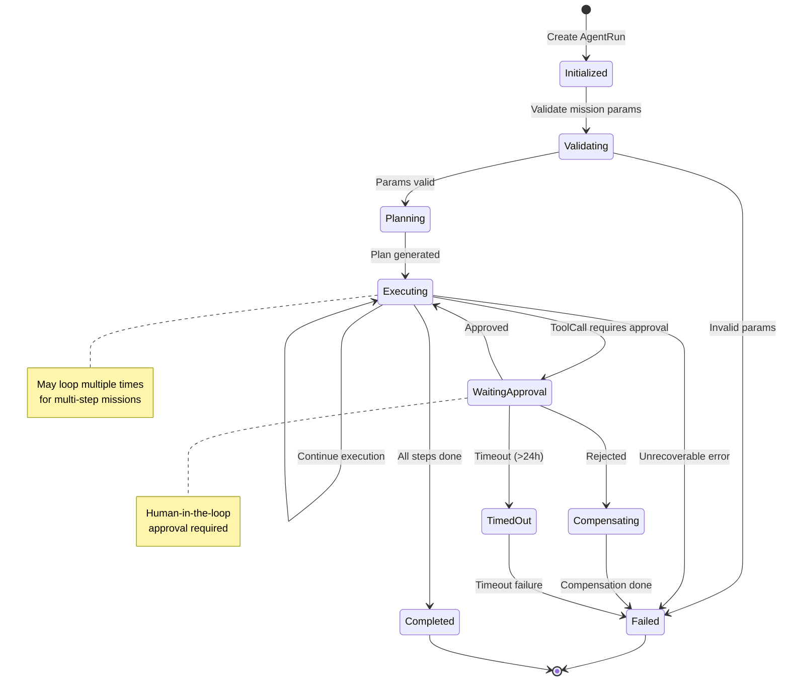
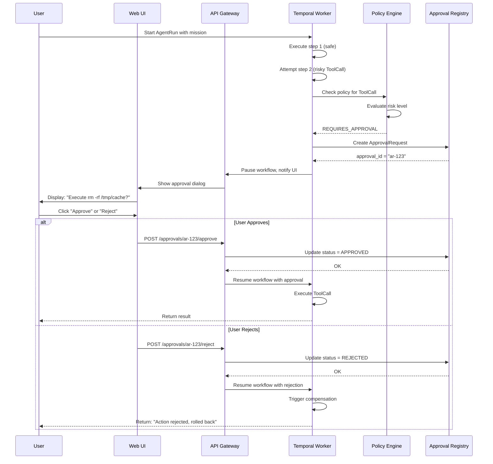

# Checklist: Исправление критических проблем документации

**Приоритет:** P0 (выполнить в течение 2 недель)  
**Ответственные:** Tech Lead, Documentation Owner, DevOps  

---

## Шаг 1: Удалить или заполнить пустые документы (2 часа)

### Вариант A: Удалить ненужные заглушки
```bash
# Проверить список пустых файлов
find docs/ -name "*.md" -empty

# Удалить явно ненужные (handover docs пока не нужны)
rm docs/00_handover/DOCUMENT_REGISTER.md
rm docs/00_handover/README_HANDOVER.md
rm docs/00_handover/SOURCE_DOCUMENTS.md

# Удалить дублирующую папку specs/
rm -rf docs/specs/
```

### Вариант B: Добавить TODO контент в важные файлы
Для критических документов, которые понадобятся позже:

```markdown
# ADR-001: Temporal как Durable Runtime

**Status:** Planned for Sprint F3  
**Owner:** Architect  
**Priority:** P1

⚠️ **This document is a placeholder.** It will be completed during Sprint F3 as part of the documentation hardening initiative.

## Brief Context
We chose Temporal.io as our durable execution engine to handle long-running agent workflows with proper fault tolerance, retries, and human-in-the-loop approvals.

## TODO
- [ ] Fill in full ADR template
- [ ] Document alternatives considered (self-written SQLite workflow, Cadence)
- [ ] Add performance benchmarks
- [ ] Link to Temporal cluster setup guide

## References
- [Temporal Documentation](https://docs.temporal.io/)
- [ADR_INDEX.md](../ADR_INDEX.md)
```

**Применить к:**
- [ ] `docs/03_adr/ADR-001-temporal-durable-runtime.md`
- [ ] `docs/03_adr/ADR-003-e2b-hybrid-sandbox.md`
- [ ] `docs/03_adr/ADR-004-mcp-tool-gateway.md`
- [ ] `docs/07_security/PROMPT_INJECTION_DEFENSE.md`
- [ ] `docs/09_ops/OBSERVABILITY_DASHBOARDS.md`

---

## Шаг 2: Исправить дубликаты (1 час)

### Проблема 1: Три RUNBOOK-003
```bash
# Посмотреть содержимое всех трех файлов
ls -la docs/09_runbooks/RUNBOOK-003*

# Выбрать лучший вариант, остальные удалить или переименовать
# Например:
mv docs/09_runbooks/RUNBOOK-003-ROLLBACK.md docs/09_runbooks/RUNBOOK-003-ROLLBACK_OLD.md
mv docs/09_runbooks/RUNBOOK-003_ROLLBACK.md docs/09_runbooks/RUNBOOK-003B-ROLLBACK-V2.md
```

**Решение:**
- [ ] Оставить `RUNBOOK-003-OBSERVABILITY_AND_LOAD.md` как есть
- [ ] Объединить два ROLLBACK файла в один `RUNBOOK-004-ROLLBACK.md`
- [ ] Обновить нумерацию последующих runbooks

### Проблема 2: Два SPEC-024
```bash
# Сравнить файлы
diff docs/04_specs/SPEC-024-RELEASE_CHECKLIST.md docs/specs/SPEC-024_Release_Candidate_Checklist.md

# Удалить дубликат из неправильной папки
rm docs/specs/SPEC-024_Release_Candidate_Checklist.md
```

**Решение:**
- [ ] Сравнить оба файла
- [ ] Оставить лучший вариант в `docs/04_specs/`
- [ ] Удалить `docs/specs/` папку полностью

---

## Шаг 3: Обновить PROJECT_BACKLOG с реальным статусом (4 часа)

### Заменить misleading статусы

**Было:**
```markdown
### Sprint 7: Temporal Durable Runtime — ✅ Completed
```

**Стало:**
```markdown
### Sprint 7: Temporal Durable Runtime — ⚠️ Skeleton/MVP Only

**Current Status:**
- ✅ Basic Temporal workflow skeleton implemented
- ✅ Worker can connect to Temporal cluster
- ❌ Activities are mocks (no real business logic)
- ❌ No error handling or compensation logic
- ❌ No integration with AgentRun state machine

**Reality Check:**
This sprint completed the *infrastructure setup* for Temporal, but the actual durable execution logic is NOT production-ready. The workflow exists as a demonstration, but real agent missions do not yet leverage Temporal's capabilities.

**Next Steps (Sprint F3):**
1. Implement real activities for AgentRun lifecycle
2. Add error handling and retry policies
3. Integrate with Approval Request flow
4. Write integration tests with Temporal test server

**Blockers:**
- Need Docker Compose setup for local Temporal cluster
- Need to define activity interfaces (input/output schemas)
- Need failure scenarios for chaos testing
```

**Применить к следующим спринтам:**
- [ ] Sprint 7 (Temporal)
- [ ] Sprint 10 (Knowledge Gateway/RAG)
- [ ] Sprint 11 (Semantic Protocol)
- [ ] Sprint 14 (Sandbox Forge)

Добавить disclaimer в начало PROJECT_BACKLOG.md:
```markdown
> ⚠️ **IMPORTANT: Reality Check**
>
> This backlog reflects *planned and partially implemented* work. Many items marked as "completed" represent **skeleton implementations** or **MVP proofs-of-concept**, not production-ready features.
>
> For an honest assessment of current state, see:
> - [CURRENT_REALITY_AUDIT.md](CURRENT_REALITY_AUDIT.md)
> - [RELEASE_BLOCKERS.md](RELEASE_BLOCKERS.md)
>
> We are currently in a **Hardening Phase** (Sprints F1-F8) to bring implementation up to par with our architectural vision.
```

---

## Шаг 4: Исправить broken links (3 часа)

### Автоматическая проверка
```bash
# Установить markdown-link-check
npm install -g markdown-link-check

# Проверить все документы
find docs/ -name "*.md" -exec markdown-link-check {} \; > link_check_results.txt

# Посмотреть ошибки
grep "✖" link_check_results.txt
```

### Ручное исправление常见 проблем

**Проблема 1: Абсолютные Windows-пути**
```markdown
# Было (LOCAL_DEVELOPMENT_SETUP.md)
cd c:\AG\agsys

# Стало
cd <project-root>
# или
cd cons/chatavg
```

**Проблема 2: Ссылки на несуществующие файлы**
```markdown
# Было (TEST_STRATEGY.md)
See CONTRACT_TEST_PLAN.md (QA-03)

# Стало (вариант A - создать файл)
# Создать docs/06_testing/CONTRACT_TEST_PLAN.md с базовым контентом

# Стало (вариант B - убрать ссылку)
Contract tests are defined inline within each SPEC file. See SPEC-001 for example.
```

**Проблема 3: Относительные пути**
```markdown
# Было
See [ARCHITECTURE_OVERVIEW](docs/02_architecture/ARCHITECTURE_OVERVIEW_V2_3.md)

# Стало (из корня проекта)
See [ARCHITECTURE_OVERVIEW](temp_repo/docs/02_architecture/ARCHITECTURE_OVERVIEW_V2_3.md)

# Стало (изнутри docs/)
See [ARCHITECTURE_OVERVIEW](02_architecture/ARCHITECTURE_OVERVIEW_V2_3.md)
```

### Чеклист исправлений
- [ ] Запустить автоматический link checker
- [ ] Исправить все абсолютные пути на относительные
- [ ] Создать missing файлы или убрать ссылки на них
- [ ] Протестировать навигацию локально (открыть README в браузере)
- [ ] Добавить CI step для проверки ссылок (см. Appendix A полного отчета)

---

## Шаг 5: Создать Master Documentation Index (6 часов)

Создать файл `docs/README.md`:

```markdown
# ChatAVG v2.3 Documentation Hub

👋 Welcome to the ChatAVG documentation! This hub helps you find what you need quickly.

---

## 🚀 Quick Start

**New to the project?** Start here:
1. [GLOSSARY.md](01_product/GLOSSARY.md) - Learn our terminology (30 min)
2. [ARCHITECTURE_OVERVIEW_V2_3.md](02_architecture/ARCHITECTURE_OVERVIEW_V2_3.md) - Understand the platform (1 hour)
3. [LOCAL_DEVELOPMENT_SETUP.md](05_delivery/LOCAL_DEVELOPMENT_SETUP.md) - Set up your environment (30 min)

**Want to contribute?** Read:
- [PROJECT_BACKLOG.md](../PROJECT_BACKLOG.md) - What we're working on
- [TEST_STRATEGY.md](06_testing/TEST_STRATEGY.md) - How we ensure quality
- [RELEASE_GATES_AND_DOD.md](05_delivery/RELEASE_GATES_AND_DOD.md) - Definition of Done

---

## 📚 Browse by Category

### Product & Vision
- [GLOSSARY.md](01_product/GLOSSARY.md) - Unified terminology
- [ROADMAP_V2_3.md](01_product/ROADMAP_V2_3.md) - Product roadmap
- [PROJECT_BRIEF.md](01_product/PROJECT_BRIEF.md) - ⚠️ Placeholder

### Architecture
- [ARCHITECTURE_OVERVIEW_V2_3.md](02_architecture/ARCHITECTURE_OVERVIEW_V2_3.md) - High-level architecture
- [C4_CONTEXT_CONTAINER_COMPONENT.md](02_architecture/C4_CONTEXT_CONTAINER_COMPONENT.md) - ⚠️ Placeholder
- [DATA_MODEL_AND_STATE_MACHINES.md](02_architecture/DATA_MODEL_AND_STATE_MACHINES.md) - ⚠️ Placeholder

### Architectural Decisions (ADRs)
- [ADR_INDEX.md](03_adr/ADR_INDEX.md) - Overview of all decisions
  - ✅ [ADR-002: LiteLLM as Model Gateway](03_adr/ADR-002-litellm-model-gateway.md)
  - ✅ [ADR-005: Semantic Shift-Left](03_adr/ADR-005-semantic-shift-left.md)
  - ⚠️ [ADR-001: Temporal Runtime](03_adr/ADR-001-temporal-durable-runtime.md) - In progress
  - ⚠️ [ADR-003: E2B Sandbox](03_adr/ADR-003-e2b-hybrid-sandbox.md) - In progress
  - ⚠️ [ADR-004: MCP Tool Gateway](03_adr/ADR-004-mcp-tool-gateway.md) - In progress

### Specifications (API & Contracts)
**Core APIs:**
- [SPEC-001: Canonical Chat Event](04_specs/SPEC-001-CANONICAL_CHAT_EVENT.md)
- [SPEC-002: Model Registry](04_specs/SPEC-002-MODEL_REGISTRY.md)
- [SPEC-003: Model Gateway](04_specs/SPEC-003-MODEL_GATEWAY.md)

**Domain Models:**
- [SPEC-005: Claim Domain Boundary](04_specs/SPEC-005-CLAIM_DOMAIN_BOUNDARY.md)
- [SPEC-006: Agent Run State Machine](04_specs/SPEC-006-AGENT_RUN_STATE_MACHINE.md)
- [SPEC-008: Mission Model](04_specs/SPEC-008-MISSION_MODEL.md)

**Contracts:**
- [SPEC-010: Error Contract](04_specs/SPEC-010-ERROR_CONTRACT.md)
- [SPEC-015: Retrieval Contract](04_specs/SPEC-015-RETRIEVAL_CONTRACT.md)

[View all 24 specifications...](04_specs/)

### Development & Delivery
- [LOCAL_DEVELOPMENT_SETUP.md](05_delivery/LOCAL_DEVELOPMENT_SETUP.md) - Setup guide
- [MOCKS_AND_SYNTHETIC_PROVIDERS.md](05_delivery/MOCKS_AND_SYNTHETIC_PROVIDERS.md) - Testing without external APIs
- [RELEASE_GATES_AND_DOD.md](05_delivery/RELEASE_GATES_AND_DOD.md) - Release criteria
- [RISK_REGISTER.md](05_delivery/RISK_REGISTER.md) - Current risks

**Sprint Reports:**
- [SPRINT_5_CLOSURE_MANIFEST.md](05_delivery/SPRINT_5_CLOSURE_MANIFEST.md)
- [SPRINT_7_CLOSURE_MANIFEST.md](05_delivery/SPRINT_7_CLOSURE_MANIFEST.md)
- [SPRINT_13_CLOSURE_MANIFEST.md](05_delivery/SPRINT_13_CLOSURE_MANIFEST.md)

### Testing
- [TEST_STRATEGY.md](06_testing/TEST_STRATEGY.md) - Overall strategy
- [TEST_MATRIX.md](06_testing/TEST_MATRIX.md) - Test coverage map
- [REGRESSION_BASELINE.md](06_testing/REGRESSION_BASELINE.md) - V1 regression tests
- [FULL_EVAL_REPORT_RC.md](06_testing/FULL_EVAL_REPORT_RC.md) - Latest eval results

### Security
- [THREAT_MODEL.md](07_security/THREAT_MODEL.md) - Threat analysis
- [ENVIRONMENT_SECRETS.md](07_security/ENVIRONMENT_SECRETS.md) - Secrets management
- [MVP_SECURITY_REVIEW.md](05_delivery/MVP_SECURITY_REVIEW.md) - Security review
- ⚠️ [PROMPT_INJECTION_DEFENSE.md](07_security/PROMPT_INJECTION_DEFENSE.md) - Placeholder

### UX & Design
- [SEMANTIC_UX_SKETCH.md](08_ux/SEMANTIC_UX_SKETCH.md) - UX sketches for semantic layer
- ⚠️ [ACCESSIBILITY_AND_MOBILE_GUIDELINES.md](08_ux/ACCESSIBILITY_AND_MOBILE_GUIDELINES.md) - Placeholder

### Operations & Runbooks
- [DEPLOYMENT_ARCHITECTURE.md](09_ops/DEPLOYMENT_ARCHITECTURE.md) - Deployment topology
- [MIGRATION-002-PROD_ROLLOUT.md](09_ops/MIGRATION-002-PROD_ROLLOUT.md) - Production rollout plan

**Runbooks:**
- [RUNBOOK-001: Temporal Recovery](09_runbooks/RUNBOOK-001-TEMPORAL_RECOVERY.md)
- [RUNBOOK-002: Sandbox Recovery](09_runbooks/RUNBOOK-002-SANDBOX_RECOVERY.md)
- [RUNBOOK-004: Chaos & Fallback](09_runbooks/RUNBOOK-004-CHAOS_AND_FALLBACK.md)

---

## 🔍 Find by Role

### 👨‍💻 Backend Developer
Start with:
1. [ARCHITECTURE_OVERVIEW](02_architecture/ARCHITECTURE_OVERVIEW_V2_3.md)
2. [SPEC-003: Model Gateway](04_specs/SPEC-003-MODEL_GATEWAY.md)
3. [SPEC-009: Durable Runtime](04_specs/SPEC-009-DURABLE_RUNTIME.md)
4. [ADR-002: LiteLLM](03_adr/ADR-002-litellm-model-gateway.md)

### 🧪 QA Engineer
Start with:
1. [TEST_STRATEGY](06_testing/TEST_STRATEGY.md)
2. [TEST_MATRIX](06_testing/TEST_MATRIX.md)
3. [RELEASE_GATES_AND_DOD](05_delivery/RELEASE_GATES_AND_DOD.md)
4. [REGRESSION_BASELINE](06_testing/REGRESSION_BASELINE.md)

### 🔒 Security Engineer
Start with:
1. [THREAT_MODEL](07_security/THREAT_MODEL.md)
2. [ENVIRONMENT_SECRETS](07_security/ENVIRONMENT_SECRETS.md)
3. [MVP_SECURITY_REVIEW](05_delivery/MVP_SECURITY_REVIEW.md)
4. [RISK_REGISTER](05_delivery/RISK_REGISTER.md)

### 📊 Product Manager
Start with:
1. [GLOSSARY](01_product/GLOSSARY.md)
2. [ROADMAP_V2_3](01_product/ROADMAP_V2_3.md)
3. [PROJECT_BACKLOG](../PROJECT_BACKLOG.md)
4. [RISK_REGISTER](05_delivery/RISK_REGISTER.md)

### 🚀 DevOps / SRE
Start with:
1. [LOCAL_DEVELOPMENT_SETUP](05_delivery/LOCAL_DEVELOPMENT_SETUP.md)
2. [DEPLOYMENT_ARCHITECTURE](09_ops/DEPLOYMENT_ARCHITECTURE.md)
3. [RUNBOOKS](09_runbooks/)
4. [MIGRATION-002-PROD_ROLLOUT](09_ops/MIGRATION-002-PROD_ROLLOUT.md)

---

## 📊 Documentation Quality

Last updated: 2026-05-19

**Health Metrics:**
- Total documents: 125
- Completion rate: 82.4% (103/125 filled)
- Broken links: [Check status](https://github.com/your-repo/actions)
- Last audit: [DOCUMENTATION_AUDIT_REPORT.md](../DOCUMENTATION_AUDIT_REPORT.md)

**Improvement Plan:**
We are actively improving our documentation. See [DOCUMENTATION_AUDIT_SUMMARY.md](../DOCUMENTATION_AUDIT_SUMMARY.md) for our action plan.

---

## 💡 Contributing

Want to improve documentation?
1. Read our [Documentation Templates](templates/) (coming soon)
2. Follow the [Author Checklist](AUTHOR_CHECKLIST.md) (coming soon)
3. Submit a PR with your changes
4. Update [this index](README.md) if you add new documents

---

**Questions?** Reach out to the team or check [PROJECT_BACKLOG.md](../PROJECT_BACKLOG.md) for current priorities.
```

---

## Шаг 6: Добавить базовые Mermaid диаграммы (4 часа)

### Диаграмма 1: C4 Container (в ARCHITECTURE_OVERVIEW_V2_3.md)

Добавить после секции "2. Ключевые компоненты":

```markdown
## 2.1. Visual Architecture (C4 Container Level)

```mermaid
C4Container
    title ChatAVG v2.3 Container Diagram

    Person(user, "User", "End user interacting via Web UI")

    System_Boundary(chatavg, "ChatAVG Platform") {
        Container(webui, "Web UI", "Vanilla JS/HTML/CSS", "User interface for chat and mission management")
        
        Container(api, "API Gateway", "Node.js + Express", "REST API, authentication, request routing")
        
        ContainerDb(sqlite, "SQLite Database", "SQLite + FTS5", "Sessions, configurations, claim ledger")
        
        Container(temporal_worker, "Temporal Worker", "Node.js + Temporal SDK", "Durable agent workflow execution")
        
        System_Boundary(gateways, "Gateway Layer") {
            Container(model_gw, "Model Gateway", "LiteLLM Proxy", "LLM routing, fallbacks, cost tracking")
            Container(tool_gw, "Tool Gateway", "MCP Server", "External tool integration")
            Container(knowledge_gw, "Knowledge Gateway", "Node.js", "RAG orchestration, retrieval")
        }
        
        Container(sandbox_mgr, "Sandbox Manager", "Node.js + E2B SDK", "Isolated code execution")
    }

    External_System(openai, "OpenAI API", "Cloud", "LLM inference")
    External_System(litellm_ext, "LiteLLM Cloud", "Cloud", "Multi-provider routing")
    External_System(e2b_cloud, "E2B Cloud", "Cloud", "Sandbox infrastructure")

    Rel(user, webui, "Uses HTTPS")
    Rel(webui, api, "HTTP/REST")
    Rel(api, sqlite, "Reads/writes")
    Rel(api, temporal_worker, "Starts workflows")
    Rel(temporal_worker, model_gw, "Calls for inference")
    Rel(temporal_worker, sandbox_mgr, "Executes code in")
    Rel(model_gw, openai, "Routes to")
    Rel(model_gw, litellm_ext, "Fallback to")
    Rel(sandbox_mgr, e2b_cloud, "Provisions VMs")
    Rel(api, knowledge_gw, "Queries for RAG")
    Rel(knowledge_gw, sqlite, "Searches FTS5")
```

**Key Flows:**
1. **Fast Path Chat:** User → Web UI → API → Model Gateway → OpenAI → Response
2. **Agent Mission:** User → Web UI → API → Temporal Worker → [Model Gateway + Sandbox + Knowledge Gateway] → Artifact
3. **Approval Flow:** Temporal Worker → API → Web UI (pause) → User approval → Temporal Worker (resume)
```

### Диаграмма 2: State Machine (в SPEC-006-AGENT_RUN_STATE_MACHINE.md)

Добавить в начало документа:

```markdown
## Agent Run State Machine



**State Descriptions:**
- **Initialized:** AgentRun created, awaiting validation
- **Validating:** Checking mission parameters against policy
- **Planning:** Generating execution plan (tool calls, retrievals)
- **Executing:** Active execution of planned steps
- **WaitingApproval:** Paused for human approval (approval request sent)
- **Compensating:** Rolling back completed actions (rejection handling)
- **Completed:** All steps successfully executed
- **Failed:** Unrecoverable error or rejection
- **TimedOut:** Approval timeout exceeded
```

### Диаграмма 3: Sequence Diagram (создать новый файл SEQUENCE_APPROVAL_FLOW.md)

```markdown
# Approval Request Flow - Sequence Diagram



**Key Points:**
- Workflow pauses in Temporal (durable, survives restarts)
- Approval stored in SQLite for audit trail
- Timeout after 24 hours auto-rejects
- All decisions logged for compliance
```

---

## Итоговый чеклист

- [ ] Шаг 1: Пустые документы обработаны (2 часа)
- [ ] Шаг 2: Дубликаты исправлены (1 час)
- [ ] Шаг 3: PROJECT_BACKLOG обновлен (4 часа)
- [ ] Шаг 4: Broken links исправлены (3 часа)
- [ ] Шаг 5: Master Index создан (6 часов)
- [ ] Шаг 6: Базовые диаграммы добавлены (4 часа)

**Общее время:** ~20 часов (2.5 рабочих дня)

**Проверка качества:**
- [ ] Запустить link checker — 0 broken links
- [ ] Открыть docs/README.md в браузере — все ссылки работают
- [ ] Попросить нового разработчика пройти онбординг — понимает структуру?
- [ ] Review с командой — все ли критические gaps закрыты?

---

**После завершения:** Перейти к P1 задачам (заполнение ADR, реструктуризация папок).
