# 🗺️ PROJECT MAP — agsys
> Автоматически сгенерировано: `2026-05-07 11:23:50`
> Скрипт: `node dev_studio/refresh.js`

---

## Архитектура компонентов

```mermaid
graph TD
  subgraph N0["chatavg"]
    N1["diagnose_mcp"]
    N2["env"]
    N3["config"]
    N4["crypto"]
    N5["errors"]
    N6["migrate"]
    N7["providers.config"]
    N8["sqlite"]
    N9["utils"]
    N10["admin.routes"]
    N11["category.repository"]
    N12["audit.service"]
    N13["auth.middleware"]
    N14["auth.routes"]
    N15["user.repository"]
    N16["users.routes"]
    N17["chat.routes"]
    N18["chat.service"]
    N19["fallbackPolicy"]
    N20["policyRouter"]
    N21["session.repository"]
    N22["sessions.routes"]
    N23["artifact.service"]
    N24["cost.service"]
    N25["execution.routes"]
    N26["mission.service"]
    N27["role_pass"]
    N28["run.repository"]
    N29["run.service"]
    N30["knowledge.cache"]
    N31["knowledge.gateway"]
    N32["knowledge.router"]
    N33["knowledge.types"]
    N34["mission.repository"]
    N35["mission.routes"]
    N36["approval.service"]
    N37["policy.engine"]
    N38["redaction.service"]
    N39["deepseek"]
    N40["google"]
    N41["grok"]
    N42["grok_responses"]
    N43["llamacpp"]
    N44["mcp"]
    N45["openai"]
    N46["openai_compat"]
    N47["openai_responses"]
    N48["openai_responses_compat"]
    N49["qwen"]
    N50["base.provider"]
    N51["provider.factory"]
    N52["providerErrors"]
    N53["providerEvents"]
    N54["providers.routes"]
    N55["claim.extractor"]
    N56["claim.ledger"]
    N57["domain.boundary"]
    N58["semantic.events"]
    N59["semantic.protocol"]
    N60["activities"]
    N61["client"]
    N62["worker"]
    N63["workflows"]
    N64["base"]
    N65["openai-responses.provider"]
    N2["env"]
    N3["config"]
    N4["crypto"]
    N5["errors"]
    N6["migrate"]
    N7["providers.config"]
    N8["sqlite"]
    N9["utils"]
    N10["admin.routes"]
    N11["category.repository"]
    N12["audit.service"]
    N13["auth.middleware"]
    N14["auth.routes"]
    N15["user.repository"]
    N16["users.routes"]
    N17["chat.routes"]
    N18["chat.service"]
    N19["fallbackPolicy"]
    N20["policyRouter"]
    N21["session.repository"]
    N22["sessions.routes"]
    N23["artifact.service"]
    N24["cost.service"]
    N25["execution.routes"]
    N26["mission.service"]
    N27["role_pass"]
    N28["run.repository"]
    N29["run.service"]
    N30["knowledge.cache"]
    N31["knowledge.gateway"]
    N32["knowledge.router"]
    N33["knowledge.types"]
    N34["mission.repository"]
    N35["mission.routes"]
    N36["approval.service"]
    N37["policy.engine"]
    N38["redaction.service"]
    N39["deepseek"]
    N40["google"]
    N41["grok"]
    N42["grok_responses"]
    N43["llamacpp"]
    N44["mcp"]
    N45["openai"]
    N46["openai_compat"]
    N47["openai_responses"]
    N48["openai_responses_compat"]
    N49["qwen"]
    N50["base.provider"]
    N51["provider.factory"]
    N52["providerErrors"]
    N53["providerEvents"]
    N54["providers.routes"]
    N55["claim.extractor"]
    N56["claim.ledger"]
    N57["domain.boundary"]
    N58["semantic.events"]
    N59["semantic.protocol"]
    N60["activities"]
    N61["client"]
    N62["worker"]
    N63["workflows"]
    N64["base"]
    N65["openai-responses.provider"]
    N66["chat"]
    N66["chat"]
    N67["reset_admin"]
    N68["server"]
    N3["config"]
    N4["crypto"]
    N5["errors"]
    N6["migrate"]
    N7["providers.config"]
    N8["sqlite"]
    N9["utils"]
    N10["admin.routes"]
    N11["category.repository"]
    N12["audit.service"]
    N13["auth.middleware"]
    N14["auth.routes"]
    N15["user.repository"]
    N16["users.routes"]
    N17["chat.routes"]
    N18["chat.service"]
    N19["fallbackPolicy"]
    N20["policyRouter"]
    N21["session.repository"]
    N22["sessions.routes"]
    N23["artifact.service"]
    N24["cost.service"]
    N25["execution.routes"]
    N26["mission.service"]
    N27["role_pass"]
    N28["run.repository"]
    N29["run.service"]
    N30["knowledge.cache"]
    N31["knowledge.gateway"]
    N32["knowledge.router"]
    N33["knowledge.types"]
    N34["mission.repository"]
    N35["mission.routes"]
    N36["approval.service"]
    N37["policy.engine"]
    N38["redaction.service"]
    N39["deepseek"]
    N40["google"]
    N41["grok"]
    N42["grok_responses"]
    N43["llamacpp"]
    N44["mcp"]
    N45["openai"]
    N46["openai_compat"]
    N47["openai_responses"]
    N48["openai_responses_compat"]
    N49["qwen"]
    N50["base.provider"]
    N51["provider.factory"]
    N52["providerErrors"]
    N53["providerEvents"]
    N54["providers.routes"]
    N69["e2b.adapter"]
    N70["local.adapter"]
    N71["egress.policy"]
    N72["sandbox.manager"]
    N73["sandbox.routes"]
    N74["sandbox.types"]
    N55["claim.extractor"]
    N56["claim.ledger"]
    N57["domain.boundary"]
    N58["semantic.events"]
    N59["semantic.protocol"]
    N60["activities"]
    N61["client"]
    N62["worker"]
    N63["workflows"]
    N75["tool.gateway"]
    N76["tool.registry"]
    N77["agent_run.test"]
    N78["api.test"]
    N79["baseline_security.test"]
    N80["contract_canonical_event.test"]
    N81["deterministic_provider.test"]
    N82["e2e_mvp_gate.test"]
    N83["errors.test"]
    N84["rag.eval"]
    N85["mission_artifacts.test"]
    N86["fast_path_guardrail.test"]
    N87["health.test"]
    N88["knowledge_gateway.test"]
    N89["performance.test"]
    N90["rag_integration.test"]
    N91["latency_baseline.test"]
    N92["deterministic_provider"]
    N93["approval.service.test"]
    N94["cost.service.test"]
    N95["policy.engine.test"]
    N96["redaction.service.test"]
    N97["provider_events.test"]
    N98["sandbox_manager.test"]
    N99["security.test"]
    N100["security_assertions.test"]
    N101["claim_extraction.test"]
    N102["domain_boundary.test"]
    N103["expand_golden_set"]
    N104["semantic.eval"]
    N105["setup_fixtures"]
    N106["signal"]
    N107["tool_gateway.test"]
  end
  subgraph N108["mcp_gateway"]
    N109["server"]
  end
  N4 --> N3
  N6 --> N8
  N6 --> N3
  N7 --> N3
  N8 --> N3
  N10 --> N13
  N10 --> N5
  N10 --> N9
  N10 --> N15
  N10 --> N11
  N10 --> N21
  N10 --> N51
  N10 --> N12
  N10 --> N4
  N10 --> N3
  N10 --> N7
  N10 --> N8
  N11 --> N8
  N11 --> N4
  N12 --> N8
  N12 --> N38
  N13 --> N3
  N13 --> N15
  N13 --> N5
  N14 --> N13
  N14 --> N15
  N14 --> N5
  N14 --> N12
  N15 --> N8
  N16 --> N15
  N16 --> N13
  N16 --> N5
  N17 --> N13
  N17 --> N5
  N17 --> N18
  N18 --> N11
  N18 --> N20
  N18 --> N19
  N18 --> N51
  N18 --> N7
  N18 --> N3
  N18 --> N9
  N18 --> N59
  N18 --> N53
  N19 --> N52
  N20 --> N51
  N21 --> N8
  N22 --> N13
  N22 --> N5
  N22 --> N21
  N23 --> N27
  N25 --> N29
  N25 --> N3
  N28 --> N8
  N29 --> N28
  N29 --> N34
  N29 --> N61
  N29 --> N3
  N31 --> N32
  N31 --> N33
  N31 --> N30
  N31 --> N3
  N34 --> N8
  N35 --> N34
  N36 --> N8
  N37 --> N38
  N39 --> N46
  N40 --> N50
  N40 --> N53
  N40 --> N52
  N41 --> N46
  N42 --> N48
  N43 --> N50
  N43 --> N53
  N43 --> N52
  N44 --> N50
  N44 --> N53
  N44 --> N52
  N45 --> N46
  N46 --> N50
  N46 --> N53
  N46 --> N52
  N47 --> N48
  N48 --> N50
  N48 --> N53
  N48 --> N52
  N49 --> N46
  N51 --> N7
  N51 --> N43
  N51 --> N45
  N51 --> N47
  N51 --> N39
  N51 --> N40
  N51 --> N49
  N51 --> N41
  N51 --> N42
  N51 --> N44
  N51 --> N92
  N54 --> N13
  N54 --> N51
  N54 --> N11
  N54 --> N7
  N57 --> N55
  N57 --> N58
  N59 --> N55
  N59 --> N57
  N59 --> N56
  N59 --> N58
  N60 --> N28
  N61 --> N3
  N62 --> N3
  N62 --> N60
  N65 --> N64
  N67 --> N8
  N68 --> N3
  N68 --> N5
  N68 --> N8
  N68 --> N13
  N68 --> N73
  N69 --> N74
  N70 --> N74
  N72 --> N71
  N72 --> N69
  N72 --> N70
  N73 --> N13
  N73 --> N5
  N73 --> N3
  N73 --> N72
  N73 --> N12
  N75 --> N52
  N75 --> N76
  N77 --> N68
  N77 --> N109
  N77 --> N8
  N78 --> N68
  N78 --> N109
  N78 --> N8
  N79 --> N68
  N79 --> N109
  N79 --> N8
  N80 --> N92
  N80 --> N53
  N81 --> N92
  N82 --> N68
  N82 --> N109
  N82 --> N8
  N82 --> N36
  N82 --> N55
  N82 --> N57
  N83 --> N5
  N84 --> N18
  N84 --> N31
  N84 --> N11
  N84 --> N51
  N85 --> N27
  N85 --> N23
  N85 --> N26
  N85 --> N18
  N85 --> N11
  N87 --> N68
  N87 --> N109
  N87 --> N8
  N88 --> N31
  N88 --> N32
  N88 --> N33
  N89 --> N31
  N89 --> N30
  N90 --> N18
  N90 --> N31
  N90 --> N11
  N91 --> N92
  N92 --> N50
  N92 --> N53
  N93 --> N36
  N93 --> N8
  N94 --> N24
  N95 --> N37
  N96 --> N38
  N97 --> N53
  N98 --> N72
  N98 --> N74
  N98 --> N71
  N99 --> N9
  N99 --> N68
  N99 --> N109
  N99 --> N8
  N100 --> N9
  N101 --> N55
  N102 --> N57
  N102 --> N55
  N102 --> N59
  N104 --> N59
  N104 --> N55
  N105 --> N8
  N106 --> N61
  N107 --> N76
  N107 --> N75
  N107 --> N52
```



## Компонент: `chatavg`

| Файл | Строк | Размер | Описание |
|---|---|---|---|
| `diagnose_mcp.js` | 38 | 1.1 KB | — |
| `dist/config/env.js` | 46 | 2.2 KB | — |
| `dist/core/config.js` | 136 | 5.6 KB | Application Configuration |
| `dist/core/crypto.js` | 68 | 2.1 KB | AES-256-GCM encryption/decryption service. |
| `dist/core/errors.js` | 79 | 2.4 KB | Centralized Error Handling |
| `dist/core/migrate.js` | 100 | 4.8 KB | Chat AVG — JSON to SQLite Migration Utility |
| `dist/core/providers.config.js` | 128 | 5.1 KB | Конфигурация провайдеров и моделей. |
| `dist/core/sqlite.js` | 252 | 8.1 KB | Database Initialization |
| `dist/core/utils.js` | 87 | 2.9 KB | Helper Utilities |
| `dist/modules/admin/admin.routes.js` | 312 | 14.2 KB | Routes: Admin Panel |
| `dist/modules/admin/category.repository.js` | 71 | 3.3 KB | Класс: CategoryRepository |
| `dist/modules/audit/audit.service.js` | 62 | 2.5 KB | Log an action to the audit log. |
| `dist/modules/auth/auth.middleware.js` | 71 | 2.6 KB | Authentication — JWT middleware & helpers |
| `dist/modules/auth/auth.routes.js` | 59 | 2.5 KB | Routes: Authentication |
| `dist/modules/auth/user.repository.js` | 63 | 2.7 KB | Класс: UserRepository |
| `dist/modules/auth/users.routes.js` | 42 | 1.5 KB | Routes: User Profile |
| `dist/modules/chat/chat.routes.js` | 57 | 2.6 KB | Routes: Chat Completions |
| `dist/modules/chat/chat.service.js` | 508 | 25.7 KB | Класс: ChatService |
| `dist/modules/chat/fallbackPolicy.js` | 45 | 1.7 KB | Determines if the given error allows for a fallback to another provider. |
| `dist/modules/chat/policyRouter.js` | 34 | 1.2 KB | Resolves the primary route and routing policies based on category settings. |
| `dist/modules/chat/session.repository.js` | 54 | 1.9 KB | Класс: SessionRepository |
| `dist/modules/chat/sessions.routes.js` | 99 | 3.6 KB | Routes: Sessions CRUD |
| `dist/modules/execution/artifact.service.js` | 74 | 2.2 KB | ArtifactService — manages versioned artifacts and patches. |
| `dist/modules/execution/cost.service.js` | 35 | 1.2 KB | Calculate cost for a model call. |
| `dist/modules/execution/execution.routes.js` | 93 | 2.6 KB | POST /api/runs |
| `dist/modules/execution/mission.service.js` | 58 | 1.7 KB | MissionService — tracks goals, distinctions, and conflicts. |
| `dist/modules/execution/role_pass.js` | 75 | 2.0 KB | RolePass — capability-based authorization system. |
| `dist/modules/execution/run.repository.js` | 59 | 2.3 KB | Класс: AgentRunRepository |
| `dist/modules/execution/run.service.js` | 112 | 3.9 KB | Класс: AgentRunService |
| `dist/modules/knowledge/knowledge.cache.js` | 60 | 1.5 KB | KnowledgeCache — simple in-memory cache for RetrievalResults. |
| `dist/modules/knowledge/knowledge.gateway.js` | 138 | 5.5 KB | Main retrieval entry point. |
| `dist/modules/knowledge/knowledge.router.js` | 65 | 2.4 KB | KnowledgeRouter |
| `dist/modules/knowledge/knowledge.types.js` | 54 | 1.8 KB | Canonical types for the Knowledge Module. |
| `dist/modules/mission/mission.repository.js` | 81 | 3.3 KB | Класс: MissionRepository |
| `dist/modules/mission/mission.routes.js` | 77 | 2.1 KB | POST /api/missions |
| `dist/modules/policy/approval.service.js` | 71 | 2.5 KB | Класс: ApprovalService |
| `dist/modules/policy/policy.engine.js` | 85 | 3.2 KB | Evaluates an action and returns a PolicyDecision. |
| `dist/modules/policy/redaction.service.js` | 32 | 1.3 KB | Redacts sensitive information from a string or object payload. |
| `dist/modules/providers/adapters/deepseek.js` | 19 | 0.5 KB | Provider: DeepSeek |
| `dist/modules/providers/adapters/google.js` | 120 | 4.5 KB | Provider: Google Gemini |
| `dist/modules/providers/adapters/grok.js` | 216 | 10.1 KB | Provider: Grok (xAI) |
| `dist/modules/providers/adapters/grok_responses.js` | 21 | 0.6 KB | Provider: Grok Responses API (xAI) |
| `dist/modules/providers/adapters/llamacpp.js` | 156 | 5.9 KB | Provider: llama.cpp (Local) |
| `dist/modules/providers/adapters/mcp.js` | 151 | 5.7 KB | Класс: MCPProvider |
| `dist/modules/providers/adapters/openai.js` | 22 | 0.5 KB | Provider: OpenAI |
| `dist/modules/providers/adapters/openai_compat.js` | 136 | 5.3 KB | OpenAI-Compatible Provider Factory |
| `dist/modules/providers/adapters/openai_responses.js` | 23 | 0.7 KB | Provider: OpenAI Responses API |
| `dist/modules/providers/adapters/openai_responses_compat.js` | 172 | 6.7 KB | OpenAI Responses API Provider Factory |
| `dist/modules/providers/adapters/qwen.js` | 20 | 0.5 KB | Provider: Qwen (Alibaba Cloud / DashScope) |
| `dist/modules/providers/base.provider.js` | 106 | 3.8 KB | Base abstract class for LLM Providers |
| `dist/modules/providers/provider.factory.js` | 58 | 1.8 KB | Provider Registry |
| `dist/modules/providers/providerErrors.js` | 13 | 0.4 KB | Класс: ProviderError |
| `dist/modules/providers/providerEvents.js` | 23 | 1.0 KB | @typedef {Object} CanonicalChatEvent |
| `dist/modules/providers/providers.routes.js` | 89 | 3.3 KB | Routes: Provider Listing |
| `dist/modules/semantic/claim.extractor.js` | 152 | 6.0 KB | ClaimExtractor — pipeline извлечения утверждений из текста. |
| `dist/modules/semantic/claim.ledger.js` | 112 | 3.1 KB | ClaimLedger — реестр всех извлечённых claims per session. |
| `dist/modules/semantic/domain.boundary.js` | 204 | 10.6 KB | DomainBoundary — детектор границ области определения и strength downgrade engine. |
| `dist/modules/semantic/semantic.events.js` | 49 | 2.2 KB | Semantic Events — канонические типы событий семантического слоя. |
| `dist/modules/semantic/semantic.protocol.js` | 103 | 3.9 KB | SemanticProtocol v0 — оркестратор смыслового слоя. |
| `dist/modules/temporal/activities.js` | 21 | 0.7 KB | — |
| `dist/modules/temporal/client.js` | 30 | 0.9 KB | — |
| `dist/modules/temporal/worker.js` | 21 | 0.6 KB | — |
| `dist/modules/temporal/workflows.js` | 34 | 1.4 KB | — |
| `dist/providers/base.js` | 69 | 2.1 KB | Класс: BaseProvider |
| `dist/providers/openai-responses.provider.js` | 127 | 5.1 KB | Класс: OpenAIResponsesProvider |
| `dist/src/config/env.js` | 46 | 2.2 KB | — |
| `dist/src/core/config.js` | 136 | 5.6 KB | Application Configuration |
| `dist/src/core/crypto.js` | 68 | 2.1 KB | AES-256-GCM encryption/decryption service. |
| `dist/src/core/errors.js` | 79 | 2.4 KB | Centralized Error Handling |
| `dist/src/core/migrate.js` | 100 | 4.8 KB | Chat AVG — JSON to SQLite Migration Utility |
| `dist/src/core/providers.config.js` | 128 | 5.1 KB | Конфигурация провайдеров и моделей. |
| `dist/src/core/sqlite.js` | 252 | 8.1 KB | Database Initialization |
| `dist/src/core/utils.js` | 87 | 2.9 KB | Helper Utilities |
| `dist/src/modules/admin/admin.routes.js` | 312 | 14.2 KB | Routes: Admin Panel |
| `dist/src/modules/admin/category.repository.js` | 71 | 3.3 KB | Класс: CategoryRepository |
| `dist/src/modules/audit/audit.service.js` | 62 | 2.5 KB | Log an action to the audit log. |
| `dist/src/modules/auth/auth.middleware.js` | 71 | 2.6 KB | Authentication — JWT middleware & helpers |
| `dist/src/modules/auth/auth.routes.js` | 59 | 2.5 KB | Routes: Authentication |
| `dist/src/modules/auth/user.repository.js` | 63 | 2.7 KB | Класс: UserRepository |
| `dist/src/modules/auth/users.routes.js` | 42 | 1.5 KB | Routes: User Profile |
| `dist/src/modules/chat/chat.routes.js` | 57 | 2.6 KB | Routes: Chat Completions |
| `dist/src/modules/chat/chat.service.js` | 508 | 25.7 KB | Класс: ChatService |
| `dist/src/modules/chat/fallbackPolicy.js` | 45 | 1.7 KB | Determines if the given error allows for a fallback to another provider. |
| `dist/src/modules/chat/policyRouter.js` | 34 | 1.2 KB | Resolves the primary route and routing policies based on category settings. |
| `dist/src/modules/chat/session.repository.js` | 54 | 1.9 KB | Класс: SessionRepository |
| `dist/src/modules/chat/sessions.routes.js` | 99 | 3.6 KB | Routes: Sessions CRUD |
| `dist/src/modules/execution/artifact.service.js` | 74 | 2.2 KB | ArtifactService — manages versioned artifacts and patches. |
| `dist/src/modules/execution/cost.service.js` | 35 | 1.2 KB | Calculate cost for a model call. |
| `dist/src/modules/execution/execution.routes.js` | 93 | 2.6 KB | POST /api/runs |
| `dist/src/modules/execution/mission.service.js` | 58 | 1.7 KB | MissionService — tracks goals, distinctions, and conflicts. |
| `dist/src/modules/execution/role_pass.js` | 75 | 2.0 KB | RolePass — capability-based authorization system. |
| `dist/src/modules/execution/run.repository.js` | 59 | 2.3 KB | Класс: AgentRunRepository |
| `dist/src/modules/execution/run.service.js` | 112 | 3.9 KB | Класс: AgentRunService |
| `dist/src/modules/knowledge/knowledge.cache.js` | 60 | 1.5 KB | KnowledgeCache — simple in-memory cache for RetrievalResults. |
| `dist/src/modules/knowledge/knowledge.gateway.js` | 138 | 5.5 KB | Main retrieval entry point. |
| `dist/src/modules/knowledge/knowledge.router.js` | 65 | 2.4 KB | KnowledgeRouter |
| `dist/src/modules/knowledge/knowledge.types.js` | 54 | 1.8 KB | Canonical types for the Knowledge Module. |
| `dist/src/modules/mission/mission.repository.js` | 81 | 3.3 KB | Класс: MissionRepository |
| `dist/src/modules/mission/mission.routes.js` | 77 | 2.1 KB | POST /api/missions |
| `dist/src/modules/policy/approval.service.js` | 71 | 2.5 KB | Класс: ApprovalService |
| `dist/src/modules/policy/policy.engine.js` | 85 | 3.2 KB | Evaluates an action and returns a PolicyDecision. |
| `dist/src/modules/policy/redaction.service.js` | 32 | 1.3 KB | Redacts sensitive information from a string or object payload. |
| `dist/src/modules/providers/adapters/deepseek.js` | 19 | 0.5 KB | Provider: DeepSeek |
| `dist/src/modules/providers/adapters/google.js` | 120 | 4.5 KB | Provider: Google Gemini |
| `dist/src/modules/providers/adapters/grok.js` | 216 | 10.1 KB | Provider: Grok (xAI) |
| `dist/src/modules/providers/adapters/grok_responses.js` | 21 | 0.6 KB | Provider: Grok Responses API (xAI) |
| `dist/src/modules/providers/adapters/llamacpp.js` | 156 | 5.9 KB | Provider: llama.cpp (Local) |
| `dist/src/modules/providers/adapters/mcp.js` | 151 | 5.7 KB | Класс: MCPProvider |
| `dist/src/modules/providers/adapters/openai.js` | 22 | 0.5 KB | Provider: OpenAI |
| `dist/src/modules/providers/adapters/openai_compat.js` | 136 | 5.3 KB | OpenAI-Compatible Provider Factory |
| `dist/src/modules/providers/adapters/openai_responses.js` | 23 | 0.7 KB | Provider: OpenAI Responses API |
| `dist/src/modules/providers/adapters/openai_responses_compat.js` | 172 | 6.7 KB | OpenAI Responses API Provider Factory |
| `dist/src/modules/providers/adapters/qwen.js` | 20 | 0.5 KB | Provider: Qwen (Alibaba Cloud / DashScope) |
| `dist/src/modules/providers/base.provider.js` | 106 | 3.8 KB | Base abstract class for LLM Providers |
| `dist/src/modules/providers/provider.factory.js` | 58 | 1.8 KB | Provider Registry |
| `dist/src/modules/providers/providerErrors.js` | 13 | 0.4 KB | Класс: ProviderError |
| `dist/src/modules/providers/providerEvents.js` | 23 | 1.0 KB | @typedef {Object} CanonicalChatEvent |
| `dist/src/modules/providers/providers.routes.js` | 89 | 3.3 KB | Routes: Provider Listing |
| `dist/src/modules/semantic/claim.extractor.js` | 152 | 6.0 KB | ClaimExtractor — pipeline извлечения утверждений из текста. |
| `dist/src/modules/semantic/claim.ledger.js` | 112 | 3.1 KB | ClaimLedger — реестр всех извлечённых claims per session. |
| `dist/src/modules/semantic/domain.boundary.js` | 204 | 10.6 KB | DomainBoundary — детектор границ области определения и strength downgrade engine. |
| `dist/src/modules/semantic/semantic.events.js` | 49 | 2.2 KB | Semantic Events — канонические типы событий семантического слоя. |
| `dist/src/modules/semantic/semantic.protocol.js` | 103 | 3.9 KB | SemanticProtocol v0 — оркестратор смыслового слоя. |
| `dist/src/modules/temporal/activities.js` | 21 | 0.7 KB | — |
| `dist/src/modules/temporal/client.js` | 30 | 0.9 KB | — |
| `dist/src/modules/temporal/worker.js` | 21 | 0.6 KB | — |
| `dist/src/modules/temporal/workflows.js` | 34 | 1.4 KB | — |
| `dist/src/providers/base.js` | 69 | 2.1 KB | Класс: BaseProvider |
| `dist/src/providers/openai-responses.provider.js` | 127 | 5.1 KB | Класс: OpenAIResponsesProvider |
| `dist/src/types/chat.js` | 3 | 0.1 KB | — |
| `dist/types/chat.js` | 3 | 0.1 KB | — |
| `reset_admin.js` | 22 | 0.6 KB | Admin Reset Utility (SQLite) |
| `server.js` | 163 | 5.8 KB | — |
| `src/core/config.js` | 159 | 5.5 KB | — |
| `src/core/crypto.js` | 78 | 1.9 KB | AES-256-GCM encryption/decryption service. |
| `src/core/errors.js` | 87 | 2.2 KB | Centralized Error Handling |
| `src/core/migrate.js` | 108 | 4.1 KB | Chat AVG — JSON to SQLite Migration Utility |
| `src/core/providers.config.js` | 129 | 4.7 KB | — |
| `src/core/sqlite.js` | 273 | 7.8 KB | — |
| `src/core/utils.js` | 91 | 2.5 KB | Helper Utilities |
| `src/modules/admin/admin.routes.js` | 377 | 13.9 KB | — |
| `src/modules/admin/category.repository.js` | 74 | 3.0 KB | Класс: CategoryRepository |
| `src/modules/audit/audit.service.js` | 70 | 2.2 KB | Log an action to the audit log. |
| `src/modules/auth/auth.middleware.js` | 78 | 2.4 KB | Authentication — JWT middleware & helpers |
| `src/modules/auth/auth.routes.js` | 67 | 2.3 KB | Routes: Authentication |
| `src/modules/auth/user.repository.js` | 70 | 2.5 KB | Класс: UserRepository |
| `src/modules/auth/users.routes.js` | 49 | 1.4 KB | Routes: User Profile |
| `src/modules/chat/chat.routes.js` | 62 | 2.4 KB | Routes: Chat Completions |
| `src/modules/chat/chat.service.js` | 555 | 22.0 KB | Класс: ChatService |
| `src/modules/chat/fallbackPolicy.js` | 49 | 1.6 KB | Класс: FallbackPolicy |
| `src/modules/chat/policyRouter.js` | 39 | 1.1 KB | Класс: PolicyRouter |
| `src/modules/chat/session.repository.js` | 59 | 1.7 KB | Класс: SessionRepository |
| `src/modules/chat/sessions.routes.js` | 105 | 3.3 KB | Routes: Sessions CRUD |
| `src/modules/execution/artifact.service.js` | 85 | 1.9 KB | ArtifactService — manages versioned artifacts and patches. |
| `src/modules/execution/cost.service.js` | 36 | 1.0 KB | Calculate cost for a model call. |
| `src/modules/execution/execution.routes.js` | 100 | 2.4 KB | POST /api/runs |
| `src/modules/execution/mission.service.js` | 64 | 1.4 KB | MissionService — tracks goals, distinctions, and conflicts. |
| `src/modules/execution/role_pass.js` | 82 | 1.7 KB | RolePass — capability-based authorization system. |
| `src/modules/execution/run.repository.js` | 75 | 2.1 KB | Класс: AgentRunRepository |
| `src/modules/execution/run.service.js` | 128 | 3.4 KB | Класс: AgentRunService |
| `src/modules/knowledge/knowledge.cache.js` | 68 | 1.3 KB | KnowledgeCache — simple in-memory cache for RetrievalResults. |
| `src/modules/knowledge/knowledge.gateway.js` | 161 | 4.9 KB | Main retrieval entry point. |
| `src/modules/knowledge/knowledge.router.js` | 74 | 2.1 KB | KnowledgeRouter |
| `src/modules/knowledge/knowledge.types.js` | 55 | 1.6 KB | Canonical types for the Knowledge Module. |
| `src/modules/mission/mission.repository.js` | 92 | 2.9 KB | Класс: MissionRepository |
| `src/modules/mission/mission.routes.js` | 80 | 1.9 KB | POST /api/missions |
| `src/modules/policy/approval.service.js` | 83 | 2.2 KB | Класс: ApprovalService |
| `src/modules/policy/policy.engine.js` | 83 | 2.7 KB | Evaluates an action and returns a PolicyDecision. |
| `src/modules/policy/redaction.service.js` | 33 | 1.1 KB | Redacts sensitive information from a string or object payload. |
| `src/modules/providers/adapters/deepseek.js` | 19 | 0.4 KB | Provider: DeepSeek |
| `src/modules/providers/adapters/google.js` | 125 | 4.0 KB | Класс: GoogleProvider |
| `src/modules/providers/adapters/grok.js` | 238 | 8.6 KB | Provider: Grok (xAI) |
| `src/modules/providers/adapters/grok_responses.js` | 21 | 0.5 KB | Provider: Grok Responses API (xAI) |
| `src/modules/providers/adapters/llamacpp.js` | 156 | 5.1 KB | Класс: LlamaCppProvider |
| `src/modules/providers/adapters/mcp.js` | 156 | 4.9 KB | Класс: MCPProvider |
| `src/modules/providers/adapters/openai.js` | 22 | 0.5 KB | Provider: OpenAI |
| `src/modules/providers/adapters/openai_compat.js` | 144 | 4.6 KB | Класс: OpenAICompatProvider |
| `src/modules/providers/adapters/openai_responses.js` | 23 | 0.6 KB | Provider: OpenAI Responses API |
| `src/modules/providers/adapters/openai_responses_compat.js` | 176 | 5.7 KB | Класс: OpenAIResponsesProvider |
| `src/modules/providers/adapters/qwen.js` | 20 | 0.5 KB | Provider: Qwen (Alibaba Cloud / DashScope) |
| `src/modules/providers/base.provider.js` | 110 | 3.5 KB | Класс: BaseProvider |
| `src/modules/providers/provider.factory.js` | 62 | 1.7 KB | — |
| `src/modules/providers/providerErrors.js` | 13 | 0.3 KB | Класс: ProviderError |
| `src/modules/providers/providerEvents.js` | 27 | 0.9 KB | — |
| `src/modules/providers/providers.routes.js` | 103 | 3.1 KB | — |
| `src/modules/sandbox/adapters/e2b.adapter.js` | 130 | 4.0 KB | E2BAdapter — primary sandbox adapter backed by E2B (e2b.dev). |
| `src/modules/sandbox/adapters/local.adapter.js` | 73 | 2.1 KB | LocalAdapter — dev/fallback sandbox adapter using Node.js child_process. |
| `src/modules/sandbox/egress.policy.js` | 112 | 4.0 KB | EgressPolicy — default-deny outbound traffic control for sandboxes. |
| `src/modules/sandbox/sandbox.manager.js` | 375 | 13.0 KB | SandboxManager — orchestrates sandbox lifecycle for high-risk agent actions. |
| `src/modules/sandbox/sandbox.routes.js` | 151 | 4.4 KB | Routes: Sandbox / Forge API |
| `src/modules/sandbox/sandbox.types.js` | 126 | 3.3 KB | Canonical types for the Sandbox / Forge module. |
| `src/modules/semantic/claim.extractor.js` | 155 | 5.3 KB | ClaimExtractor — pipeline извлечения утверждений из текста. |
| `src/modules/semantic/claim.ledger.js` | 118 | 2.6 KB | ClaimLedger — реестр всех извлечённых claims per session. |
| `src/modules/semantic/domain.boundary.js` | 209 | 9.5 KB | DomainBoundary — детектор границ области определения и strength downgrade engine. |
| `src/modules/semantic/semantic.events.js` | 53 | 2.1 KB | Semantic Events — канонические типы событий семантического слоя. |
| `src/modules/semantic/semantic.protocol.js` | 116 | 3.6 KB | SemanticProtocol v0 — оркестратор смыслового слоя. |
| `src/modules/temporal/activities.js` | 24 | 0.7 KB | — |
| `src/modules/temporal/client.js` | 33 | 0.8 KB | — |
| `src/modules/temporal/worker.js` | 23 | 0.6 KB | — |
| `src/modules/temporal/workflows.js` | 43 | 1.3 KB | — |
| `src/modules/tools/tool.gateway.js` | 121 | 3.6 KB | ToolCall states for the state machine. |
| `src/modules/tools/tool.registry.js` | 106 | 2.4 KB | Risk classes for Tool executions. |
| `tests/agent_run.test.js` | 139 | 4.0 KB | — |
| `tests/api.test.js` | 170 | 5.3 KB | — |
| `tests/baseline_security.test.js` | 53 | 2.0 KB | — |
| `tests/contract_canonical_event.test.js` | 164 | 5.9 KB | Contract tests for AsyncIterable semantics of provider adapters. |
| `tests/deterministic_provider.test.js` | 89 | 3.0 KB | — |
| `tests/e2e_mvp_gate.test.js` | 136 | 4.3 KB | — |
| `tests/errors.test.js` | 53 | 1.8 KB | — |
| `tests/evals/rag.eval.js` | 139 | 4.7 KB | Класс: RAGEvalRunner |
| `tests/execution/mission_artifacts.test.js` | 75 | 3.0 KB | — |
| `tests/fast_path_guardrail.test.js` | 131 | 4.7 KB | Fast Path Guardrail Tests |
| `tests/health.test.js` | 51 | 1.5 KB | — |
| `tests/knowledge/knowledge_gateway.test.js` | 72 | 2.7 KB | — |
| `tests/knowledge/performance.test.js` | 53 | 2.1 KB | — |
| `tests/knowledge/rag_integration.test.js` | 70 | 2.3 KB | — |
| `tests/latency_baseline.test.js` | 138 | 5.0 KB | Latency Measurement Utility |
| `tests/mocks/deterministic_provider.js` | 79 | 2.7 KB | DeterministicProvider — синтетический провайдер для тестов. |
| `tests/policy/approval.service.test.js` | 45 | 1.9 KB | — |
| `tests/policy/cost.service.test.js` | 16 | 0.5 KB | — |
| `tests/policy/policy.engine.test.js` | 33 | 1.5 KB | — |
| `tests/policy/redaction.service.test.js` | 29 | 1.0 KB | — |
| `tests/provider_events.test.js` | 60 | 2.0 KB | — |
| `tests/sandbox/sandbox_manager.test.js` | 383 | 13.4 KB | SandboxManager Integration Tests |
| `tests/security.test.js` | 44 | 1.7 KB | — |
| `tests/security_assertions.test.js` | 187 | 6.0 KB | CORS, SSRF, JSON Limit, and Prompt Sanitization assertion tests. |
| `tests/semantic/claim_extraction.test.js` | 113 | 5.2 KB | Tests: ClaimExtractor — извлечение утверждений из текста. |
| `tests/semantic/domain_boundary.test.js` | 174 | 8.2 KB | Tests: DomainBoundary — проверка границ и strength downgrade. |
| `tests/semantic/expand_golden_set.js` | 355 | 12.1 KB | — |
| `tests/semantic/semantic.eval.js` | 163 | 6.2 KB | Semantic Eval Runner — запуск golden set тестов. |
| `tests/setup_fixtures.js` | 101 | 3.2 KB | — |
| `tests/signal.js` | 18 | 0.5 KB | — |
| `tests/tools/tool_gateway.test.js` | 101 | 3.5 KB | — |

### `dist/config/env.js`
- **Экспорт**: `config`, `env`, `config`
- **Зависимости**:

### `dist/core/config.js`
- **Экспорт**: `{`
- **Зависимости**:

### `dist/core/crypto.js`
- **Экспорт**: `{`
- **Зависимости**:
  - `./config` → SECRET

### `dist/core/errors.js`
- **Класс**: `AppError` extends `Error`
- **Класс**: `AuthError` extends `AppError`
- **Класс**: `ValidationError` extends `AppError`
- **Класс**: `NotFoundError` extends `AppError`
- **Экспорт**: `{`
- **Зависимости**:

### `dist/core/migrate.js`
- **Экспорт**: `migrate`
- **Зависимости**:
  - `./sqlite` → db
  - `./config` → USERS_FILE, CATEGORIES_FILE, SESSIONS_ROOT

### `dist/core/providers.config.js`
- **Экспорт**: `providersConfig`
- **Зависимости**:
  - `./config` → providerEnv

### `dist/core/sqlite.js`
- **Экспорт**: `db`
- **Зависимости**:
  - `./config` → DATA_DIR
  - `./config` → DEFAULT_CATEGORY_PARAMS, DEFAULT_SYSTEM_PROMPT

### `dist/core/utils.js`
- **Экспорт**: `{`

### `dist/modules/admin/admin.routes.js`
- **Экспорт**: `router`
- **Роуты**:
  - `GET /users`
  - `POST /users/:username`
  - `DELETE /users/:username`
  - `GET /categories`
  - `POST /categories/:category_name`
  - `DELETE /categories/:category_name`
  - `POST /categories/:category_name/test`
  - `GET /stats`
  - `GET /audit`
  - `GET /dashboard/mvp`
- **Зависимости**:
  - `../auth/auth.middleware` → authenticate, requireAdmin
  - `../../core/errors` → asyncHandler
  - `../../core/utils` → assertSafeIdentifier, mergeFields, validateProviderUrl
  - `../auth/user.repository` → userRepository
  - `./category.repository` → categoryRepository
  - `../chat/session.repository` → sessionRepository
  - `../providers/provider.factory` → getProvider
  - `../audit/audit.service` → AuditService
  - `../../core/crypto` → crypto
  - `../../core/config` → TEST_TIMEOUT
  - `../../core/providers.config` → providersConfig
  - `../../core/sqlite` → db
  - `../../core/config` → FEATURE_FLAGS

### `dist/modules/admin/category.repository.js`
- **Класс**: `CategoryRepository`
- **Экспорт**: `new CategoryRepository()`
- **Зависимости**:
  - `../../core/sqlite` → db
  - `../../core/crypto` → crypto

### `dist/modules/audit/audit.service.js`
- **Класс**: `AuditService`
- **Экспорт**: `AuditService`
- **Зависимости**:
  - `../../core/sqlite` → db
  - `../policy/redaction.service` → RedactionService

### `dist/modules/auth/auth.middleware.js`
- **Экспорт**: `{ authenticate, requireAdmin, signToken, isExpired }`, `authenticate`, `requireAdmin`, `signToken`, `isExpired`
- **Зависимости**:
  - `../../core/config` → SECRET, TOKEN_EXPIRY
  - `./user.repository` → userRepository
  - `../../core/errors` → AppError, AuthError

### `dist/modules/auth/auth.routes.js`
- **Экспорт**: `router`
- **Роуты**:
  - `POST /login`
- **Зависимости**:
  - `./auth.middleware` → signToken, isExpired
  - `./user.repository` → userRepository
  - `../../core/errors` → asyncHandler
  - `../audit/audit.service` → AuditService

### `dist/modules/auth/user.repository.js`
- **Класс**: `UserRepository`
- **Экспорт**: `new UserRepository()`
- **Зависимости**:
  - `../../core/sqlite` → db

### `dist/modules/auth/users.routes.js`
- **Экспорт**: `router`
- **Роуты**:
  - `GET /me`
  - `PATCH /me`
- **Зависимости**:
  - `./user.repository` → userRepository
  - `./auth.middleware` → authenticate
  - `../../core/errors` → asyncHandler

### `dist/modules/chat/chat.routes.js`
- **Экспорт**: `router`
- **Роуты**:
  - `POST /completions`
- **Зависимости**:
  - `../auth/auth.middleware` → authenticate
  - `../../core/errors` → asyncHandler
  - `./chat.service` → chatService

### `dist/modules/chat/chat.service.js`
- **Класс**: `ChatService`
- **Экспорт**: `new ChatService()`
- **Зависимости**:
  - `../admin/category.repository` → categoryRepository
  - `./policyRouter` → policyRouter
  - `./fallbackPolicy` → fallbackPolicy
  - `../providers/provider.factory` → getProvider, adapters
  - `../../core/providers.config` → providersConfig
  - `../../core/config` → ALLOWED_EXTRA_PARAMS, PROVIDER_TIMEOUT, SEMANTIC_LAYER_ENABLED, AGENT_RUNS_ENABLED, KNOWLEDGE_GATEWAY_ENABLED
  - `../../core/utils` → validateProviderUrl, sanitizePromptText
  - `../semantic/semantic.protocol` → SemanticProtocol
  - `../providers/providerEvents` → ProviderEvents

### `dist/modules/chat/fallbackPolicy.js`
- **Класс**: `FallbackPolicy`
- **Экспорт**: `new FallbackPolicy()`
- **Зависимости**:
  - `../providers/providerErrors` → ProviderError

### `dist/modules/chat/policyRouter.js`
- **Класс**: `PolicyRouter`
- **Экспорт**: `new PolicyRouter()`
- **Зависимости**:
  - `../providers/provider.factory` → getProvider

### `dist/modules/chat/session.repository.js`
- **Класс**: `SessionRepository`
- **Экспорт**: `new SessionRepository()`
- **Зависимости**:
  - `../../core/sqlite` → db

### `dist/modules/chat/sessions.routes.js`
- **Экспорт**: `router`
- **Роуты**:
  - `GET /`
  - `GET /:id`
  - `POST /`
  - `DELETE /:id`
  - `PATCH /:id`
- **Зависимости**:
  - `../auth/auth.middleware` → authenticate
  - `../../core/errors` → asyncHandler
  - `./session.repository` → sessionRepository

### `dist/modules/execution/artifact.service.js`
- **Класс**: `ArtifactService`
- **Экспорт**: `new ArtifactService()`
- **Зависимости**:
  - `./role_pass` → roleRegistry

### `dist/modules/execution/cost.service.js`
- **Класс**: `CostService`
- **Экспорт**: `{ CostService }`, `CostService`

### `dist/modules/execution/execution.routes.js`
- **Экспорт**: `router`
- **Роуты**:
  - `POST /`
  - `GET /:id`
  - `POST /:id/cancel`
  - `GET /:id/events`
- **Зависимости**:
  - `./run.service` → runService
  - `../../core/config` → AGENT_RUNS_ENABLED

### `dist/modules/execution/mission.service.js`
- **Класс**: `MissionService`
- **Экспорт**: `new MissionService()`
- **Зависимости**:

### `dist/modules/execution/role_pass.js`
- **Класс**: `RolePass`
- **Класс**: `RoleRegistry`
- **Экспорт**: `new RoleRegistry()`

### `dist/modules/execution/run.repository.js`
- **Класс**: `AgentRunRepository`
- **Экспорт**: `new AgentRunRepository()`
- **Зависимости**:
  - `../../core/sqlite` → db

### `dist/modules/execution/run.service.js`
- **Класс**: `AgentRunService` extends `EventEmitter`
- **Экспорт**: `new AgentRunService()`
- **Зависимости**:
  - `./run.repository` → runRepository
  - `../mission/mission.repository` → missionRepository
  - `../temporal/client` → temporalClient
  - `../../core/config` → TEMPORAL_RUNTIME_ENABLED

### `dist/modules/knowledge/knowledge.cache.js`
- **Класс**: `KnowledgeCache`
- **Экспорт**: `new KnowledgeCache()`

### `dist/modules/knowledge/knowledge.gateway.js`
- **Класс**: `KnowledgeGateway`
- **Экспорт**: `new KnowledgeGateway()`
- **Зависимости**:
  - `./knowledge.router` → knowledgeRouter
  - `./knowledge.types` → RetrievalResult
  - `./knowledge.cache` → knowledgeCache
  - `../../core/config` → KNOWLEDGE_GATEWAY_ENABLED

### `dist/modules/knowledge/knowledge.router.js`
- **Класс**: `KnowledgeRouter`
- **Экспорт**: `new KnowledgeRouter()`

### `dist/modules/knowledge/knowledge.types.js`
- **Класс**: `RetrievalChunk`
- **Класс**: `RetrievalResult`
- **Экспорт**: `{`

### `dist/modules/mission/mission.repository.js`
- **Класс**: `MissionRepository`
- **Экспорт**: `new MissionRepository()`
- **Зависимости**:
  - `../../core/sqlite` → db

### `dist/modules/mission/mission.routes.js`
- **Экспорт**: `router`
- **Роуты**:
  - `POST /`
  - `GET /:id`
  - `GET /session/:sessionId`
  - `PATCH /:id`
- **Зависимости**:
  - `./mission.repository` → missionRepository

### `dist/modules/policy/approval.service.js`
- **Класс**: `ApprovalService`
- **Экспорт**: `{ ApprovalService }`, `ApprovalService`
- **Зависимости**:
  - `../../core/sqlite` → db

### `dist/modules/policy/policy.engine.js`
- **Класс**: `PolicyEngine`
- **Экспорт**: `{ PolicyEngine, RiskClass }`, `PolicyEngine`, `RiskClass`
- **Зависимости**:
  - `./redaction.service` → RedactionService

### `dist/modules/policy/redaction.service.js`
- **Класс**: `RedactionService`
- **Экспорт**: `{ RedactionService }`, `RedactionService`

### `dist/modules/providers/adapters/deepseek.js`
- **Экспорт**: `createProvider({`
- **Зависимости**:
  - `./openai_compat` → createProvider

### `dist/modules/providers/adapters/google.js`
- **Класс**: `GoogleProvider` extends `BaseProvider`
- **Экспорт**: `new GoogleProvider()`
- **Зависимости**:
  - `../base.provider` → BaseProvider
  - `./../providerEvents` → ProviderEvents
  - `./../providerErrors` → ProviderError

### `dist/modules/providers/adapters/grok.js`
- **Класс**: `GrokProvider` extends `OpenAICompatProvider`
- **Экспорт**: `new GrokProvider({`
- **Зависимости**:
  - `./openai_compat` → OpenAICompatProvider

### `dist/modules/providers/adapters/grok_responses.js`
- **Экспорт**: `createResponsesProvider({`
- **Зависимости**:
  - `./openai_responses_compat` → createResponsesProvider

### `dist/modules/providers/adapters/llamacpp.js`
- **Класс**: `LlamaCppProvider` extends `BaseProvider`
- **Экспорт**: `new LlamaCppProvider()`
- **Зависимости**:
  - `../base.provider` → BaseProvider
  - `./../providerEvents` → ProviderEvents
  - `./../providerErrors` → ProviderError

### `dist/modules/providers/adapters/mcp.js`
- **Класс**: `MCPProvider` extends `BaseProvider`
- **Экспорт**: `new MCPProvider({`
- **Зависимости**:
  - `../base.provider` → BaseProvider
  - `../providerEvents` → ProviderEvents
  - `../providerErrors` → ProviderError

### `dist/modules/providers/adapters/openai.js`
- **Экспорт**: `createProvider({`
- **Зависимости**:
  - `./openai_compat` → createProvider

### `dist/modules/providers/adapters/openai_compat.js`
- **Класс**: `OpenAICompatProvider` extends `BaseProvider`
- **Экспорт**: `{ OpenAICompatProvider, createProvider }`, `OpenAICompatProvider`, `createProvider`
- **Зависимости**:
  - `../base.provider` → BaseProvider
  - `./../providerEvents` → ProviderEvents
  - `./../providerErrors` → ProviderError

### `dist/modules/providers/adapters/openai_responses.js`
- **Экспорт**: `createResponsesProvider({`
- **Зависимости**:
  - `./openai_responses_compat` → createResponsesProvider

### `dist/modules/providers/adapters/openai_responses_compat.js`
- **Класс**: `OpenAIResponsesProvider` extends `BaseProvider`
- **Экспорт**: `{ OpenAIResponsesProvider, createResponsesProvider }`, `OpenAIResponsesProvider`, `createResponsesProvider`
- **Зависимости**:
  - `../base.provider` → BaseProvider
  - `./../providerEvents` → ProviderEvents
  - `./../providerErrors` → ProviderError

### `dist/modules/providers/adapters/qwen.js`
- **Экспорт**: `createProvider({`
- **Зависимости**:
  - `./openai_compat` → createProvider

### `dist/modules/providers/base.provider.js`
- **Класс**: `BaseProvider`
- **Экспорт**: `BaseProvider`

### `dist/modules/providers/provider.factory.js`
- **Экспорт**: `{ getProvider, listProviders, adapters }`, `getProvider`, `listProviders`, `adapters`
- **Зависимости**:
  - `../../core/providers.config` → providersConfig
  - `./adapters/llamacpp` → (side-effect)
  - `./adapters/openai` → (side-effect)
  - `./adapters/openai_responses` → (side-effect)
  - `./adapters/deepseek` → (side-effect)
  - `./adapters/google` → (side-effect)
  - `./adapters/qwen` → (side-effect)
  - `./adapters/grok` → (side-effect)
  - `./adapters/grok_responses` → (side-effect)
  - `./adapters/mcp` → (side-effect)
  - `../../../tests/mocks/deterministic_provider` → DeterministicProvider

### `dist/modules/providers/providerErrors.js`
- **Класс**: `ProviderError` extends `Error`
- **Экспорт**: `{ ProviderError }`, `ProviderError`

### `dist/modules/providers/providerEvents.js`
- **Экспорт**: `ProviderEvents`

### `dist/modules/providers/providers.routes.js`
- **Экспорт**: `router`
- **Роуты**:
  - `GET /`
  - `GET /health`
  - `GET /:id/models`
  - `GET /:id/health`
- **Зависимости**:
  - `../auth/auth.middleware` → authenticate
  - `./provider.factory` → listProviders
  - `../admin/category.repository` → categoryRepository
  - `./provider.factory` → getProvider
  - `../../core/providers.config` → providersConfig
  - `../../core/providers.config` → providersConfig
  - `../../core/providers.config` → providersConfig

### `dist/modules/semantic/claim.extractor.js`
- **Класс**: `ClaimExtractor`
- **Экспорт**: `{ ClaimExtractor, STRENGTH_ORDER }`, `ClaimExtractor`, `STRENGTH_ORDER`
- **Зависимости**:

### `dist/modules/semantic/claim.ledger.js`
- **Класс**: `ClaimLedger`
- **Экспорт**: `{ ClaimLedger }`, `ClaimLedger`

### `dist/modules/semantic/domain.boundary.js`
- **Класс**: `DomainBoundary`
- **Экспорт**: `{ DomainBoundary, DEFAULT_BOUNDARIES }`, `DomainBoundary`, `DEFAULT_BOUNDARIES`
- **Зависимости**:
  - `./claim.extractor` → ClaimExtractor
  - `./semantic.events` → SemanticEvents

### `dist/modules/semantic/semantic.events.js`
- **Экспорт**: `SemanticEvents`

### `dist/modules/semantic/semantic.protocol.js`
- **Класс**: `SemanticProtocol`
- **Экспорт**: `{ SemanticProtocol, PROTOCOL_VERSION }`, `SemanticProtocol`, `PROTOCOL_VERSION`
- **Зависимости**:
  - `./claim.extractor` → ClaimExtractor
  - `./domain.boundary` → DomainBoundary
  - `./claim.ledger` → ClaimLedger
  - `./semantic.events` → SemanticEvents

### `dist/modules/temporal/activities.js`
- **Экспорт**: `{`
- **Зависимости**:
  - `../execution/run.repository` → runRepository

### `dist/modules/temporal/client.js`
- **Экспорт**: `{`
- **Зависимости**:
  - `../../core/config` → TEMPORAL_URL

### `dist/modules/temporal/workflows.js`
- **Экспорт**: `{`
- **Зависимости**:

### `dist/providers/base.js`
- **Класс**: `BaseProvider`
- **Экспорт**: `BaseProvider`, `BaseProvider`

### `dist/providers/openai-responses.provider.js`
- **Класс**: `OpenAIResponsesProvider` extends `base_js_1`
- **Экспорт**: `OpenAIResponsesProvider`, `OpenAIResponsesProvider`
- **Зависимости**:
  - `./base.js` → base_js_1

### `dist/src/config/env.js`
- **Экспорт**: `config`, `env`, `config`
- **Зависимости**:

### `dist/src/core/config.js`
- **Экспорт**: `{`
- **Зависимости**:

### `dist/src/core/crypto.js`
- **Экспорт**: `{`
- **Зависимости**:
  - `./config` → SECRET

### `dist/src/core/errors.js`
- **Класс**: `AppError` extends `Error`
- **Класс**: `AuthError` extends `AppError`
- **Класс**: `ValidationError` extends `AppError`
- **Класс**: `NotFoundError` extends `AppError`
- **Экспорт**: `{`
- **Зависимости**:

### `dist/src/core/migrate.js`
- **Экспорт**: `migrate`
- **Зависимости**:
  - `./sqlite` → db
  - `./config` → USERS_FILE, CATEGORIES_FILE, SESSIONS_ROOT

### `dist/src/core/providers.config.js`
- **Экспорт**: `providersConfig`
- **Зависимости**:
  - `./config` → providerEnv

### `dist/src/core/sqlite.js`
- **Экспорт**: `db`
- **Зависимости**:
  - `./config` → DATA_DIR
  - `./config` → DEFAULT_CATEGORY_PARAMS, DEFAULT_SYSTEM_PROMPT

### `dist/src/core/utils.js`
- **Экспорт**: `{`

### `dist/src/modules/admin/admin.routes.js`
- **Экспорт**: `router`
- **Роуты**:
  - `GET /users`
  - `POST /users/:username`
  - `DELETE /users/:username`
  - `GET /categories`
  - `POST /categories/:category_name`
  - `DELETE /categories/:category_name`
  - `POST /categories/:category_name/test`
  - `GET /stats`
  - `GET /audit`
  - `GET /dashboard/mvp`
- **Зависимости**:
  - `../auth/auth.middleware` → authenticate, requireAdmin
  - `../../core/errors` → asyncHandler
  - `../../core/utils` → assertSafeIdentifier, mergeFields, validateProviderUrl
  - `../auth/user.repository` → userRepository
  - `./category.repository` → categoryRepository
  - `../chat/session.repository` → sessionRepository
  - `../providers/provider.factory` → getProvider
  - `../audit/audit.service` → AuditService
  - `../../core/crypto` → crypto
  - `../../core/config` → TEST_TIMEOUT
  - `../../core/providers.config` → providersConfig
  - `../../core/sqlite` → db
  - `../../core/config` → FEATURE_FLAGS

### `dist/src/modules/admin/category.repository.js`
- **Класс**: `CategoryRepository`
- **Экспорт**: `new CategoryRepository()`
- **Зависимости**:
  - `../../core/sqlite` → db
  - `../../core/crypto` → crypto

### `dist/src/modules/audit/audit.service.js`
- **Класс**: `AuditService`
- **Экспорт**: `AuditService`
- **Зависимости**:
  - `../../core/sqlite` → db
  - `../policy/redaction.service` → RedactionService

### `dist/src/modules/auth/auth.middleware.js`
- **Экспорт**: `{ authenticate, requireAdmin, signToken, isExpired }`, `authenticate`, `requireAdmin`, `signToken`, `isExpired`
- **Зависимости**:
  - `../../core/config` → SECRET, TOKEN_EXPIRY
  - `./user.repository` → userRepository
  - `../../core/errors` → AppError, AuthError

### `dist/src/modules/auth/auth.routes.js`
- **Экспорт**: `router`
- **Роуты**:
  - `POST /login`
- **Зависимости**:
  - `./auth.middleware` → signToken, isExpired
  - `./user.repository` → userRepository
  - `../../core/errors` → asyncHandler
  - `../audit/audit.service` → AuditService

### `dist/src/modules/auth/user.repository.js`
- **Класс**: `UserRepository`
- **Экспорт**: `new UserRepository()`
- **Зависимости**:
  - `../../core/sqlite` → db

### `dist/src/modules/auth/users.routes.js`
- **Экспорт**: `router`
- **Роуты**:
  - `GET /me`
  - `PATCH /me`
- **Зависимости**:
  - `./user.repository` → userRepository
  - `./auth.middleware` → authenticate
  - `../../core/errors` → asyncHandler

### `dist/src/modules/chat/chat.routes.js`
- **Экспорт**: `router`
- **Роуты**:
  - `POST /completions`
- **Зависимости**:
  - `../auth/auth.middleware` → authenticate
  - `../../core/errors` → asyncHandler
  - `./chat.service` → chatService

### `dist/src/modules/chat/chat.service.js`
- **Класс**: `ChatService`
- **Экспорт**: `new ChatService()`
- **Зависимости**:
  - `../admin/category.repository` → categoryRepository
  - `./policyRouter` → policyRouter
  - `./fallbackPolicy` → fallbackPolicy
  - `../providers/provider.factory` → getProvider, adapters
  - `../../core/providers.config` → providersConfig
  - `../../core/config` → ALLOWED_EXTRA_PARAMS, PROVIDER_TIMEOUT, SEMANTIC_LAYER_ENABLED, AGENT_RUNS_ENABLED, KNOWLEDGE_GATEWAY_ENABLED
  - `../../core/utils` → validateProviderUrl, sanitizePromptText
  - `../semantic/semantic.protocol` → SemanticProtocol
  - `../providers/providerEvents` → ProviderEvents

### `dist/src/modules/chat/fallbackPolicy.js`
- **Класс**: `FallbackPolicy`
- **Экспорт**: `new FallbackPolicy()`
- **Зависимости**:
  - `../providers/providerErrors` → ProviderError

### `dist/src/modules/chat/policyRouter.js`
- **Класс**: `PolicyRouter`
- **Экспорт**: `new PolicyRouter()`
- **Зависимости**:
  - `../providers/provider.factory` → getProvider

### `dist/src/modules/chat/session.repository.js`
- **Класс**: `SessionRepository`
- **Экспорт**: `new SessionRepository()`
- **Зависимости**:
  - `../../core/sqlite` → db

### `dist/src/modules/chat/sessions.routes.js`
- **Экспорт**: `router`
- **Роуты**:
  - `GET /`
  - `GET /:id`
  - `POST /`
  - `DELETE /:id`
  - `PATCH /:id`
- **Зависимости**:
  - `../auth/auth.middleware` → authenticate
  - `../../core/errors` → asyncHandler
  - `./session.repository` → sessionRepository

### `dist/src/modules/execution/artifact.service.js`
- **Класс**: `ArtifactService`
- **Экспорт**: `new ArtifactService()`
- **Зависимости**:
  - `./role_pass` → roleRegistry

### `dist/src/modules/execution/cost.service.js`
- **Класс**: `CostService`
- **Экспорт**: `{ CostService }`, `CostService`

### `dist/src/modules/execution/execution.routes.js`
- **Экспорт**: `router`
- **Роуты**:
  - `POST /`
  - `GET /:id`
  - `POST /:id/cancel`
  - `GET /:id/events`
- **Зависимости**:
  - `./run.service` → runService
  - `../../core/config` → AGENT_RUNS_ENABLED

### `dist/src/modules/execution/mission.service.js`
- **Класс**: `MissionService`
- **Экспорт**: `new MissionService()`
- **Зависимости**:

### `dist/src/modules/execution/role_pass.js`
- **Класс**: `RolePass`
- **Класс**: `RoleRegistry`
- **Экспорт**: `new RoleRegistry()`

### `dist/src/modules/execution/run.repository.js`
- **Класс**: `AgentRunRepository`
- **Экспорт**: `new AgentRunRepository()`
- **Зависимости**:
  - `../../core/sqlite` → db

### `dist/src/modules/execution/run.service.js`
- **Класс**: `AgentRunService` extends `EventEmitter`
- **Экспорт**: `new AgentRunService()`
- **Зависимости**:
  - `./run.repository` → runRepository
  - `../mission/mission.repository` → missionRepository
  - `../temporal/client` → temporalClient
  - `../../core/config` → TEMPORAL_RUNTIME_ENABLED

### `dist/src/modules/knowledge/knowledge.cache.js`
- **Класс**: `KnowledgeCache`
- **Экспорт**: `new KnowledgeCache()`

### `dist/src/modules/knowledge/knowledge.gateway.js`
- **Класс**: `KnowledgeGateway`
- **Экспорт**: `new KnowledgeGateway()`
- **Зависимости**:
  - `./knowledge.router` → knowledgeRouter
  - `./knowledge.types` → RetrievalResult
  - `./knowledge.cache` → knowledgeCache
  - `../../core/config` → KNOWLEDGE_GATEWAY_ENABLED

### `dist/src/modules/knowledge/knowledge.router.js`
- **Класс**: `KnowledgeRouter`
- **Экспорт**: `new KnowledgeRouter()`

### `dist/src/modules/knowledge/knowledge.types.js`
- **Класс**: `RetrievalChunk`
- **Класс**: `RetrievalResult`
- **Экспорт**: `{`

### `dist/src/modules/mission/mission.repository.js`
- **Класс**: `MissionRepository`
- **Экспорт**: `new MissionRepository()`
- **Зависимости**:
  - `../../core/sqlite` → db

### `dist/src/modules/mission/mission.routes.js`
- **Экспорт**: `router`
- **Роуты**:
  - `POST /`
  - `GET /:id`
  - `GET /session/:sessionId`
  - `PATCH /:id`
- **Зависимости**:
  - `./mission.repository` → missionRepository

### `dist/src/modules/policy/approval.service.js`
- **Класс**: `ApprovalService`
- **Экспорт**: `{ ApprovalService }`, `ApprovalService`
- **Зависимости**:
  - `../../core/sqlite` → db

### `dist/src/modules/policy/policy.engine.js`
- **Класс**: `PolicyEngine`
- **Экспорт**: `{ PolicyEngine, RiskClass }`, `PolicyEngine`, `RiskClass`
- **Зависимости**:
  - `./redaction.service` → RedactionService

### `dist/src/modules/policy/redaction.service.js`
- **Класс**: `RedactionService`
- **Экспорт**: `{ RedactionService }`, `RedactionService`

### `dist/src/modules/providers/adapters/deepseek.js`
- **Экспорт**: `createProvider({`
- **Зависимости**:
  - `./openai_compat` → createProvider

### `dist/src/modules/providers/adapters/google.js`
- **Класс**: `GoogleProvider` extends `BaseProvider`
- **Экспорт**: `new GoogleProvider()`
- **Зависимости**:
  - `../base.provider` → BaseProvider
  - `./../providerEvents` → ProviderEvents
  - `./../providerErrors` → ProviderError

### `dist/src/modules/providers/adapters/grok.js`
- **Класс**: `GrokProvider` extends `OpenAICompatProvider`
- **Экспорт**: `new GrokProvider({`
- **Зависимости**:
  - `./openai_compat` → OpenAICompatProvider

### `dist/src/modules/providers/adapters/grok_responses.js`
- **Экспорт**: `createResponsesProvider({`
- **Зависимости**:
  - `./openai_responses_compat` → createResponsesProvider

### `dist/src/modules/providers/adapters/llamacpp.js`
- **Класс**: `LlamaCppProvider` extends `BaseProvider`
- **Экспорт**: `new LlamaCppProvider()`
- **Зависимости**:
  - `../base.provider` → BaseProvider
  - `./../providerEvents` → ProviderEvents
  - `./../providerErrors` → ProviderError

### `dist/src/modules/providers/adapters/mcp.js`
- **Класс**: `MCPProvider` extends `BaseProvider`
- **Экспорт**: `new MCPProvider({`
- **Зависимости**:
  - `../base.provider` → BaseProvider
  - `../providerEvents` → ProviderEvents
  - `../providerErrors` → ProviderError

### `dist/src/modules/providers/adapters/openai.js`
- **Экспорт**: `createProvider({`
- **Зависимости**:
  - `./openai_compat` → createProvider

### `dist/src/modules/providers/adapters/openai_compat.js`
- **Класс**: `OpenAICompatProvider` extends `BaseProvider`
- **Экспорт**: `{ OpenAICompatProvider, createProvider }`, `OpenAICompatProvider`, `createProvider`
- **Зависимости**:
  - `../base.provider` → BaseProvider
  - `./../providerEvents` → ProviderEvents
  - `./../providerErrors` → ProviderError

### `dist/src/modules/providers/adapters/openai_responses.js`
- **Экспорт**: `createResponsesProvider({`
- **Зависимости**:
  - `./openai_responses_compat` → createResponsesProvider

### `dist/src/modules/providers/adapters/openai_responses_compat.js`
- **Класс**: `OpenAIResponsesProvider` extends `BaseProvider`
- **Экспорт**: `{ OpenAIResponsesProvider, createResponsesProvider }`, `OpenAIResponsesProvider`, `createResponsesProvider`
- **Зависимости**:
  - `../base.provider` → BaseProvider
  - `./../providerEvents` → ProviderEvents
  - `./../providerErrors` → ProviderError

### `dist/src/modules/providers/adapters/qwen.js`
- **Экспорт**: `createProvider({`
- **Зависимости**:
  - `./openai_compat` → createProvider

### `dist/src/modules/providers/base.provider.js`
- **Класс**: `BaseProvider`
- **Экспорт**: `BaseProvider`

### `dist/src/modules/providers/provider.factory.js`
- **Экспорт**: `{ getProvider, listProviders, adapters }`, `getProvider`, `listProviders`, `adapters`
- **Зависимости**:
  - `../../core/providers.config` → providersConfig
  - `./adapters/llamacpp` → (side-effect)
  - `./adapters/openai` → (side-effect)
  - `./adapters/openai_responses` → (side-effect)
  - `./adapters/deepseek` → (side-effect)
  - `./adapters/google` → (side-effect)
  - `./adapters/qwen` → (side-effect)
  - `./adapters/grok` → (side-effect)
  - `./adapters/grok_responses` → (side-effect)
  - `./adapters/mcp` → (side-effect)
  - `../../../tests/mocks/deterministic_provider` → DeterministicProvider

### `dist/src/modules/providers/providerErrors.js`
- **Класс**: `ProviderError` extends `Error`
- **Экспорт**: `{ ProviderError }`, `ProviderError`

### `dist/src/modules/providers/providerEvents.js`
- **Экспорт**: `ProviderEvents`

### `dist/src/modules/providers/providers.routes.js`
- **Экспорт**: `router`
- **Роуты**:
  - `GET /`
  - `GET /health`
  - `GET /:id/models`
  - `GET /:id/health`
- **Зависимости**:
  - `../auth/auth.middleware` → authenticate
  - `./provider.factory` → listProviders
  - `../admin/category.repository` → categoryRepository
  - `./provider.factory` → getProvider
  - `../../core/providers.config` → providersConfig
  - `../../core/providers.config` → providersConfig
  - `../../core/providers.config` → providersConfig

### `dist/src/modules/semantic/claim.extractor.js`
- **Класс**: `ClaimExtractor`
- **Экспорт**: `{ ClaimExtractor, STRENGTH_ORDER }`, `ClaimExtractor`, `STRENGTH_ORDER`
- **Зависимости**:

### `dist/src/modules/semantic/claim.ledger.js`
- **Класс**: `ClaimLedger`
- **Экспорт**: `{ ClaimLedger }`, `ClaimLedger`

### `dist/src/modules/semantic/domain.boundary.js`
- **Класс**: `DomainBoundary`
- **Экспорт**: `{ DomainBoundary, DEFAULT_BOUNDARIES }`, `DomainBoundary`, `DEFAULT_BOUNDARIES`
- **Зависимости**:
  - `./claim.extractor` → ClaimExtractor
  - `./semantic.events` → SemanticEvents

### `dist/src/modules/semantic/semantic.events.js`
- **Экспорт**: `SemanticEvents`

### `dist/src/modules/semantic/semantic.protocol.js`
- **Класс**: `SemanticProtocol`
- **Экспорт**: `{ SemanticProtocol, PROTOCOL_VERSION }`, `SemanticProtocol`, `PROTOCOL_VERSION`
- **Зависимости**:
  - `./claim.extractor` → ClaimExtractor
  - `./domain.boundary` → DomainBoundary
  - `./claim.ledger` → ClaimLedger
  - `./semantic.events` → SemanticEvents

### `dist/src/modules/temporal/activities.js`
- **Экспорт**: `{`
- **Зависимости**:
  - `../execution/run.repository` → runRepository

### `dist/src/modules/temporal/client.js`
- **Экспорт**: `{`
- **Зависимости**:
  - `../../core/config` → TEMPORAL_URL

### `dist/src/modules/temporal/workflows.js`
- **Экспорт**: `{`
- **Зависимости**:

### `dist/src/providers/base.js`
- **Класс**: `BaseProvider`
- **Экспорт**: `BaseProvider`, `BaseProvider`

### `dist/src/providers/openai-responses.provider.js`
- **Класс**: `OpenAIResponsesProvider` extends `base_js_1`
- **Экспорт**: `OpenAIResponsesProvider`, `OpenAIResponsesProvider`
- **Зависимости**:
  - `./base.js` → base_js_1

### `server.js`
- **Экспорт**: `{ app, server }`, `app`, `server`
- **Роуты**:
  - `USE /api/auth`
  - `USE /api/users`
  - `USE /api/admin`
  - `USE /api/sessions`
  - `USE /api/chat`
  - `USE /api/providers`
  - `USE /api/missions`
  - `USE /api/runs`
  - `USE /api/sandboxes`
  - `GET /health`
  - `GET /ready`
  - `USE /api`
  - `GET *`
- **Зависимости**:
  - `./src/core/config` → PORT, WEBUI_DIR, allowedOrigins, isDev
  - `./src/core/errors` → errorHandler, AppError
  - `./src/core/sqlite` → (side-effect)
  - `./src/modules/auth/auth.middleware` → authenticate
  - `./src/modules/sandbox/sandbox.routes` → router: sandboxRouter
  - `./src/core/sqlite` → (side-effect)

### `src/core/config.js`
- **Экспорт**: `{`
- **Зависимости**:

### `src/core/crypto.js`
- **Экспорт**: `{`
- **Зависимости**:
  - `./config` → SECRET

### `src/core/errors.js`
- **Класс**: `AppError` extends `Error`
- **Класс**: `AuthError` extends `AppError`
- **Класс**: `ValidationError` extends `AppError`
- **Класс**: `NotFoundError` extends `AppError`
- **Экспорт**: `{`
- **Зависимости**:

### `src/core/migrate.js`
- **Экспорт**: `migrate`
- **Зависимости**:
  - `./sqlite` → db
  - `./config` → USERS_FILE, CATEGORIES_FILE, SESSIONS_ROOT

### `src/core/providers.config.js`
- **Экспорт**: `providersConfig`
- **Зависимости**:
  - `./config` → providerEnv

### `src/core/sqlite.js`
- **Экспорт**: `db`
- **Зависимости**:
  - `./config` → DATA_DIR
  - `./config` → DEFAULT_CATEGORY_PARAMS, DEFAULT_SYSTEM_PROMPT

### `src/core/utils.js`
- **Экспорт**: `{`

### `src/modules/admin/admin.routes.js`
- **Экспорт**: `router`
- **Роуты**:
  - `GET /users`
  - `POST /users/:username`
  - `DELETE /users/:username`
  - `GET /categories`
  - `POST /categories/:category_name`
  - `DELETE /categories/:category_name`
  - `POST /categories/:category_name/test`
  - `GET /stats`
  - `GET /audit`
  - `GET /dashboard/mvp`
- **Зависимости**:
  - `../auth/auth.middleware` → authenticate, requireAdmin
  - `../../core/errors` → asyncHandler
  - `../../core/utils` → assertSafeIdentifier, mergeFields, validateProviderUrl
  - `../auth/user.repository` → userRepository
  - `./category.repository` → categoryRepository
  - `../chat/session.repository` → sessionRepository
  - `../providers/provider.factory` → getProvider
  - `../audit/audit.service` → AuditService
  - `../../core/crypto` → crypto
  - `../../core/config` → TEST_TIMEOUT
  - `../../core/providers.config` → providersConfig
  - `../../core/sqlite` → db
  - `../../core/config` → FEATURE_FLAGS

### `src/modules/admin/category.repository.js`
- **Класс**: `CategoryRepository`
- **Экспорт**: `new CategoryRepository()`
- **Зависимости**:
  - `../../core/sqlite` → db
  - `../../core/crypto` → crypto

### `src/modules/audit/audit.service.js`
- **Класс**: `AuditService`
- **Экспорт**: `AuditService`
- **Зависимости**:
  - `../../core/sqlite` → db
  - `../policy/redaction.service` → RedactionService

### `src/modules/auth/auth.middleware.js`
- **Экспорт**: `{ authenticate, requireAdmin, signToken, isExpired }`, `authenticate`, `requireAdmin`, `signToken`, `isExpired`
- **Зависимости**:
  - `../../core/config` → SECRET, TOKEN_EXPIRY
  - `./user.repository` → userRepository
  - `../../core/errors` → AppError, AuthError

### `src/modules/auth/auth.routes.js`
- **Экспорт**: `router`
- **Роуты**:
  - `POST /login`
- **Зависимости**:
  - `./auth.middleware` → signToken, isExpired
  - `./user.repository` → userRepository
  - `../../core/errors` → asyncHandler
  - `../audit/audit.service` → AuditService

### `src/modules/auth/user.repository.js`
- **Класс**: `UserRepository`
- **Экспорт**: `new UserRepository()`
- **Зависимости**:
  - `../../core/sqlite` → db

### `src/modules/auth/users.routes.js`
- **Экспорт**: `router`
- **Роуты**:
  - `GET /me`
  - `PATCH /me`
- **Зависимости**:
  - `./user.repository` → userRepository
  - `./auth.middleware` → authenticate
  - `../../core/errors` → asyncHandler

### `src/modules/chat/chat.routes.js`
- **Экспорт**: `router`
- **Роуты**:
  - `POST /completions`
- **Зависимости**:
  - `../auth/auth.middleware` → authenticate
  - `../../core/errors` → asyncHandler
  - `./chat.service` → chatService

### `src/modules/chat/chat.service.js`
- **Класс**: `ChatService`
- **Экспорт**: `new ChatService()`
- **Зависимости**:
  - `../admin/category.repository` → categoryRepository
  - `./policyRouter` → policyRouter
  - `./fallbackPolicy` → fallbackPolicy
  - `../providers/provider.factory` → getProvider, adapters
  - `../../core/providers.config` → providersConfig
  - `../../core/config` → ALLOWED_EXTRA_PARAMS, PROVIDER_TIMEOUT, SEMANTIC_LAYER_ENABLED, AGENT_RUNS_ENABLED, KNOWLEDGE_GATEWAY_ENABLED
  - `../../core/utils` → validateProviderUrl, sanitizePromptText
  - `../semantic/semantic.protocol` → SemanticProtocol
  - `../providers/providerEvents` → ProviderEvents

### `src/modules/chat/fallbackPolicy.js`
- **Класс**: `FallbackPolicy`
- **Экспорт**: `new FallbackPolicy()`
- **Зависимости**:
  - `../providers/providerErrors` → ProviderError

### `src/modules/chat/policyRouter.js`
- **Класс**: `PolicyRouter`
- **Экспорт**: `new PolicyRouter()`
- **Зависимости**:
  - `../providers/provider.factory` → getProvider

### `src/modules/chat/session.repository.js`
- **Класс**: `SessionRepository`
- **Экспорт**: `new SessionRepository()`
- **Зависимости**:
  - `../../core/sqlite` → db

### `src/modules/chat/sessions.routes.js`
- **Экспорт**: `router`
- **Роуты**:
  - `GET /`
  - `GET /:id`
  - `POST /`
  - `DELETE /:id`
  - `PATCH /:id`
- **Зависимости**:
  - `../auth/auth.middleware` → authenticate
  - `../../core/errors` → asyncHandler
  - `./session.repository` → sessionRepository

### `src/modules/execution/artifact.service.js`
- **Класс**: `ArtifactService`
- **Экспорт**: `new ArtifactService()`
- **Зависимости**:
  - `./role_pass` → roleRegistry

### `src/modules/execution/cost.service.js`
- **Класс**: `CostService`
- **Экспорт**: `{ CostService }`, `CostService`

### `src/modules/execution/execution.routes.js`
- **Экспорт**: `router`
- **Роуты**:
  - `POST /`
  - `GET /:id`
  - `POST /:id/cancel`
  - `GET /:id/events`
- **Зависимости**:
  - `./run.service` → runService
  - `../../core/config` → AGENT_RUNS_ENABLED

### `src/modules/execution/mission.service.js`
- **Класс**: `MissionService`
- **Экспорт**: `new MissionService()`
- **Зависимости**:

### `src/modules/execution/role_pass.js`
- **Класс**: `RolePass`
- **Класс**: `RoleRegistry`
- **Экспорт**: `new RoleRegistry()`

### `src/modules/execution/run.repository.js`
- **Класс**: `AgentRunRepository`
- **Экспорт**: `new AgentRunRepository()`
- **Зависимости**:
  - `../../core/sqlite` → db

### `src/modules/execution/run.service.js`
- **Класс**: `AgentRunService` extends `EventEmitter`
- **Экспорт**: `new AgentRunService()`
- **Зависимости**:
  - `./run.repository` → runRepository
  - `../mission/mission.repository` → missionRepository
  - `../temporal/client` → temporalClient
  - `../../core/config` → TEMPORAL_RUNTIME_ENABLED

### `src/modules/knowledge/knowledge.cache.js`
- **Класс**: `KnowledgeCache`
- **Экспорт**: `new KnowledgeCache()`

### `src/modules/knowledge/knowledge.gateway.js`
- **Класс**: `KnowledgeGateway`
- **Экспорт**: `new KnowledgeGateway()`
- **Зависимости**:
  - `./knowledge.router` → knowledgeRouter
  - `./knowledge.types` → RetrievalResult
  - `./knowledge.cache` → knowledgeCache
  - `../../core/config` → KNOWLEDGE_GATEWAY_ENABLED

### `src/modules/knowledge/knowledge.router.js`
- **Класс**: `KnowledgeRouter`
- **Экспорт**: `new KnowledgeRouter()`

### `src/modules/knowledge/knowledge.types.js`
- **Класс**: `RetrievalChunk`
- **Класс**: `RetrievalResult`
- **Экспорт**: `{`

### `src/modules/mission/mission.repository.js`
- **Класс**: `MissionRepository`
- **Экспорт**: `new MissionRepository()`
- **Зависимости**:
  - `../../core/sqlite` → db

### `src/modules/mission/mission.routes.js`
- **Экспорт**: `router`
- **Роуты**:
  - `POST /`
  - `GET /:id`
  - `GET /session/:sessionId`
  - `PATCH /:id`
- **Зависимости**:
  - `./mission.repository` → missionRepository

### `src/modules/policy/approval.service.js`
- **Класс**: `ApprovalService`
- **Экспорт**: `{ ApprovalService }`, `ApprovalService`
- **Зависимости**:
  - `../../core/sqlite` → db

### `src/modules/policy/policy.engine.js`
- **Класс**: `PolicyEngine`
- **Экспорт**: `{ PolicyEngine, RiskClass }`, `PolicyEngine`, `RiskClass`
- **Зависимости**:
  - `./redaction.service` → RedactionService

### `src/modules/policy/redaction.service.js`
- **Класс**: `RedactionService`
- **Экспорт**: `{ RedactionService }`, `RedactionService`

### `src/modules/providers/adapters/deepseek.js`
- **Экспорт**: `createProvider({`
- **Зависимости**:
  - `./openai_compat` → createProvider

### `src/modules/providers/adapters/google.js`
- **Класс**: `GoogleProvider` extends `BaseProvider`
- **Экспорт**: `new GoogleProvider()`
- **Зависимости**:
  - `../base.provider` → BaseProvider
  - `./../providerEvents` → ProviderEvents
  - `./../providerErrors` → ProviderError

### `src/modules/providers/adapters/grok.js`
- **Класс**: `GrokProvider` extends `OpenAICompatProvider`
- **Экспорт**: `new GrokProvider({`
- **Зависимости**:
  - `./openai_compat` → OpenAICompatProvider

### `src/modules/providers/adapters/grok_responses.js`
- **Экспорт**: `createResponsesProvider({`
- **Зависимости**:
  - `./openai_responses_compat` → createResponsesProvider

### `src/modules/providers/adapters/llamacpp.js`
- **Класс**: `LlamaCppProvider` extends `BaseProvider`
- **Экспорт**: `new LlamaCppProvider()`
- **Зависимости**:
  - `../base.provider` → BaseProvider
  - `./../providerEvents` → ProviderEvents
  - `./../providerErrors` → ProviderError

### `src/modules/providers/adapters/mcp.js`
- **Класс**: `MCPProvider` extends `BaseProvider`
- **Экспорт**: `new MCPProvider({`
- **Зависимости**:
  - `../base.provider` → BaseProvider
  - `../providerEvents` → ProviderEvents
  - `../providerErrors` → ProviderError

### `src/modules/providers/adapters/openai.js`
- **Экспорт**: `createProvider({`
- **Зависимости**:
  - `./openai_compat` → createProvider

### `src/modules/providers/adapters/openai_compat.js`
- **Класс**: `OpenAICompatProvider` extends `BaseProvider`
- **Экспорт**: `{ OpenAICompatProvider, createProvider }`, `OpenAICompatProvider`, `createProvider`
- **Зависимости**:
  - `../base.provider` → BaseProvider
  - `./../providerEvents` → ProviderEvents
  - `./../providerErrors` → ProviderError

### `src/modules/providers/adapters/openai_responses.js`
- **Экспорт**: `createResponsesProvider({`
- **Зависимости**:
  - `./openai_responses_compat` → createResponsesProvider

### `src/modules/providers/adapters/openai_responses_compat.js`
- **Класс**: `OpenAIResponsesProvider` extends `BaseProvider`
- **Экспорт**: `{ OpenAIResponsesProvider, createResponsesProvider }`, `OpenAIResponsesProvider`, `createResponsesProvider`
- **Зависимости**:
  - `../base.provider` → BaseProvider
  - `./../providerEvents` → ProviderEvents
  - `./../providerErrors` → ProviderError

### `src/modules/providers/adapters/qwen.js`
- **Экспорт**: `createProvider({`
- **Зависимости**:
  - `./openai_compat` → createProvider

### `src/modules/providers/base.provider.js`
- **Класс**: `BaseProvider`
- **Экспорт**: `BaseProvider`

### `src/modules/providers/provider.factory.js`
- **Экспорт**: `{ getProvider, listProviders, adapters }`, `getProvider`, `listProviders`, `adapters`
- **Зависимости**:
  - `../../core/providers.config` → providersConfig
  - `./adapters/llamacpp` → (side-effect)
  - `./adapters/openai` → (side-effect)
  - `./adapters/openai_responses` → (side-effect)
  - `./adapters/deepseek` → (side-effect)
  - `./adapters/google` → (side-effect)
  - `./adapters/qwen` → (side-effect)
  - `./adapters/grok` → (side-effect)
  - `./adapters/grok_responses` → (side-effect)
  - `./adapters/mcp` → (side-effect)
  - `../../../tests/mocks/deterministic_provider` → DeterministicProvider

### `src/modules/providers/providerErrors.js`
- **Класс**: `ProviderError` extends `Error`
- **Экспорт**: `{ ProviderError }`, `ProviderError`

### `src/modules/providers/providerEvents.js`
- **Экспорт**: `ProviderEvents`

### `src/modules/providers/providers.routes.js`
- **Экспорт**: `router`
- **Роуты**:
  - `GET /`
  - `GET /health`
  - `GET /:id/models`
  - `GET /:id/health`
- **Зависимости**:
  - `../auth/auth.middleware` → authenticate
  - `./provider.factory` → listProviders
  - `../admin/category.repository` → categoryRepository
  - `./provider.factory` → getProvider
  - `../../core/providers.config` → providersConfig
  - `../../core/providers.config` → providersConfig
  - `../../core/providers.config` → providersConfig

### `src/modules/sandbox/adapters/e2b.adapter.js`
- **Класс**: `E2BAdapter`
- **Экспорт**: `{ E2BAdapter }`, `E2BAdapter`
- **Зависимости**:
  - `../sandbox.types` → SandboxState

### `src/modules/sandbox/adapters/local.adapter.js`
- **Класс**: `LocalAdapter`
- **Экспорт**: `{ LocalAdapter }`, `LocalAdapter`
- **Зависимости**:
  - `../sandbox.types` → SandboxState

### `src/modules/sandbox/egress.policy.js`
- **Класс**: `EgressPolicy`
- **Экспорт**: `{ EgressPolicy, PROVIDER_ENDPOINT_PATTERNS }`, `EgressPolicy`, `PROVIDER_ENDPOINT_PATTERNS`
- **Зависимости**:

### `src/modules/sandbox/sandbox.manager.js`
- **Класс**: `SandboxManager`
- **Экспорт**: `{ SandboxManager }`, `SandboxManager`
- **Зависимости**:
  - `./egress.policy` → EgressPolicy
  - `./adapters/e2b.adapter` → E2BAdapter
  - `./adapters/local.adapter` → LocalAdapter

### `src/modules/sandbox/sandbox.routes.js`
- **Экспорт**: `{ router, sandboxManager }`, `router`, `sandboxManager`
- **Роуты**:
  - `POST /`
  - `GET /:sandboxId`
  - `POST /:sandboxId/run`
  - `POST /:sandboxId/snapshot`
  - `POST /:sandboxId/freeze`
  - `POST /:sandboxId/terminate`
  - `POST /:sandboxId/quarantine`
  - `DELETE /:sandboxId`
- **Зависимости**:
  - `../auth/auth.middleware` → authenticate
  - `../../core/errors` → asyncHandler
  - `../../core/config` → SANDBOX_FORGE_ENABLED
  - `./sandbox.manager` → SandboxManager
  - `../audit/audit.service` → AuditService

### `src/modules/sandbox/sandbox.types.js`
- **Экспорт**: `{`

### `src/modules/semantic/claim.extractor.js`
- **Класс**: `ClaimExtractor`
- **Экспорт**: `{ ClaimExtractor, STRENGTH_ORDER }`, `ClaimExtractor`, `STRENGTH_ORDER`
- **Зависимости**:

### `src/modules/semantic/claim.ledger.js`
- **Класс**: `ClaimLedger`
- **Экспорт**: `{ ClaimLedger }`, `ClaimLedger`

### `src/modules/semantic/domain.boundary.js`
- **Класс**: `DomainBoundary`
- **Экспорт**: `{ DomainBoundary, DEFAULT_BOUNDARIES }`, `DomainBoundary`, `DEFAULT_BOUNDARIES`
- **Зависимости**:
  - `./claim.extractor` → ClaimExtractor
  - `./semantic.events` → SemanticEvents

### `src/modules/semantic/semantic.events.js`
- **Экспорт**: `SemanticEvents`

### `src/modules/semantic/semantic.protocol.js`
- **Класс**: `SemanticProtocol`
- **Экспорт**: `{ SemanticProtocol, PROTOCOL_VERSION }`, `SemanticProtocol`, `PROTOCOL_VERSION`
- **Зависимости**:
  - `./claim.extractor` → ClaimExtractor
  - `./domain.boundary` → DomainBoundary
  - `./claim.ledger` → ClaimLedger
  - `./semantic.events` → SemanticEvents

### `src/modules/temporal/activities.js`
- **Экспорт**: `{`
- **Зависимости**:
  - `../execution/run.repository` → runRepository

### `src/modules/temporal/client.js`
- **Экспорт**: `{`
- **Зависимости**:
  - `../../core/config` → TEMPORAL_URL

### `src/modules/temporal/workflows.js`
- **Экспорт**: `{`
- **Зависимости**:

### `src/modules/tools/tool.gateway.js`
- **Класс**: `ToolCall`
- **Класс**: `ToolGateway`
- **Экспорт**: `{`
- **Зависимости**:
  - `../providers/providerErrors` → ProviderError
  - `./tool.registry` → isSideEffectRiskClass

### `src/modules/tools/tool.registry.js`
- **Класс**: `ToolDefinitionVersion`
- **Класс**: `ToolRegistry`
- **Экспорт**: `{`
- **Зависимости**:

### `tests/evals/rag.eval.js`
- **Класс**: `RAGEvalRunner`
- **Экспорт**: `{ RAGEvalRunner }`, `RAGEvalRunner`
- **Зависимости**:
  - `../../src/modules/chat/chat.service` → chatService
  - `../../src/modules/knowledge/knowledge.gateway` → knowledgeGateway
  - `../../src/modules/admin/category.repository` → categoryRepository
  - `../../src/modules/providers/provider.factory` → adapters
  - `./rag_dataset.json` → ragDataset

### `tests/mocks/deterministic_provider.js`
- **Класс**: `DeterministicProvider` extends `BaseProvider`
- **Экспорт**: `{ DeterministicProvider }`, `DeterministicProvider`
- **Зависимости**:
  - `../../src/modules/providers/base.provider` → BaseProvider
  - `../../src/modules/providers/providerEvents` → ProviderEvents

### `tests/semantic/semantic.eval.js`
- **Класс**: `SemanticEvalRunner`
- **Экспорт**: `{ SemanticEvalRunner }`, `SemanticEvalRunner`
- **Зависимости**:
  - `../../src/modules/semantic/semantic.protocol` → SemanticProtocol
  - `../../src/modules/semantic/claim.extractor` → ClaimExtractor
  - `./golden_set.json` → goldenSet

### `tests/setup_fixtures.js`
- **Экспорт**: `{ loadFixtures }`, `loadFixtures`
- **Зависимости**:
  - `../src/core/sqlite` → db

## Компонент: `mcp_gateway`

| Файл | Строк | Размер | Описание |
|---|---|---|---|
| `server.js` | 263 | 8.4 KB | — |

### `server.js`
- **Роуты**:
  - `GET /mcp`
  - `POST /mcp/message/:sessionId`
  - `GET /health`
- **Зависимости**:

## Переменные окружения

Переменные, используемые в коде:

| Переменная | Используется в |
|---|---|
| `ALLOW_CUSTOM_PROVIDER_URLS` | chatavg/utils.js, chatavg/utils.js, chatavg/utils.js |
| `CHATAVG_ADMIN_PASSWORD` | chatavg/sqlite.js, chatavg/sqlite.js, chatavg/sqlite.js |
| `CHATAVG_SECRET` | chatavg/agent_run.test.js, chatavg/api.test.js, chatavg/contract_canonical_event.test.js, chatavg/deterministic_provider.test.js, chatavg/e2e_mvp_gate.test.js, chatavg/errors.test.js, chatavg/fast_path_guardrail.test.js, chatavg/health.test.js, chatavg/latency_baseline.test.js, chatavg/provider_events.test.js, chatavg/security_assertions.test.js, chatavg/setup_fixtures.js |
| `DEBUG_PROVIDER_PAYLOADS` | chatavg/grok.js, chatavg/openai_compat.js, chatavg/grok.js, chatavg/openai_compat.js, chatavg/grok.js, chatavg/openai_compat.js |
| `E2B_API_KEY` | chatavg/e2b.adapter.js, chatavg/sandbox.manager.js |
| `E2B_TEMPLATE` | chatavg/sandbox.manager.js |
| `NODE_ENV` | chatavg/errors.js, chatavg/grok.js, chatavg/openai_compat.js, chatavg/provider.factory.js, chatavg/errors.js, chatavg/grok.js, chatavg/openai_compat.js, chatavg/provider.factory.js, chatavg/server.js, chatavg/errors.js, chatavg/grok.js, chatavg/openai_compat.js, chatavg/provider.factory.js, chatavg/agent_run.test.js, chatavg/api.test.js, chatavg/contract_canonical_event.test.js, chatavg/deterministic_provider.test.js, chatavg/e2e_mvp_gate.test.js, chatavg/errors.test.js, chatavg/fast_path_guardrail.test.js, chatavg/health.test.js, chatavg/latency_baseline.test.js, chatavg/provider_events.test.js, chatavg/security_assertions.test.js, chatavg/setup_fixtures.js |
| `PORT` | mcp_gateway/server.js |
| `SEMANTIC_LAYER_ENABLED` | chatavg/mission_artifacts.test.js |

## API Реестр

Все обнаруженные HTTP-эндпоинты:

| Метод | Путь | Файл |
|---|---|---|
| `GET` | `/users` | `chatavg/dist/modules/admin/admin.routes.js` |
| `POST` | `/users/:username` | `chatavg/dist/modules/admin/admin.routes.js` |
| `DELETE` | `/users/:username` | `chatavg/dist/modules/admin/admin.routes.js` |
| `GET` | `/categories` | `chatavg/dist/modules/admin/admin.routes.js` |
| `POST` | `/categories/:category_name` | `chatavg/dist/modules/admin/admin.routes.js` |
| `DELETE` | `/categories/:category_name` | `chatavg/dist/modules/admin/admin.routes.js` |
| `POST` | `/categories/:category_name/test` | `chatavg/dist/modules/admin/admin.routes.js` |
| `GET` | `/stats` | `chatavg/dist/modules/admin/admin.routes.js` |
| `GET` | `/audit` | `chatavg/dist/modules/admin/admin.routes.js` |
| `GET` | `/dashboard/mvp` | `chatavg/dist/modules/admin/admin.routes.js` |
| `POST` | `/login` | `chatavg/dist/modules/auth/auth.routes.js` |
| `GET` | `/me` | `chatavg/dist/modules/auth/users.routes.js` |
| `PATCH` | `/me` | `chatavg/dist/modules/auth/users.routes.js` |
| `POST` | `/completions` | `chatavg/dist/modules/chat/chat.routes.js` |
| `GET` | `/` | `chatavg/dist/modules/chat/sessions.routes.js` |
| `GET` | `/:id` | `chatavg/dist/modules/chat/sessions.routes.js` |
| `POST` | `/` | `chatavg/dist/modules/chat/sessions.routes.js` |
| `DELETE` | `/:id` | `chatavg/dist/modules/chat/sessions.routes.js` |
| `PATCH` | `/:id` | `chatavg/dist/modules/chat/sessions.routes.js` |
| `POST` | `/` | `chatavg/dist/modules/execution/execution.routes.js` |
| `GET` | `/:id` | `chatavg/dist/modules/execution/execution.routes.js` |
| `POST` | `/:id/cancel` | `chatavg/dist/modules/execution/execution.routes.js` |
| `GET` | `/:id/events` | `chatavg/dist/modules/execution/execution.routes.js` |
| `POST` | `/` | `chatavg/dist/modules/mission/mission.routes.js` |
| `GET` | `/:id` | `chatavg/dist/modules/mission/mission.routes.js` |
| `GET` | `/session/:sessionId` | `chatavg/dist/modules/mission/mission.routes.js` |
| `PATCH` | `/:id` | `chatavg/dist/modules/mission/mission.routes.js` |
| `GET` | `/` | `chatavg/dist/modules/providers/providers.routes.js` |
| `GET` | `/health` | `chatavg/dist/modules/providers/providers.routes.js` |
| `GET` | `/:id/models` | `chatavg/dist/modules/providers/providers.routes.js` |
| `GET` | `/:id/health` | `chatavg/dist/modules/providers/providers.routes.js` |
| `GET` | `/users` | `chatavg/dist/src/modules/admin/admin.routes.js` |
| `POST` | `/users/:username` | `chatavg/dist/src/modules/admin/admin.routes.js` |
| `DELETE` | `/users/:username` | `chatavg/dist/src/modules/admin/admin.routes.js` |
| `GET` | `/categories` | `chatavg/dist/src/modules/admin/admin.routes.js` |
| `POST` | `/categories/:category_name` | `chatavg/dist/src/modules/admin/admin.routes.js` |
| `DELETE` | `/categories/:category_name` | `chatavg/dist/src/modules/admin/admin.routes.js` |
| `POST` | `/categories/:category_name/test` | `chatavg/dist/src/modules/admin/admin.routes.js` |
| `GET` | `/stats` | `chatavg/dist/src/modules/admin/admin.routes.js` |
| `GET` | `/audit` | `chatavg/dist/src/modules/admin/admin.routes.js` |
| `GET` | `/dashboard/mvp` | `chatavg/dist/src/modules/admin/admin.routes.js` |
| `POST` | `/login` | `chatavg/dist/src/modules/auth/auth.routes.js` |
| `GET` | `/me` | `chatavg/dist/src/modules/auth/users.routes.js` |
| `PATCH` | `/me` | `chatavg/dist/src/modules/auth/users.routes.js` |
| `POST` | `/completions` | `chatavg/dist/src/modules/chat/chat.routes.js` |
| `GET` | `/` | `chatavg/dist/src/modules/chat/sessions.routes.js` |
| `GET` | `/:id` | `chatavg/dist/src/modules/chat/sessions.routes.js` |
| `POST` | `/` | `chatavg/dist/src/modules/chat/sessions.routes.js` |
| `DELETE` | `/:id` | `chatavg/dist/src/modules/chat/sessions.routes.js` |
| `PATCH` | `/:id` | `chatavg/dist/src/modules/chat/sessions.routes.js` |
| `POST` | `/` | `chatavg/dist/src/modules/execution/execution.routes.js` |
| `GET` | `/:id` | `chatavg/dist/src/modules/execution/execution.routes.js` |
| `POST` | `/:id/cancel` | `chatavg/dist/src/modules/execution/execution.routes.js` |
| `GET` | `/:id/events` | `chatavg/dist/src/modules/execution/execution.routes.js` |
| `POST` | `/` | `chatavg/dist/src/modules/mission/mission.routes.js` |
| `GET` | `/:id` | `chatavg/dist/src/modules/mission/mission.routes.js` |
| `GET` | `/session/:sessionId` | `chatavg/dist/src/modules/mission/mission.routes.js` |
| `PATCH` | `/:id` | `chatavg/dist/src/modules/mission/mission.routes.js` |
| `GET` | `/` | `chatavg/dist/src/modules/providers/providers.routes.js` |
| `GET` | `/health` | `chatavg/dist/src/modules/providers/providers.routes.js` |
| `GET` | `/:id/models` | `chatavg/dist/src/modules/providers/providers.routes.js` |
| `GET` | `/:id/health` | `chatavg/dist/src/modules/providers/providers.routes.js` |
| `USE` | `/api/auth` | `chatavg/server.js` |
| `USE` | `/api/users` | `chatavg/server.js` |
| `USE` | `/api/admin` | `chatavg/server.js` |
| `USE` | `/api/sessions` | `chatavg/server.js` |
| `USE` | `/api/chat` | `chatavg/server.js` |
| `USE` | `/api/providers` | `chatavg/server.js` |
| `USE` | `/api/missions` | `chatavg/server.js` |
| `USE` | `/api/runs` | `chatavg/server.js` |
| `USE` | `/api/sandboxes` | `chatavg/server.js` |
| `GET` | `/health` | `chatavg/server.js` |
| `GET` | `/ready` | `chatavg/server.js` |
| `USE` | `/api` | `chatavg/server.js` |
| `GET` | `*` | `chatavg/server.js` |
| `GET` | `/users` | `chatavg/src/modules/admin/admin.routes.js` |
| `POST` | `/users/:username` | `chatavg/src/modules/admin/admin.routes.js` |
| `DELETE` | `/users/:username` | `chatavg/src/modules/admin/admin.routes.js` |
| `GET` | `/categories` | `chatavg/src/modules/admin/admin.routes.js` |
| `POST` | `/categories/:category_name` | `chatavg/src/modules/admin/admin.routes.js` |
| `DELETE` | `/categories/:category_name` | `chatavg/src/modules/admin/admin.routes.js` |
| `POST` | `/categories/:category_name/test` | `chatavg/src/modules/admin/admin.routes.js` |
| `GET` | `/stats` | `chatavg/src/modules/admin/admin.routes.js` |
| `GET` | `/audit` | `chatavg/src/modules/admin/admin.routes.js` |
| `GET` | `/dashboard/mvp` | `chatavg/src/modules/admin/admin.routes.js` |
| `POST` | `/login` | `chatavg/src/modules/auth/auth.routes.js` |
| `GET` | `/me` | `chatavg/src/modules/auth/users.routes.js` |
| `PATCH` | `/me` | `chatavg/src/modules/auth/users.routes.js` |
| `POST` | `/completions` | `chatavg/src/modules/chat/chat.routes.js` |
| `GET` | `/` | `chatavg/src/modules/chat/sessions.routes.js` |
| `GET` | `/:id` | `chatavg/src/modules/chat/sessions.routes.js` |
| `POST` | `/` | `chatavg/src/modules/chat/sessions.routes.js` |
| `DELETE` | `/:id` | `chatavg/src/modules/chat/sessions.routes.js` |
| `PATCH` | `/:id` | `chatavg/src/modules/chat/sessions.routes.js` |
| `POST` | `/` | `chatavg/src/modules/execution/execution.routes.js` |
| `GET` | `/:id` | `chatavg/src/modules/execution/execution.routes.js` |
| `POST` | `/:id/cancel` | `chatavg/src/modules/execution/execution.routes.js` |
| `GET` | `/:id/events` | `chatavg/src/modules/execution/execution.routes.js` |
| `POST` | `/` | `chatavg/src/modules/mission/mission.routes.js` |
| `GET` | `/:id` | `chatavg/src/modules/mission/mission.routes.js` |
| `GET` | `/session/:sessionId` | `chatavg/src/modules/mission/mission.routes.js` |
| `PATCH` | `/:id` | `chatavg/src/modules/mission/mission.routes.js` |
| `GET` | `/` | `chatavg/src/modules/providers/providers.routes.js` |
| `GET` | `/health` | `chatavg/src/modules/providers/providers.routes.js` |
| `GET` | `/:id/models` | `chatavg/src/modules/providers/providers.routes.js` |
| `GET` | `/:id/health` | `chatavg/src/modules/providers/providers.routes.js` |
| `POST` | `/` | `chatavg/src/modules/sandbox/sandbox.routes.js` |
| `GET` | `/:sandboxId` | `chatavg/src/modules/sandbox/sandbox.routes.js` |
| `POST` | `/:sandboxId/run` | `chatavg/src/modules/sandbox/sandbox.routes.js` |
| `POST` | `/:sandboxId/snapshot` | `chatavg/src/modules/sandbox/sandbox.routes.js` |
| `POST` | `/:sandboxId/freeze` | `chatavg/src/modules/sandbox/sandbox.routes.js` |
| `POST` | `/:sandboxId/terminate` | `chatavg/src/modules/sandbox/sandbox.routes.js` |
| `POST` | `/:sandboxId/quarantine` | `chatavg/src/modules/sandbox/sandbox.routes.js` |
| `DELETE` | `/:sandboxId` | `chatavg/src/modules/sandbox/sandbox.routes.js` |
| `GET` | `/mcp` | `mcp_gateway/server.js` |
| `POST` | `/mcp/message/:sessionId` | `mcp_gateway/server.js` |
| `GET` | `/health` | `mcp_gateway/server.js` |

## Граф зависимостей (внутренние модули)

### chatavg
```
crypto.js → config
migrate.js → sqlite, config
providers.config.js → config
sqlite.js → config, config
admin.routes.js → auth.middleware, errors, utils, user.repository, category.repository, session.repository, provider.factory, audit.service, crypto, config, providers.config, sqlite, config
category.repository.js → sqlite, crypto
audit.service.js → sqlite, redaction.service
auth.middleware.js → config, user.repository, errors
auth.routes.js → auth.middleware, user.repository, errors, audit.service
user.repository.js → sqlite
users.routes.js → user.repository, auth.middleware, errors
chat.routes.js → auth.middleware, errors, chat.service
chat.service.js → category.repository, policyRouter, fallbackPolicy, provider.factory, providers.config, config, utils, semantic.protocol, providerEvents
fallbackPolicy.js → providerErrors
policyRouter.js → provider.factory
session.repository.js → sqlite
sessions.routes.js → auth.middleware, errors, session.repository
artifact.service.js → role_pass
execution.routes.js → run.service, config
run.repository.js → sqlite
run.service.js → run.repository, mission.repository, client, config
knowledge.gateway.js → knowledge.router, knowledge.types, knowledge.cache, config
mission.repository.js → sqlite
mission.routes.js → mission.repository
approval.service.js → sqlite
policy.engine.js → redaction.service
deepseek.js → openai_compat
google.js → base.provider, providerEvents, providerErrors
grok.js → openai_compat
grok_responses.js → openai_responses_compat
llamacpp.js → base.provider, providerEvents, providerErrors
mcp.js → base.provider, providerEvents, providerErrors
openai.js → openai_compat
openai_compat.js → base.provider, providerEvents, providerErrors
openai_responses.js → openai_responses_compat
openai_responses_compat.js → base.provider, providerEvents, providerErrors
qwen.js → openai_compat
provider.factory.js → providers.config, llamacpp, openai, openai_responses, deepseek, google, qwen, grok, grok_responses, mcp, deterministic_provider
providers.routes.js → auth.middleware, provider.factory, category.repository, provider.factory, providers.config, providers.config, providers.config
domain.boundary.js → claim.extractor, semantic.events
semantic.protocol.js → claim.extractor, domain.boundary, claim.ledger, semantic.events
activities.js → run.repository
client.js → config
worker.js → config, activities
openai-responses.provider.js → base
crypto.js → config
migrate.js → sqlite, config
providers.config.js → config
sqlite.js → config, config
admin.routes.js → auth.middleware, errors, utils, user.repository, category.repository, session.repository, provider.factory, audit.service, crypto, config, providers.config, sqlite, config
category.repository.js → sqlite, crypto
audit.service.js → sqlite, redaction.service
auth.middleware.js → config, user.repository, errors
auth.routes.js → auth.middleware, user.repository, errors, audit.service
user.repository.js → sqlite
users.routes.js → user.repository, auth.middleware, errors
chat.routes.js → auth.middleware, errors, chat.service
chat.service.js → category.repository, policyRouter, fallbackPolicy, provider.factory, providers.config, config, utils, semantic.protocol, providerEvents
fallbackPolicy.js → providerErrors
policyRouter.js → provider.factory
session.repository.js → sqlite
sessions.routes.js → auth.middleware, errors, session.repository
artifact.service.js → role_pass
execution.routes.js → run.service, config
run.repository.js → sqlite
run.service.js → run.repository, mission.repository, client, config
knowledge.gateway.js → knowledge.router, knowledge.types, knowledge.cache, config
mission.repository.js → sqlite
mission.routes.js → mission.repository
approval.service.js → sqlite
policy.engine.js → redaction.service
deepseek.js → openai_compat
google.js → base.provider, providerEvents, providerErrors
grok.js → openai_compat
grok_responses.js → openai_responses_compat
llamacpp.js → base.provider, providerEvents, providerErrors
mcp.js → base.provider, providerEvents, providerErrors
openai.js → openai_compat
openai_compat.js → base.provider, providerEvents, providerErrors
openai_responses.js → openai_responses_compat
openai_responses_compat.js → base.provider, providerEvents, providerErrors
qwen.js → openai_compat
provider.factory.js → providers.config, llamacpp, openai, openai_responses, deepseek, google, qwen, grok, grok_responses, mcp, deterministic_provider
providers.routes.js → auth.middleware, provider.factory, category.repository, provider.factory, providers.config, providers.config, providers.config
domain.boundary.js → claim.extractor, semantic.events
semantic.protocol.js → claim.extractor, domain.boundary, claim.ledger, semantic.events
activities.js → run.repository
client.js → config
worker.js → config, activities
openai-responses.provider.js → base
reset_admin.js → sqlite
server.js → config, errors, sqlite, auth.middleware, sandbox.routes, sqlite
crypto.js → config
migrate.js → sqlite, config
providers.config.js → config
sqlite.js → config, config
admin.routes.js → auth.middleware, errors, utils, user.repository, category.repository, session.repository, provider.factory, audit.service, crypto, config, providers.config, sqlite, config
category.repository.js → sqlite, crypto
audit.service.js → sqlite, redaction.service
auth.middleware.js → config, user.repository, errors
auth.routes.js → auth.middleware, user.repository, errors, audit.service
user.repository.js → sqlite
users.routes.js → user.repository, auth.middleware, errors
chat.routes.js → auth.middleware, errors, chat.service
chat.service.js → category.repository, policyRouter, fallbackPolicy, provider.factory, providers.config, config, utils, semantic.protocol, providerEvents
fallbackPolicy.js → providerErrors
policyRouter.js → provider.factory
session.repository.js → sqlite
sessions.routes.js → auth.middleware, errors, session.repository
artifact.service.js → role_pass
execution.routes.js → run.service, config
run.repository.js → sqlite
run.service.js → run.repository, mission.repository, client, config
knowledge.gateway.js → knowledge.router, knowledge.types, knowledge.cache, config
mission.repository.js → sqlite
mission.routes.js → mission.repository
approval.service.js → sqlite
policy.engine.js → redaction.service
deepseek.js → openai_compat
google.js → base.provider, providerEvents, providerErrors
grok.js → openai_compat
grok_responses.js → openai_responses_compat
llamacpp.js → base.provider, providerEvents, providerErrors
mcp.js → base.provider, providerEvents, providerErrors
openai.js → openai_compat
openai_compat.js → base.provider, providerEvents, providerErrors
openai_responses.js → openai_responses_compat
openai_responses_compat.js → base.provider, providerEvents, providerErrors
qwen.js → openai_compat
provider.factory.js → providers.config, llamacpp, openai, openai_responses, deepseek, google, qwen, grok, grok_responses, mcp, deterministic_provider
providers.routes.js → auth.middleware, provider.factory, category.repository, provider.factory, providers.config, providers.config, providers.config
e2b.adapter.js → sandbox.types
local.adapter.js → sandbox.types
sandbox.manager.js → egress.policy, e2b.adapter, local.adapter
sandbox.routes.js → auth.middleware, errors, config, sandbox.manager, audit.service
domain.boundary.js → claim.extractor, semantic.events
semantic.protocol.js → claim.extractor, domain.boundary, claim.ledger, semantic.events
activities.js → run.repository
client.js → config
worker.js → config, activities
tool.gateway.js → providerErrors, tool.registry
agent_run.test.js → server, sqlite
api.test.js → server, sqlite
baseline_security.test.js → server, sqlite
contract_canonical_event.test.js → deterministic_provider, providerEvents
deterministic_provider.test.js → deterministic_provider
e2e_mvp_gate.test.js → server, sqlite, approval.service, claim.extractor, domain.boundary
errors.test.js → errors
rag.eval.js → chat.service, knowledge.gateway, category.repository, provider.factory, rag_dataset.json
mission_artifacts.test.js → role_pass, artifact.service, mission.service, chat.service, category.repository
health.test.js → server, sqlite
knowledge_gateway.test.js → knowledge.gateway, knowledge.router, knowledge.types
performance.test.js → knowledge.gateway, knowledge.cache
rag_integration.test.js → chat.service, knowledge.gateway, category.repository
latency_baseline.test.js → deterministic_provider
deterministic_provider.js → base.provider, providerEvents
approval.service.test.js → approval.service, sqlite
cost.service.test.js → cost.service
policy.engine.test.js → policy.engine
redaction.service.test.js → redaction.service
provider_events.test.js → providerEvents
sandbox_manager.test.js → sandbox.manager, sandbox.types, egress.policy
security.test.js → utils, server, sqlite
security_assertions.test.js → utils
claim_extraction.test.js → claim.extractor
domain_boundary.test.js → domain.boundary, claim.extractor, semantic.protocol
semantic.eval.js → semantic.protocol, claim.extractor, golden_set.json
setup_fixtures.js → sqlite
signal.js → client
tool_gateway.test.js → tool.registry, tool.gateway, providerErrors
```

### mcp_gateway
```
```
