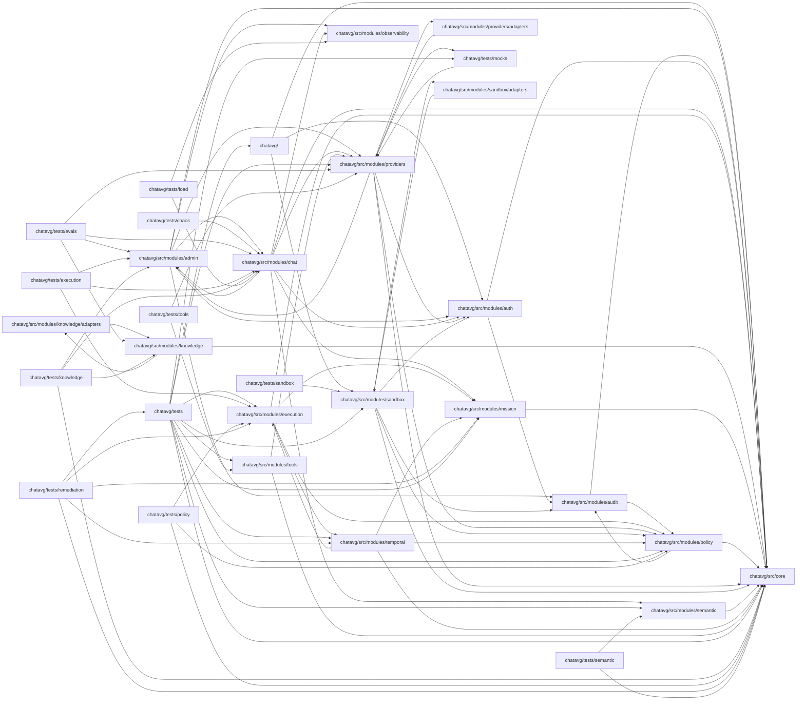

# 🗺️ PROJECT MAP — agsys
> Автоматически сгенерировано: `2026-05-08 01:39:36`
> Скрипт: `node dev_studio/refresh.js`

## 📊 Telemetry / Context Health
| Metric | Value | Note |
|---|---|---|
| **Total Files** | `132` | Только JS/TS исходники |
| **Total Lines** | `14331` | Суммарно по проекту |
| **Project Weight** | `~117 448 tokens` | Оценка (4 символа/токен) |
| **Context Pressure** | `91.8%` | Нагрузка на окно 128k (Full Scan) |
| **Map Efficiency** | `~84%` | Экономия контекста через карту |

---

## Высокоуровневая архитектура
> Связи между основными модулями и папками



## Детальная карта компонентов
> Полный граф зависимостей всех файлов проекта

```mermaid
graph LR
  subgraph N0["chatavg"]
    N1["diagnose_mcp.js"]
    N2["reset_admin.js"]
    N3["server.js"]
    subgraph N4["src/config"]
      N5["env.ts"]
    end
    subgraph N6["src/core"]
      N7["config.js"]
      N8["crypto.js"]
      N9["errors.js"]
      N10["migrate.js"]
      N11["providers.config.js"]
      N12["sqlite.js"]
      N13["utils.js"]
    end
    subgraph N14["src/modules/admin"]
      N15["admin.routes.js"]
      N16["category.repository.js"]
    end
    subgraph N17["src/modules/audit"]
      N18["audit.service.js"]
    end
    subgraph N19["src/modules/auth"]
      N20["auth.middleware.js"]
      N21["auth.routes.js"]
      N22["user.repository.js"]
      N23["users.routes.js"]
    end
    subgraph N24["src/modules/chat"]
      N25["chat.controller.js"]
      N26["chat.routes.js"]
      N27["chat.service.js"]
      N28["chat_completion.mapper.js"]
      N29["fallbackPolicy.js"]
      N30["fast_chat.service.js"]
      N31["mission_binding.service.js"]
      N32["model.gateway.js"]
      N33["policyRouter.js"]
      N34["session.repository.js"]
      N35["sessions.routes.js"]
    end
    subgraph N36["src/modules/execution"]
      N37["artifact.service.js"]
      N38["cost.service.js"]
      N39["execution.routes.js"]
      N40["mission.service.js"]
      N41["role_pass.js"]
      N42["run.repository.js"]
      N43["run.service.js"]
    end
    subgraph N44["src/modules/knowledge/adapters"]
      N45["sqlite_fts.adapter.js"]
    end
    subgraph N46["src/modules/knowledge"]
      N47["ingestion.service.js"]
      N48["knowledge.cache.js"]
      N49["knowledge.gateway.js"]
      N50["knowledge.repository.js"]
      N51["knowledge.router.js"]
      N52["knowledge.types.js"]
    end
    subgraph N53["src/modules/mission"]
      N54["mission.repository.js"]
      N55["mission.routes.js"]
    end
    subgraph N56["src/modules/observability"]
      N57["trace.bus.js"]
    end
    subgraph N58["src/modules/policy"]
      N59["approval.service.js"]
      N60["cost.service.js"]
      N61["policy.engine.js"]
      N62["policy.guard.js"]
      N63["redaction.service.js"]
    end
    subgraph N64["src/modules/providers/adapters"]
      N65["deepseek.js"]
      N66["google.js"]
      N67["grok.js"]
      N68["grok_responses.js"]
      N69["llamacpp.js"]
      N70["mcp.js"]
      N71["openai.js"]
      N72["openai_compat.js"]
      N73["openai_responses.js"]
      N74["openai_responses_compat.js"]
      N75["qwen.js"]
    end
    subgraph N76["src/modules/providers"]
      N77["base.provider.js"]
      N78["provider.factory.js"]
      N79["providerErrors.js"]
      N80["providerEvents.js"]
      N81["providers.routes.js"]
    end
    subgraph N82["src/modules/sandbox/adapters"]
      N83["e2b.adapter.js"]
      N84["local.adapter.js"]
    end
    subgraph N85["src/modules/sandbox"]
      N86["egress.policy.js"]
      N87["sandbox.manager.js"]
      N88["sandbox.routes.js"]
      N89["sandbox.types.js"]
      N90["sandbox.utils.js"]
    end
    subgraph N91["src/modules/semantic"]
      N92["claim.extractor.js"]
      N93["claim.ledger.js"]
      N94["domain.boundary.js"]
      N95["semantic.events.js"]
      N96["semantic.protocol.js"]
      N97["semantic.repository.js"]
    end
    subgraph N98["src/modules/temporal"]
      N99["activities.js"]
      N100["client.js"]
      N101["durable.interface.js"]
      N102["worker.js"]
      N103["workflows.js"]
    end
    subgraph N104["src/modules/tools"]
      N105["tool.gateway.js"]
      N106["tool.registry.js"]
    end
    subgraph N107["src/providers"]
      N108["base.ts"]
      N109["openai-responses.provider.ts"]
    end
    subgraph N110["src/types"]
      N111["chat.ts"]
    end
    subgraph N112["tests"]
      N113["agent_run.test.js"]
      N114["agent_run_durability.test.js"]
      N115["agent_run_routes.test.js"]
      N116["api.test.js"]
      N117["baseline_security.test.js"]
      N118["contract_canonical_event.test.js"]
      N119["deterministic_provider.test.js"]
      N120["e2e_mvp_gate.test.js"]
      N121["errors.test.js"]
      N122["fast_path_guardrail.test.js"]
      N123["health.test.js"]
      N124["latency_baseline.test.js"]
      N125["provider_events.test.js"]
      N126["security.test.js"]
      N127["security_assertions.test.js"]
      N128["security_red_team.test.js"]
      N129["setup_fixtures.js"]
      N130["signal.js"]
      N131["sprint_r6_verification.test.js"]
    end
    subgraph N132["tests/chaos"]
      N133["chaos.test.js"]
    end
    subgraph N134["tests/evals"]
      N135["rag.eval.js"]
    end
    subgraph N136["tests/execution"]
      N137["mission_artifacts.test.js"]
    end
    subgraph N138["tests/knowledge"]
      N139["knowledge_gateway.test.js"]
      N140["knowledge_mvp.test.js"]
      N141["performance.test.js"]
      N142["rag_integration.test.js"]
    end
    subgraph N143["tests/load"]
      N144["load_harness.test.js"]
    end
    subgraph N145["tests/mocks"]
      N146["deterministic_provider.js"]
    end
    subgraph N147["tests/policy"]
      N148["approval.service.test.js"]
      N149["cost.service.test.js"]
      N150["policy.engine.test.js"]
      N151["redaction.service.test.js"]
    end
    subgraph N152["tests/remediation"]
      N153["production_safety.test.js"]
      N154["temporal_v2_3.test.js"]
    end
    subgraph N155["tests/sandbox"]
      N156["sandbox_manager.test.js"]
    end
    subgraph N157["tests/semantic"]
      N158["claim_extraction.test.js"]
      N159["domain_boundary.test.js"]
      N160["expand_golden_set.js"]
      N161["semantic.eval.js"]
      N162["semantic_v2.test.js"]
    end
    subgraph N163["tests/tools"]
      N164["tool_gateway.test.js"]
    end
  end
  subgraph N165["mcp_gateway"]
    N166["server.js"]
  end
  N2 --> N12
  N3 --> N7
  N3 --> N9
  N3 --> N12
  N3 --> N20
  N3 --> N88
  N8 --> N7
  N10 --> N12
  N10 --> N7
  N11 --> N7
  N12 --> N7
  N15 --> N20
  N15 --> N9
  N15 --> N13
  N15 --> N22
  N15 --> N16
  N15 --> N34
  N15 --> N78
  N15 --> N18
  N15 --> N8
  N15 --> N7
  N15 --> N11
  N15 --> N12
  N15 --> N57
  N16 --> N12
  N16 --> N8
  N18 --> N12
  N18 --> N63
  N20 --> N7
  N20 --> N22
  N20 --> N9
  N21 --> N20
  N21 --> N22
  N21 --> N9
  N21 --> N18
  N22 --> N12
  N23 --> N22
  N23 --> N20
  N23 --> N9
  N25 --> N16
  N25 --> N27
  N25 --> N30
  N25 --> N31
  N25 --> N7
  N26 --> N20
  N26 --> N9
  N26 --> N25
  N27 --> N16
  N27 --> N33
  N27 --> N32
  N27 --> N28
  N27 --> N31
  N27 --> N11
  N27 --> N7
  N27 --> N13
  N27 --> N57
  N27 --> N96
  N28 --> N13
  N28 --> N7
  N29 --> N79
  N30 --> N32
  N30 --> N28
  N30 --> N33
  N30 --> N13
  N30 --> N11
  N31 --> N54
  N32 --> N78
  N32 --> N11
  N32 --> N7
  N32 --> N13
  N32 --> N29
  N32 --> N57
  N32 --> N80
  N33 --> N78
  N34 --> N12
  N35 --> N20
  N35 --> N9
  N35 --> N34
  N37 --> N41
  N39 --> N43
  N39 --> N7
  N39 --> N62
  N39 --> N42
  N42 --> N12
  N43 --> N42
  N43 --> N54
  N43 --> N100
  N43 --> N7
  N45 --> N50
  N47 --> N50
  N49 --> N51
  N49 --> N52
  N49 --> N48
  N49 --> N7
  N49 --> N45
  N50 --> N12
  N54 --> N12
  N55 --> N54
  N59 --> N12
  N60 --> N12
  N61 --> N63
  N62 --> N61
  N62 --> N18
  N65 --> N72
  N66 --> N77
  N66 --> N80
  N66 --> N79
  N67 --> N72
  N68 --> N74
  N69 --> N77
  N69 --> N80
  N69 --> N79
  N70 --> N77
  N70 --> N80
  N70 --> N79
  N71 --> N72
  N72 --> N77
  N72 --> N80
  N72 --> N79
  N73 --> N74
  N74 --> N77
  N74 --> N80
  N74 --> N79
  N75 --> N72
  N78 --> N11
  N78 --> N69
  N78 --> N71
  N78 --> N73
  N78 --> N65
  N78 --> N66
  N78 --> N75
  N78 --> N67
  N78 --> N68
  N78 --> N70
  N78 --> N146
  N81 --> N20
  N81 --> N78
  N81 --> N62
  N81 --> N16
  N81 --> N11
  N83 --> N89
  N84 --> N89
  N87 --> N86
  N87 --> N83
  N87 --> N84
  N87 --> N90
  N88 --> N20
  N88 --> N9
  N88 --> N7
  N88 --> N87
  N88 --> N18
  N88 --> N62
  N93 --> N97
  N93 --> N12
  N94 --> N92
  N94 --> N95
  N96 --> N92
  N96 --> N94
  N96 --> N93
  N96 --> N95
  N96 --> N97
  N97 --> N12
  N99 --> N42
  N99 --> N54
  N99 --> N59
  N100 --> N7
  N100 --> N101
  N102 --> N7
  N102 --> N99
  N105 --> N79
  N105 --> N106
  N105 --> N12
  N113 --> N3
  N113 --> N12
  N113 --> N100
  N114 --> N3
  N114 --> N12
  N114 --> N42
  N114 --> N43
  N115 --> N3
  N115 --> N12
  N116 --> N3
  N116 --> N12
  N117 --> N3
  N117 --> N12
  N133 --> N27
  N133 --> N29
  N118 --> N146
  N118 --> N80
  N119 --> N146
  N120 --> N3
  N120 --> N12
  N120 --> N59
  N120 --> N92
  N120 --> N94
  N121 --> N9
  N135 --> N27
  N135 --> N49
  N135 --> N16
  N135 --> N78
  N137 --> N41
  N137 --> N37
  N137 --> N40
  N137 --> N27
  N137 --> N16
  N123 --> N3
  N123 --> N12
  N139 --> N49
  N139 --> N51
  N139 --> N52
  N140 --> N49
  N140 --> N47
  N140 --> N50
  N140 --> N12
  N141 --> N49
  N141 --> N48
  N142 --> N27
  N142 --> N49
  N142 --> N16
  N124 --> N146
  N144 --> N27
  N144 --> N29
  N144 --> N57
  N146 --> N77
  N146 --> N80
  N148 --> N59
  N148 --> N12
  N149 --> N38
  N150 --> N61
  N151 --> N63
  N125 --> N80
  N154 --> N100
  N154 --> N99
  N154 --> N12
  N154 --> N42
  N154 --> N54
  N154 --> N129
  N156 --> N87
  N156 --> N89
  N156 --> N86
  N156 --> N90
  N126 --> N13
  N126 --> N3
  N126 --> N12
  N127 --> N13
  N128 --> N86
  N128 --> N105
  N128 --> N106
  N128 --> N54
  N128 --> N12
  N158 --> N92
  N159 --> N94
  N159 --> N92
  N159 --> N96
  N159 --> N12
  N161 --> N96
  N161 --> N92
  N161 --> N12
  N161 --> N94
  N162 --> N96
  N162 --> N97
  N162 --> N12
  N162 --> N94
  N129 --> N12
  N130 --> N100
  N131 --> N61
  N131 --> N105
  N131 --> N106
  N131 --> N59
  N131 --> N60
  N131 --> N12
  N164 --> N106
  N164 --> N105
  N164 --> N79
```



## Компонент: `chatavg`

| Файл | Строк | Размер | Описание |
|---|---|---|---|
| `diagnose_mcp.js` | 38 | 1.1 KB | — |
| `reset_admin.js` | 22 | 0.6 KB | Admin Reset Utility (SQLite) |
| `server.js` | 163 | 5.7 KB | Chat AVG Gateway — Entry Point |
| `src/config/env.ts` | 47 | 1.7 KB | — |
| `src/core/config.js` | 175 | 6.1 KB | — |
| `src/core/crypto.js` | 78 | 1.9 KB | AES-256-GCM encryption/decryption service. |
| `src/core/errors.js` | 87 | 2.2 KB | Centralized Error Handling |
| `src/core/migrate.js` | 108 | 4.1 KB | Chat AVG — JSON to SQLite Migration Utility |
| `src/core/providers.config.js` | 129 | 4.7 KB | — |
| `src/core/sqlite.js` | 459 | 14.2 KB | — |
| `src/core/utils.js` | 91 | 2.5 KB | Helper Utilities |
| `src/modules/admin/admin.routes.js` | 386 | 14.2 KB | — |
| `src/modules/admin/category.repository.js` | 74 | 3.0 KB | Класс: CategoryRepository |
| `src/modules/audit/audit.service.js` | 88 | 3.0 KB | Log an action to the audit log. |
| `src/modules/auth/auth.middleware.js` | 78 | 2.4 KB | Authentication — JWT middleware & helpers |
| `src/modules/auth/auth.routes.js` | 67 | 2.3 KB | Routes: Authentication |
| `src/modules/auth/user.repository.js` | 70 | 2.5 KB | Класс: UserRepository |
| `src/modules/auth/users.routes.js` | 49 | 1.4 KB | Routes: User Profile |
| `src/modules/chat/chat.controller.js` | 160 | 5.2 KB | Класс: ChatController |
| `src/modules/chat/chat.routes.js` | 58 | 2.4 KB | Routes: Chat Completions |
| `src/modules/chat/chat.service.js` | 326 | 11.5 KB | Класс: ChatService |
| `src/modules/chat/chat_completion.mapper.js` | 101 | 3.4 KB | Prepares messages for the LLM by adding system prompts and covenants. |
| `src/modules/chat/fallbackPolicy.js` | 49 | 1.6 KB | Класс: FallbackPolicy |
| `src/modules/chat/fast_chat.service.js` | 49 | 1.5 KB | Optimized path for simple chat completions. |
| `src/modules/chat/mission_binding.service.js` | 76 | 2.4 KB | Ensures a mission exists for the given ID or creates a new one. |
| `src/modules/chat/model.gateway.js` | 160 | 5.7 KB | Main entry point for LLM orchestration. |
| `src/modules/chat/policyRouter.js` | 39 | 1.1 KB | Класс: PolicyRouter |
| `src/modules/chat/session.repository.js` | 59 | 1.7 KB | Класс: SessionRepository |
| `src/modules/chat/sessions.routes.js` | 105 | 3.3 KB | Routes: Sessions CRUD |
| `src/modules/execution/artifact.service.js` | 85 | 1.9 KB | ArtifactService — manages versioned artifacts and patches. |
| `src/modules/execution/cost.service.js` | 36 | 1.0 KB | Calculate cost for a model call. |
| `src/modules/execution/execution.routes.js` | 123 | 3.4 KB | POST /api/runs |
| `src/modules/execution/mission.service.js` | 66 | 1.5 KB | MissionService — tracks goals, distinctions, and conflicts. |
| `src/modules/execution/role_pass.js` | 82 | 1.7 KB | RolePass — capability-based authorization system. |
| `src/modules/execution/run.repository.js` | 146 | 4.3 KB | Класс: AgentRunRepository |
| `src/modules/execution/run.service.js` | 140 | 4.1 KB | Класс: AgentRunService |
| `src/modules/knowledge/adapters/sqlite_fts.adapter.js` | 28 | 0.7 KB | Search for relevant chunks. |
| `src/modules/knowledge/ingestion.service.js` | 117 | 3.1 KB | Ingests a file or directory. |
| `src/modules/knowledge/knowledge.cache.js` | 68 | 1.3 KB | KnowledgeCache — simple in-memory cache for RetrievalResults. |
| `src/modules/knowledge/knowledge.gateway.js` | 163 | 5.0 KB | Main retrieval entry point. |
| `src/modules/knowledge/knowledge.repository.js` | 112 | 2.9 KB | Sources |
| `src/modules/knowledge/knowledge.router.js` | 74 | 2.1 KB | KnowledgeRouter |
| `src/modules/knowledge/knowledge.types.js` | 55 | 1.6 KB | Canonical types for the Knowledge Module. |
| `src/modules/mission/mission.repository.js` | 92 | 2.9 KB | Класс: MissionRepository |
| `src/modules/mission/mission.routes.js` | 85 | 2.1 KB | POST /api/missions |
| `src/modules/observability/trace.bus.js` | 47 | 1.0 KB | Emit a trace event. |
| `src/modules/policy/approval.service.js` | 102 | 2.9 KB | Creates an approval request with enriched metadata for the preview. |
| `src/modules/policy/cost.service.js` | 83 | 2.3 KB | Records a cost event in the database. |
| `src/modules/policy/policy.engine.js` | 128 | 4.5 KB | Evaluates an action and returns a PolicyDecision. |
| `src/modules/policy/policy.guard.js` | 68 | 2.0 KB | PolicyGuard middleware. |
| `src/modules/policy/redaction.service.js` | 33 | 1.1 KB | Redacts sensitive information from a string or object payload. |
| `src/modules/providers/adapters/deepseek.js` | 19 | 0.4 KB | Provider: DeepSeek |
| `src/modules/providers/adapters/google.js` | 125 | 4.0 KB | Класс: GoogleProvider |
| `src/modules/providers/adapters/grok.js` | 238 | 8.6 KB | Provider: Grok (xAI) |
| `src/modules/providers/adapters/grok_responses.js` | 21 | 0.5 KB | Provider: Grok Responses API (xAI) |
| `src/modules/providers/adapters/llamacpp.js` | 156 | 5.1 KB | Класс: LlamaCppProvider |
| `src/modules/providers/adapters/mcp.js` | 156 | 4.9 KB | Класс: MCPProvider |
| `src/modules/providers/adapters/openai.js` | 22 | 0.5 KB | Provider: OpenAI |
| `src/modules/providers/adapters/openai_compat.js` | 144 | 4.6 KB | Класс: OpenAICompatProvider |
| `src/modules/providers/adapters/openai_responses.js` | 23 | 0.6 KB | Provider: OpenAI Responses API |
| `src/modules/providers/adapters/openai_responses_compat.js` | 176 | 5.7 KB | Класс: OpenAIResponsesProvider |
| `src/modules/providers/adapters/qwen.js` | 20 | 0.5 KB | Provider: Qwen (Alibaba Cloud / DashScope) |
| `src/modules/providers/base.provider.js` | 110 | 3.5 KB | Класс: BaseProvider |
| `src/modules/providers/provider.factory.js` | 62 | 1.7 KB | — |
| `src/modules/providers/providerErrors.js` | 13 | 0.3 KB | Класс: ProviderError |
| `src/modules/providers/providerEvents.js` | 27 | 0.9 KB | — |
| `src/modules/providers/providers.routes.js` | 104 | 3.2 KB | — |
| `src/modules/sandbox/adapters/e2b.adapter.js` | 130 | 4.0 KB | E2BAdapter — primary sandbox adapter backed by E2B (e2b.dev). |
| `src/modules/sandbox/adapters/local.adapter.js` | 73 | 2.1 KB | LocalAdapter — dev/fallback sandbox adapter using Node.js child_process. |
| `src/modules/sandbox/egress.policy.js` | 112 | 4.0 KB | EgressPolicy — default-deny outbound traffic control for sandboxes. |
| `src/modules/sandbox/sandbox.manager.js` | 346 | 11.8 KB | SandboxManager — orchestrates sandbox lifecycle for high-risk agent actions. |
| `src/modules/sandbox/sandbox.routes.js` | 156 | 4.8 KB | Routes: Sandbox / Forge API |
| `src/modules/sandbox/sandbox.types.js` | 126 | 3.3 KB | Canonical types for the Sandbox / Forge module. |
| `src/modules/sandbox/sandbox.utils.js` | 66 | 2.0 KB | Scans artifacts for suspicious content and applies size limits. |
| `src/modules/semantic/claim.extractor.js` | 200 | 6.9 KB | ClaimExtractor — pipeline извлечения утверждений из текста. |
| `src/modules/semantic/claim.ledger.js` | 95 | 2.6 KB | ClaimLedger — реестр всех извлечённых claims per session. |
| `src/modules/semantic/domain.boundary.js` | 250 | 10.4 KB | DomainBoundary — детектор границ области определения и strength downgrade engine. |
| `src/modules/semantic/semantic.events.js` | 53 | 2.1 KB | Semantic Events — канонические типы событий семантического слоя. |
| `src/modules/semantic/semantic.protocol.js` | 121 | 3.7 KB | Основной pipeline: извлечь claims → проверить boundaries → сохранить в ledger. |
| `src/modules/semantic/semantic.repository.js` | 172 | 5.0 KB | SemanticRepository — персистенция для ClaimLedger и SemanticProtocol. |
| `src/modules/temporal/activities.js` | 131 | 3.6 KB | — |
| `src/modules/temporal/client.js` | 89 | 2.4 KB | Класс: TemporalAdapter |
| `src/modules/temporal/durable.interface.js` | 52 | 1.4 KB | DurableRuntime Interface Specification (v2.3) |
| `src/modules/temporal/worker.js` | 23 | 0.6 KB | — |
| `src/modules/temporal/workflows.js` | 201 | 5.5 KB | — |
| `src/modules/tools/tool.gateway.js` | 161 | 5.4 KB | ToolCall states for the state machine. |
| `src/modules/tools/tool.registry.js` | 106 | 2.4 KB | Risk classes for Tool executions. |
| `src/providers/base.ts` | 95 | 2.3 KB | — |
| `src/providers/openai-responses.provider.ts` | 128 | 4.1 KB | — |
| `src/types/chat.ts` | 37 | 0.7 KB | — |
| `tests/agent_run.test.js` | 140 | 4.1 KB | — |
| `tests/agent_run_durability.test.js` | 142 | 5.3 KB | — |
| `tests/agent_run_routes.test.js` | 104 | 3.5 KB | — |
| `tests/api.test.js` | 169 | 5.2 KB | — |
| `tests/baseline_security.test.js` | 52 | 2.0 KB | — |
| `tests/chaos/chaos.test.js` | 58 | 2.1 KB | — |
| `tests/contract_canonical_event.test.js` | 164 | 5.9 KB | Contract tests for AsyncIterable semantics of provider adapters. |
| `tests/deterministic_provider.test.js` | 89 | 3.0 KB | — |
| `tests/e2e_mvp_gate.test.js` | 136 | 4.3 KB | — |
| `tests/errors.test.js` | 53 | 1.8 KB | — |
| `tests/evals/rag.eval.js` | 139 | 4.7 KB | Класс: RAGEvalRunner |
| `tests/execution/mission_artifacts.test.js` | 75 | 3.0 KB | — |
| `tests/fast_path_guardrail.test.js` | 131 | 4.7 KB | Fast Path Guardrail Tests |
| `tests/health.test.js` | 50 | 1.4 KB | — |
| `tests/knowledge/knowledge_gateway.test.js` | 72 | 2.7 KB | — |
| `tests/knowledge/knowledge_mvp.test.js` | 82 | 2.9 KB | — |
| `tests/knowledge/performance.test.js` | 53 | 2.1 KB | — |
| `tests/knowledge/rag_integration.test.js` | 70 | 2.3 KB | — |
| `tests/latency_baseline.test.js` | 138 | 5.0 KB | Latency Measurement Utility |
| `tests/load/load_harness.test.js` | 54 | 1.7 KB | — |
| `tests/mocks/deterministic_provider.js` | 79 | 2.7 KB | DeterministicProvider — синтетический провайдер для тестов. |
| `tests/policy/approval.service.test.js` | 45 | 1.9 KB | — |
| `tests/policy/cost.service.test.js` | 16 | 0.5 KB | — |
| `tests/policy/policy.engine.test.js` | 33 | 1.5 KB | — |
| `tests/policy/redaction.service.test.js` | 29 | 1.0 KB | — |
| `tests/provider_events.test.js` | 60 | 2.0 KB | — |
| `tests/remediation/production_safety.test.js` | 99 | 3.9 KB | These tests verify the "Production Safety Hardening" requirements. |
| `tests/remediation/temporal_v2_3.test.js` | 118 | 4.1 KB | — |
| `tests/sandbox/sandbox_manager.test.js` | 384 | 13.5 KB | SandboxManager Integration Tests |
| `tests/security.test.js` | 43 | 1.7 KB | — |
| `tests/security_assertions.test.js` | 187 | 6.0 KB | CORS, SSRF, JSON Limit, and Prompt Sanitization assertion tests. |
| `tests/security_red_team.test.js` | 105 | 4.1 KB | Red-Team Security Suite for Sprint 17 Release Candidate. |
| `tests/semantic/claim_extraction.test.js` | 113 | 5.3 KB | Tests: ClaimExtractor — извлечение утверждений из текста. |
| `tests/semantic/domain_boundary.test.js` | 159 | 7.1 KB | Tests: DomainBoundary — проверка границ и strength downgrade. |
| `tests/semantic/expand_golden_set.js` | 355 | 12.1 KB | — |
| `tests/semantic/semantic.eval.js` | 173 | 6.1 KB | Semantic Eval Runner v0.2 — запуск golden set тестов. |
| `tests/semantic/semantic_v2.test.js` | 97 | 4.9 KB | — |
| `tests/setup_fixtures.js` | 104 | 3.3 KB | — |
| `tests/signal.js` | 18 | 0.5 KB | — |
| `tests/sprint_r6_verification.test.js` | 116 | 4.2 KB | — |
| `tests/tools/tool_gateway.test.js` | 101 | 3.5 KB | — |

### `server.js`
- **Экспорт**: `{ app, server }`, `app`, `server`
- **Роуты**:
  - `USE /api/auth`
  - `USE /api/users`
  - `USE /api/admin`
  - `USE /api/sessions`
  - `USE /api/chat`
  - `USE /api/providers`
  - `USE /api/missions`
  - `USE /api/runs`
  - `USE /api/sandboxes`
  - `GET /health`
  - `GET /ready`
  - `USE /api`
  - `GET *`
- **Зависимости**:
  - `./src/core/config` → PORT, WEBUI_DIR, allowedOrigins, isDev
  - `./src/core/errors` → errorHandler, AppError
  - `./src/core/sqlite` → (side-effect)
  - `./src/modules/auth/auth.middleware` → authenticate
  - `./src/modules/sandbox/sandbox.routes` → router: sandboxRouter
  - `./src/core/sqlite` → (side-effect)

### `src/config/env.ts`
- **Экспорт**: `env`, `config`
- **Зависимости**:

### `src/core/config.js`
- **Экспорт**: `{`
- **Зависимости**:

### `src/core/crypto.js`
- **Экспорт**: `{`
- **Зависимости**:
  - `./config` → SECRET

### `src/core/errors.js`
- **Класс**: `AppError` extends `Error`
- **Класс**: `AuthError` extends `AppError`
- **Класс**: `ValidationError` extends `AppError`
- **Класс**: `NotFoundError` extends `AppError`
- **Экспорт**: `{`
- **Зависимости**:

### `src/core/migrate.js`
- **Экспорт**: `migrate`
- **Зависимости**:
  - `./sqlite` → db
  - `./config` → USERS_FILE, CATEGORIES_FILE, SESSIONS_ROOT

### `src/core/providers.config.js`
- **Экспорт**: `providersConfig`
- **Зависимости**:
  - `./config` → providerEnv

### `src/core/sqlite.js`
- **Экспорт**: `db`
- **Зависимости**:
  - `./config` → DATA_DIR
  - `./config` → DEFAULT_CATEGORY_PARAMS, DEFAULT_SYSTEM_PROMPT

### `src/core/utils.js`
- **Экспорт**: `{`

### `src/modules/admin/admin.routes.js`
- **Экспорт**: `router`
- **Роуты**:
  - `GET /users`
  - `POST /users/:username`
  - `DELETE /users/:username`
  - `GET /categories`
  - `POST /categories/:category_name`
  - `DELETE /categories/:category_name`
  - `POST /categories/:category_name/test`
  - `GET /stats`
  - `GET /audit`
  - `GET /dashboard/mvp`
- **Зависимости**:
  - `../auth/auth.middleware` → authenticate, requireAdmin
  - `../../core/errors` → asyncHandler
  - `../../core/utils` → assertSafeIdentifier, mergeFields, validateProviderUrl
  - `../auth/user.repository` → userRepository
  - `./category.repository` → categoryRepository
  - `../chat/session.repository` → sessionRepository
  - `../providers/provider.factory` → getProvider
  - `../audit/audit.service` → AuditService
  - `../../core/crypto` → crypto
  - `../../core/config` → TEST_TIMEOUT
  - `../../core/providers.config` → providersConfig
  - `../../core/sqlite` → db
  - `../observability/trace.bus` → traceBus
  - `../../core/config` → FEATURE_FLAGS

### `src/modules/admin/category.repository.js`
- **Класс**: `CategoryRepository`
- **Экспорт**: `new CategoryRepository()`
- **Зависимости**:
  - `../../core/sqlite` → db
  - `../../core/crypto` → crypto

### `src/modules/audit/audit.service.js`
- **Класс**: `AuditService`
- **Экспорт**: `AuditService`
- **Зависимости**:
  - `../../core/sqlite` → db
  - `../policy/redaction.service` → RedactionService

### `src/modules/auth/auth.middleware.js`
- **Экспорт**: `{ authenticate, requireAdmin, signToken, isExpired }`, `authenticate`, `requireAdmin`, `signToken`, `isExpired`
- **Зависимости**:
  - `../../core/config` → SECRET, TOKEN_EXPIRY
  - `./user.repository` → userRepository
  - `../../core/errors` → AppError, AuthError

### `src/modules/auth/auth.routes.js`
- **Экспорт**: `router`
- **Роуты**:
  - `POST /login`
- **Зависимости**:
  - `./auth.middleware` → signToken, isExpired
  - `./user.repository` → userRepository
  - `../../core/errors` → asyncHandler
  - `../audit/audit.service` → AuditService

### `src/modules/auth/user.repository.js`
- **Класс**: `UserRepository`
- **Экспорт**: `new UserRepository()`
- **Зависимости**:
  - `../../core/sqlite` → db

### `src/modules/auth/users.routes.js`
- **Экспорт**: `router`
- **Роуты**:
  - `GET /me`
  - `PATCH /me`
- **Зависимости**:
  - `./user.repository` → userRepository
  - `./auth.middleware` → authenticate
  - `../../core/errors` → asyncHandler

### `src/modules/chat/chat.controller.js`
- **Класс**: `ChatController`
- **Экспорт**: `new ChatController()`
- **Зависимости**:
  - `../admin/category.repository` → categoryRepository
  - `./chat.service` → chatService
  - `./fast_chat.service` → fastChatService
  - `./mission_binding.service` → missionBinding
  - `../../core/config` → AGENT_RUNS_ENABLED

### `src/modules/chat/chat.routes.js`
- **Экспорт**: `router`
- **Роуты**:
  - `POST /completions`
- **Зависимости**:
  - `../auth/auth.middleware` → authenticate
  - `../../core/errors` → asyncHandler
  - `./chat.controller` → chatController

### `src/modules/chat/chat.service.js`
- **Класс**: `ChatService`
- **Экспорт**: `new ChatService()`
- **Зависимости**:
  - `../admin/category.repository` → categoryRepository
  - `./policyRouter` → policyRouter
  - `./model.gateway` → modelGateway
  - `./chat_completion.mapper` → mapper
  - `./mission_binding.service` → missionBinding
  - `../../core/providers.config` → providersConfig
  - `../../core/config` → PROVIDER_TIMEOUT, SEMANTIC_LAYER_ENABLED, AGENT_RUNS_ENABLED, KNOWLEDGE_GATEWAY_ENABLED
  - `../../core/utils` → validateProviderUrl
  - `../observability/trace.bus` → traceBus
  - `../semantic/semantic.protocol` → SemanticProtocol

### `src/modules/chat/chat_completion.mapper.js`
- **Класс**: `ChatCompletionMapper`
- **Экспорт**: `new ChatCompletionMapper()`
- **Зависимости**:
  - `../../core/utils` → sanitizePromptText
  - `../../core/config` → ALLOWED_EXTRA_PARAMS

### `src/modules/chat/fallbackPolicy.js`
- **Класс**: `FallbackPolicy`
- **Экспорт**: `new FallbackPolicy()`
- **Зависимости**:
  - `../providers/providerErrors` → ProviderError

### `src/modules/chat/fast_chat.service.js`
- **Класс**: `FastChatService`
- **Экспорт**: `new FastChatService()`
- **Зависимости**:
  - `./model.gateway` → modelGateway
  - `./chat_completion.mapper` → mapper
  - `./policyRouter` → policyRouter
  - `../../core/utils` → validateProviderUrl
  - `../../core/providers.config` → providersConfig

### `src/modules/chat/mission_binding.service.js`
- **Класс**: `MissionBindingService`
- **Экспорт**: `new MissionBindingService()`
- **Зависимости**:
  - `../mission/mission.repository` → missionRepository

### `src/modules/chat/model.gateway.js`
- **Класс**: `ModelGateway`
- **Экспорт**: `new ModelGateway()`
- **Зависимости**:
  - `../providers/provider.factory` → getProvider, adapters
  - `../../core/providers.config` → providersConfig
  - `../../core/config` → PROVIDER_TIMEOUT
  - `../../core/utils` → validateProviderUrl
  - `./fallbackPolicy` → fallbackPolicy
  - `../observability/trace.bus` → traceBus
  - `../providers/providerEvents` → ProviderEvents

### `src/modules/chat/policyRouter.js`
- **Класс**: `PolicyRouter`
- **Экспорт**: `new PolicyRouter()`
- **Зависимости**:
  - `../providers/provider.factory` → getProvider

### `src/modules/chat/session.repository.js`
- **Класс**: `SessionRepository`
- **Экспорт**: `new SessionRepository()`
- **Зависимости**:
  - `../../core/sqlite` → db

### `src/modules/chat/sessions.routes.js`
- **Экспорт**: `router`
- **Роуты**:
  - `GET /`
  - `GET /:id`
  - `POST /`
  - `DELETE /:id`
  - `PATCH /:id`
- **Зависимости**:
  - `../auth/auth.middleware` → authenticate
  - `../../core/errors` → asyncHandler
  - `./session.repository` → sessionRepository

### `src/modules/execution/artifact.service.js`
- **Класс**: `ArtifactService`
- **Экспорт**: `new ArtifactService()`
- **Зависимости**:
  - `./role_pass` → roleRegistry

### `src/modules/execution/cost.service.js`
- **Класс**: `CostService`
- **Экспорт**: `{ CostService }`, `CostService`

### `src/modules/execution/execution.routes.js`
- **Экспорт**: `router`
- **Роуты**:
  - `POST /`
  - `GET /:id`
  - `POST /:id/cancel`
  - `GET /:id/events`
- **Зависимости**:
  - `./run.service` → runService
  - `../../core/config` → AGENT_RUNS_ENABLED
  - `../policy/policy.guard` → policyGuard
  - `./run.repository` → runRepository

### `src/modules/execution/mission.service.js`
- **Класс**: `MissionService`
- **Экспорт**: `new MissionService()`
- **Зависимости**:

### `src/modules/execution/role_pass.js`
- **Класс**: `RolePass`
- **Класс**: `RoleRegistry`
- **Экспорт**: `new RoleRegistry()`

### `src/modules/execution/run.repository.js`
- **Класс**: `AgentRunRepository`
- **Экспорт**: `new AgentRunRepository()`
- **Зависимости**:
  - `../../core/sqlite` → db

### `src/modules/execution/run.service.js`
- **Класс**: `AgentRunService` extends `EventEmitter`
- **Экспорт**: `new AgentRunService()`
- **Зависимости**:
  - `./run.repository` → runRepository
  - `../mission/mission.repository` → missionRepository
  - `../temporal/client` → temporalClient
  - `../../core/config` → TEMPORAL_RUNTIME_ENABLED

### `src/modules/knowledge/adapters/sqlite_fts.adapter.js`
- **Класс**: `SQLiteFTSRetriever`
- **Экспорт**: `SQLiteFTSRetriever`
- **Зависимости**:
  - `../knowledge.repository` → knowledgeRepository

### `src/modules/knowledge/ingestion.service.js`
- **Класс**: `IngestionService`
- **Экспорт**: `new IngestionService()`
- **Зависимости**:
  - `./knowledge.repository` → knowledgeRepository

### `src/modules/knowledge/knowledge.cache.js`
- **Класс**: `KnowledgeCache`
- **Экспорт**: `new KnowledgeCache()`

### `src/modules/knowledge/knowledge.gateway.js`
- **Класс**: `KnowledgeGateway`
- **Экспорт**: `new KnowledgeGateway()`
- **Зависимости**:
  - `./knowledge.router` → knowledgeRouter
  - `./knowledge.types` → RetrievalResult
  - `./knowledge.cache` → knowledgeCache
  - `../../core/config` → KNOWLEDGE_GATEWAY_ENABLED
  - `./adapters/sqlite_fts.adapter` → SQLiteFTSRetriever

### `src/modules/knowledge/knowledge.repository.js`
- **Класс**: `KnowledgeRepository`
- **Экспорт**: `new KnowledgeRepository()`
- **Зависимости**:
  - `../../core/sqlite` → db

### `src/modules/knowledge/knowledge.router.js`
- **Класс**: `KnowledgeRouter`
- **Экспорт**: `new KnowledgeRouter()`

### `src/modules/knowledge/knowledge.types.js`
- **Класс**: `RetrievalChunk`
- **Класс**: `RetrievalResult`
- **Экспорт**: `{`

### `src/modules/mission/mission.repository.js`
- **Класс**: `MissionRepository`
- **Экспорт**: `new MissionRepository()`
- **Зависимости**:
  - `../../core/sqlite` → db

### `src/modules/mission/mission.routes.js`
- **Экспорт**: `router`
- **Роуты**:
  - `POST /`
  - `GET /:id`
  - `GET /session/:sessionId`
  - `PATCH /:id`
- **Зависимости**:
  - `./mission.repository` → missionRepository

### `src/modules/observability/trace.bus.js`
- **Класс**: `TraceBus` extends `EventEmitter`
- **Экспорт**: `new TraceBus()`
- **Зависимости**:

### `src/modules/policy/approval.service.js`
- **Класс**: `ApprovalService`
- **Экспорт**: `{ ApprovalService }`, `ApprovalService`
- **Зависимости**:
  - `../../core/sqlite` → db

### `src/modules/policy/cost.service.js`
- **Класс**: `CostService`
- **Экспорт**: `{ CostService }`, `CostService`
- **Зависимости**:
  - `../../core/sqlite` → db

### `src/modules/policy/policy.engine.js`
- **Класс**: `PolicyEngine`
- **Экспорт**: `{ PolicyEngine, RiskClass }`, `PolicyEngine`, `RiskClass`
- **Зависимости**:
  - `./redaction.service` → RedactionService

### `src/modules/policy/policy.guard.js`
- **Экспорт**: `{ policyGuard }`, `policyGuard`
- **Зависимости**:
  - `./policy.engine` → PolicyEngine
  - `../audit/audit.service` → AuditService

### `src/modules/policy/redaction.service.js`
- **Класс**: `RedactionService`
- **Экспорт**: `{ RedactionService }`, `RedactionService`

### `src/modules/providers/adapters/deepseek.js`
- **Экспорт**: `createProvider({`
- **Зависимости**:
  - `./openai_compat` → createProvider

### `src/modules/providers/adapters/google.js`
- **Класс**: `GoogleProvider` extends `BaseProvider`
- **Экспорт**: `new GoogleProvider()`
- **Зависимости**:
  - `../base.provider` → BaseProvider
  - `./../providerEvents` → ProviderEvents
  - `./../providerErrors` → ProviderError

### `src/modules/providers/adapters/grok.js`
- **Класс**: `GrokProvider` extends `OpenAICompatProvider`
- **Экспорт**: `new GrokProvider({`
- **Зависимости**:
  - `./openai_compat` → OpenAICompatProvider

### `src/modules/providers/adapters/grok_responses.js`
- **Экспорт**: `createResponsesProvider({`
- **Зависимости**:
  - `./openai_responses_compat` → createResponsesProvider

### `src/modules/providers/adapters/llamacpp.js`
- **Класс**: `LlamaCppProvider` extends `BaseProvider`
- **Экспорт**: `new LlamaCppProvider()`
- **Зависимости**:
  - `../base.provider` → BaseProvider
  - `./../providerEvents` → ProviderEvents
  - `./../providerErrors` → ProviderError

### `src/modules/providers/adapters/mcp.js`
- **Класс**: `MCPProvider` extends `BaseProvider`
- **Экспорт**: `new MCPProvider({`
- **Зависимости**:
  - `../base.provider` → BaseProvider
  - `../providerEvents` → ProviderEvents
  - `../providerErrors` → ProviderError

### `src/modules/providers/adapters/openai.js`
- **Экспорт**: `createProvider({`
- **Зависимости**:
  - `./openai_compat` → createProvider

### `src/modules/providers/adapters/openai_compat.js`
- **Класс**: `OpenAICompatProvider` extends `BaseProvider`
- **Экспорт**: `{ OpenAICompatProvider, createProvider }`, `OpenAICompatProvider`, `createProvider`
- **Зависимости**:
  - `../base.provider` → BaseProvider
  - `./../providerEvents` → ProviderEvents
  - `./../providerErrors` → ProviderError

### `src/modules/providers/adapters/openai_responses.js`
- **Экспорт**: `createResponsesProvider({`
- **Зависимости**:
  - `./openai_responses_compat` → createResponsesProvider

### `src/modules/providers/adapters/openai_responses_compat.js`
- **Класс**: `OpenAIResponsesProvider` extends `BaseProvider`
- **Экспорт**: `{ OpenAIResponsesProvider, createResponsesProvider }`, `OpenAIResponsesProvider`, `createResponsesProvider`
- **Зависимости**:
  - `../base.provider` → BaseProvider
  - `./../providerEvents` → ProviderEvents
  - `./../providerErrors` → ProviderError

### `src/modules/providers/adapters/qwen.js`
- **Экспорт**: `createProvider({`
- **Зависимости**:
  - `./openai_compat` → createProvider

### `src/modules/providers/base.provider.js`
- **Класс**: `BaseProvider`
- **Экспорт**: `BaseProvider`

### `src/modules/providers/provider.factory.js`
- **Экспорт**: `{ getProvider, listProviders, adapters }`, `getProvider`, `listProviders`, `adapters`
- **Зависимости**:
  - `../../core/providers.config` → providersConfig
  - `./adapters/llamacpp` → (side-effect)
  - `./adapters/openai` → (side-effect)
  - `./adapters/openai_responses` → (side-effect)
  - `./adapters/deepseek` → (side-effect)
  - `./adapters/google` → (side-effect)
  - `./adapters/qwen` → (side-effect)
  - `./adapters/grok` → (side-effect)
  - `./adapters/grok_responses` → (side-effect)
  - `./adapters/mcp` → (side-effect)
  - `../../../tests/mocks/deterministic_provider` → DeterministicProvider

### `src/modules/providers/providerErrors.js`
- **Класс**: `ProviderError` extends `Error`
- **Экспорт**: `{ ProviderError }`, `ProviderError`

### `src/modules/providers/providerEvents.js`
- **Экспорт**: `ProviderEvents`

### `src/modules/providers/providers.routes.js`
- **Экспорт**: `router`
- **Роуты**:
  - `GET /`
  - `GET /health`
  - `GET /:id/models`
  - `GET /:id/health`
- **Зависимости**:
  - `../auth/auth.middleware` → authenticate
  - `./provider.factory` → listProviders
  - `../policy/policy.guard` → policyGuard
  - `../admin/category.repository` → categoryRepository
  - `./provider.factory` → getProvider
  - `../../core/providers.config` → providersConfig
  - `../../core/providers.config` → providersConfig
  - `../../core/providers.config` → providersConfig

### `src/modules/sandbox/adapters/e2b.adapter.js`
- **Класс**: `E2BAdapter`
- **Экспорт**: `{ E2BAdapter }`, `E2BAdapter`
- **Зависимости**:
  - `../sandbox.types` → SandboxState

### `src/modules/sandbox/adapters/local.adapter.js`
- **Класс**: `LocalAdapter`
- **Экспорт**: `{ LocalAdapter }`, `LocalAdapter`
- **Зависимости**:
  - `../sandbox.types` → SandboxState

### `src/modules/sandbox/egress.policy.js`
- **Класс**: `EgressPolicy`
- **Экспорт**: `{ EgressPolicy, PROVIDER_ENDPOINT_PATTERNS }`, `EgressPolicy`, `PROVIDER_ENDPOINT_PATTERNS`
- **Зависимости**:

### `src/modules/sandbox/sandbox.manager.js`
- **Класс**: `SandboxManager`
- **Экспорт**: `{ SandboxManager }`, `SandboxManager`
- **Зависимости**:
  - `./egress.policy` → EgressPolicy
  - `./adapters/e2b.adapter` → E2BAdapter
  - `./adapters/local.adapter` → LocalAdapter
  - `./sandbox.utils` → scanArtifacts, estimateCost, MAX_OUTPUT_BYTES

### `src/modules/sandbox/sandbox.routes.js`
- **Экспорт**: `{ router, sandboxManager }`, `router`, `sandboxManager`
- **Роуты**:
  - `POST /`
  - `GET /:sandboxId`
  - `POST /:sandboxId/run`
  - `POST /:sandboxId/snapshot`
  - `POST /:sandboxId/freeze`
  - `POST /:sandboxId/terminate`
  - `POST /:sandboxId/quarantine`
  - `DELETE /:sandboxId`
- **Зависимости**:
  - `../auth/auth.middleware` → authenticate
  - `../../core/errors` → asyncHandler
  - `../../core/config` → SANDBOX_FORGE_ENABLED
  - `./sandbox.manager` → SandboxManager
  - `../audit/audit.service` → AuditService
  - `../policy/policy.guard` → policyGuard

### `src/modules/sandbox/sandbox.types.js`
- **Экспорт**: `{`

### `src/modules/sandbox/sandbox.utils.js`
- **Экспорт**: `{`
- **Зависимости**:

### `src/modules/semantic/claim.extractor.js`
- **Класс**: `ClaimExtractor`
- **Экспорт**: `{ ClaimExtractor, STRENGTH_ORDER }`, `ClaimExtractor`, `STRENGTH_ORDER`
- **Зависимости**:

### `src/modules/semantic/claim.ledger.js`
- **Класс**: `ClaimLedger`
- **Экспорт**: `{ ClaimLedger }`, `ClaimLedger`
- **Зависимости**:
  - `./semantic.repository` → semanticRepository
  - `../../core/sqlite` → rows
  - `../../core/sqlite` → rows
  - `../../core/sqlite` → (side-effect)

### `src/modules/semantic/domain.boundary.js`
- **Класс**: `DomainBoundary`
- **Экспорт**: `{ DomainBoundary, DEFAULT_BOUNDARIES, REALITY_LEVELS, STRENGTH_POLICY }`, `DomainBoundary`, `DEFAULT_BOUNDARIES`, `REALITY_LEVELS`, `STRENGTH_POLICY`
- **Зависимости**:
  - `./claim.extractor` → ClaimExtractor
  - `./semantic.events` → SemanticEvents

### `src/modules/semantic/semantic.events.js`
- **Экспорт**: `SemanticEvents`

### `src/modules/semantic/semantic.protocol.js`
- **Класс**: `SemanticProtocol`
- **Экспорт**: `{ SemanticProtocol, PROTOCOL_VERSION }`, `SemanticProtocol`, `PROTOCOL_VERSION`
- **Зависимости**:
  - `./claim.extractor` → ClaimExtractor
  - `./domain.boundary` → DomainBoundary, REALITY_LEVELS, STRENGTH_POLICY
  - `./claim.ledger` → ClaimLedger
  - `./semantic.events` → SemanticEvents
  - `./semantic.repository` → semanticRepository

### `src/modules/semantic/semantic.repository.js`
- **Класс**: `SemanticRepository`
- **Экспорт**: `new SemanticRepository()`
- **Зависимости**:
  - `../../core/sqlite` → db

### `src/modules/temporal/activities.js`
- **Экспорт**: `{`
- **Зависимости**:
  - `../execution/run.repository` → runRepository
  - `../mission/mission.repository` → missionRepository
  - `../policy/approval.service` → ApprovalService

### `src/modules/temporal/client.js`
- **Класс**: `TemporalAdapter` extends `DurableRuntime`
- **Экспорт**: `new TemporalAdapter()`
- **Зависимости**:
  - `../../core/config` → TEMPORAL_URL
  - `./durable.interface` → DurableRuntime

### `src/modules/temporal/durable.interface.js`
- **Класс**: `DurableRuntime`
- **Экспорт**: `DurableRuntime`

### `src/modules/temporal/workflows.js`
- **Экспорт**: `{`
- **Зависимости**:

### `src/modules/tools/tool.gateway.js`
- **Класс**: `ToolCall`
- **Класс**: `ToolGateway`
- **Экспорт**: `{`
- **Зависимости**:
  - `../providers/providerErrors` → ProviderError
  - `./tool.registry` → isSideEffectRiskClass
  - `../../core/sqlite` → db

### `src/modules/tools/tool.registry.js`
- **Класс**: `ToolDefinitionVersion`
- **Класс**: `ToolRegistry`
- **Экспорт**: `{`
- **Зависимости**:

### `src/providers/openai-responses.provider.ts`
- **Экспорт**: `OpenAIResponsesProvider`
- **Зависимости**:
  - `./base.js` → BaseProvider, ProviderConfig, ChatEvent
  - `../types/chat.js` → ChatMessage

### `tests/evals/rag.eval.js`
- **Класс**: `RAGEvalRunner`
- **Экспорт**: `{ RAGEvalRunner }`, `RAGEvalRunner`
- **Зависимости**:
  - `../../src/modules/chat/chat.service` → chatService
  - `../../src/modules/knowledge/knowledge.gateway` → knowledgeGateway
  - `../../src/modules/admin/category.repository` → categoryRepository
  - `../../src/modules/providers/provider.factory` → adapters
  - `./rag_dataset.json` → ragDataset

### `tests/mocks/deterministic_provider.js`
- **Класс**: `DeterministicProvider` extends `BaseProvider`
- **Экспорт**: `{ DeterministicProvider }`, `DeterministicProvider`
- **Зависимости**:
  - `../../src/modules/providers/base.provider` → BaseProvider
  - `../../src/modules/providers/providerEvents` → ProviderEvents

### `tests/semantic/semantic.eval.js`
- **Класс**: `SemanticEvalRunner`
- **Экспорт**: `{ SemanticEvalRunner }`, `SemanticEvalRunner`
- **Зависимости**:
  - `../../src/modules/semantic/semantic.protocol` → SemanticProtocol
  - `../../src/modules/semantic/claim.extractor` → ClaimExtractor
  - `./golden_set.json` → goldenSet
  - `../../src/core/sqlite` → db
  - `../../src/modules/semantic/domain.boundary` → DEFAULT_BOUNDARIES

### `tests/setup_fixtures.js`
- **Экспорт**: `{ loadFixtures }`, `loadFixtures`
- **Зависимости**:
  - `../src/core/sqlite` → db

## Компонент: `mcp_gateway`

| Файл | Строк | Размер | Описание |
|---|---|---|---|
| `server.js` | 263 | 8.4 KB | — |

### `server.js`
- **Роуты**:
  - `GET /mcp`
  - `POST /mcp/message/:sessionId`
  - `GET /health`
- **Зависимости**:

## Переменные окружения

Переменные, используемые в коде:

| Переменная | Используется в |
|---|---|
| `ALLOW_CUSTOM_PROVIDER_URLS` | chatavg/utils.js |
| `CHATAVG_ADMIN_PASSWORD` | chatavg/sqlite.js |
| `CHATAVG_SECRET` | chatavg/agent_run.test.js, chatavg/agent_run_durability.test.js, chatavg/agent_run_routes.test.js, chatavg/api.test.js, chatavg/contract_canonical_event.test.js, chatavg/deterministic_provider.test.js, chatavg/e2e_mvp_gate.test.js, chatavg/errors.test.js, chatavg/fast_path_guardrail.test.js, chatavg/health.test.js, chatavg/knowledge_mvp.test.js, chatavg/latency_baseline.test.js, chatavg/provider_events.test.js, chatavg/security_assertions.test.js, chatavg/setup_fixtures.js |
| `DEBUG_PROVIDER_PAYLOADS` | chatavg/grok.js, chatavg/openai_compat.js |
| `E2B_API_KEY` | chatavg/e2b.adapter.js, chatavg/sandbox.manager.js, chatavg/production_safety.test.js |
| `E2B_TEMPLATE` | chatavg/sandbox.manager.js |
| `KNOWLEDGE_GATEWAY_ENABLED` | chatavg/knowledge_mvp.test.js |
| `NODE_ENV` | chatavg/server.js, chatavg/errors.js, chatavg/sqlite.js, chatavg/grok.js, chatavg/openai_compat.js, chatavg/provider.factory.js, chatavg/sandbox.manager.js, chatavg/agent_run.test.js, chatavg/agent_run_durability.test.js, chatavg/agent_run_routes.test.js, chatavg/api.test.js, chatavg/contract_canonical_event.test.js, chatavg/deterministic_provider.test.js, chatavg/e2e_mvp_gate.test.js, chatavg/errors.test.js, chatavg/fast_path_guardrail.test.js, chatavg/health.test.js, chatavg/knowledge_mvp.test.js, chatavg/latency_baseline.test.js, chatavg/provider_events.test.js, chatavg/production_safety.test.js, chatavg/security_assertions.test.js, chatavg/setup_fixtures.js |
| `PORT` | mcp_gateway/server.js |
| `SEMANTIC_LAYER_ENABLED` | chatavg/mission_artifacts.test.js |
| `SEMANTIC_LLM_EXTRACTOR_ENABLED` | chatavg/claim.extractor.js |

## API Реестр

Все обнаруженные HTTP-эндпоинты:

| Метод | Путь | Файл |
|---|---|---|
| `USE` | `/api/auth` | `chatavg/server.js` |
| `USE` | `/api/users` | `chatavg/server.js` |
| `USE` | `/api/admin` | `chatavg/server.js` |
| `USE` | `/api/sessions` | `chatavg/server.js` |
| `USE` | `/api/chat` | `chatavg/server.js` |
| `USE` | `/api/providers` | `chatavg/server.js` |
| `USE` | `/api/missions` | `chatavg/server.js` |
| `USE` | `/api/runs` | `chatavg/server.js` |
| `USE` | `/api/sandboxes` | `chatavg/server.js` |
| `GET` | `/health` | `chatavg/server.js` |
| `GET` | `/ready` | `chatavg/server.js` |
| `USE` | `/api` | `chatavg/server.js` |
| `GET` | `*` | `chatavg/server.js` |
| `GET` | `/users` | `chatavg/src/modules/admin/admin.routes.js` |
| `POST` | `/users/:username` | `chatavg/src/modules/admin/admin.routes.js` |
| `DELETE` | `/users/:username` | `chatavg/src/modules/admin/admin.routes.js` |
| `GET` | `/categories` | `chatavg/src/modules/admin/admin.routes.js` |
| `POST` | `/categories/:category_name` | `chatavg/src/modules/admin/admin.routes.js` |
| `DELETE` | `/categories/:category_name` | `chatavg/src/modules/admin/admin.routes.js` |
| `POST` | `/categories/:category_name/test` | `chatavg/src/modules/admin/admin.routes.js` |
| `GET` | `/stats` | `chatavg/src/modules/admin/admin.routes.js` |
| `GET` | `/audit` | `chatavg/src/modules/admin/admin.routes.js` |
| `GET` | `/dashboard/mvp` | `chatavg/src/modules/admin/admin.routes.js` |
| `POST` | `/login` | `chatavg/src/modules/auth/auth.routes.js` |
| `GET` | `/me` | `chatavg/src/modules/auth/users.routes.js` |
| `PATCH` | `/me` | `chatavg/src/modules/auth/users.routes.js` |
| `POST` | `/completions` | `chatavg/src/modules/chat/chat.routes.js` |
| `GET` | `/` | `chatavg/src/modules/chat/sessions.routes.js` |
| `GET` | `/:id` | `chatavg/src/modules/chat/sessions.routes.js` |
| `POST` | `/` | `chatavg/src/modules/chat/sessions.routes.js` |
| `DELETE` | `/:id` | `chatavg/src/modules/chat/sessions.routes.js` |
| `PATCH` | `/:id` | `chatavg/src/modules/chat/sessions.routes.js` |
| `POST` | `/` | `chatavg/src/modules/execution/execution.routes.js` |
| `GET` | `/:id` | `chatavg/src/modules/execution/execution.routes.js` |
| `POST` | `/:id/cancel` | `chatavg/src/modules/execution/execution.routes.js` |
| `GET` | `/:id/events` | `chatavg/src/modules/execution/execution.routes.js` |
| `POST` | `/` | `chatavg/src/modules/mission/mission.routes.js` |
| `GET` | `/:id` | `chatavg/src/modules/mission/mission.routes.js` |
| `GET` | `/session/:sessionId` | `chatavg/src/modules/mission/mission.routes.js` |
| `PATCH` | `/:id` | `chatavg/src/modules/mission/mission.routes.js` |
| `GET` | `/` | `chatavg/src/modules/providers/providers.routes.js` |
| `GET` | `/health` | `chatavg/src/modules/providers/providers.routes.js` |
| `GET` | `/:id/models` | `chatavg/src/modules/providers/providers.routes.js` |
| `GET` | `/:id/health` | `chatavg/src/modules/providers/providers.routes.js` |
| `POST` | `/` | `chatavg/src/modules/sandbox/sandbox.routes.js` |
| `GET` | `/:sandboxId` | `chatavg/src/modules/sandbox/sandbox.routes.js` |
| `POST` | `/:sandboxId/run` | `chatavg/src/modules/sandbox/sandbox.routes.js` |
| `POST` | `/:sandboxId/snapshot` | `chatavg/src/modules/sandbox/sandbox.routes.js` |
| `POST` | `/:sandboxId/freeze` | `chatavg/src/modules/sandbox/sandbox.routes.js` |
| `POST` | `/:sandboxId/terminate` | `chatavg/src/modules/sandbox/sandbox.routes.js` |
| `POST` | `/:sandboxId/quarantine` | `chatavg/src/modules/sandbox/sandbox.routes.js` |
| `DELETE` | `/:sandboxId` | `chatavg/src/modules/sandbox/sandbox.routes.js` |
| `GET` | `/mcp` | `mcp_gateway/server.js` |
| `POST` | `/mcp/message/:sessionId` | `mcp_gateway/server.js` |
| `GET` | `/health` | `mcp_gateway/server.js` |

## Граф зависимостей (внутренние модули)

### chatavg
```
reset_admin.js → sqlite
server.js → config, errors, sqlite, auth.middleware, sandbox.routes, sqlite
crypto.js → config
migrate.js → sqlite, config
providers.config.js → config
sqlite.js → config, config
admin.routes.js → auth.middleware, errors, utils, user.repository, category.repository, session.repository, provider.factory, audit.service, crypto, config, providers.config, sqlite, trace.bus, config
category.repository.js → sqlite, crypto
audit.service.js → sqlite, redaction.service
auth.middleware.js → config, user.repository, errors
auth.routes.js → auth.middleware, user.repository, errors, audit.service
user.repository.js → sqlite
users.routes.js → user.repository, auth.middleware, errors
chat.controller.js → category.repository, chat.service, fast_chat.service, mission_binding.service, config
chat.routes.js → auth.middleware, errors, chat.controller
chat.service.js → category.repository, policyRouter, model.gateway, chat_completion.mapper, mission_binding.service, providers.config, config, utils, trace.bus, semantic.protocol
chat_completion.mapper.js → utils, config
fallbackPolicy.js → providerErrors
fast_chat.service.js → model.gateway, chat_completion.mapper, policyRouter, utils, providers.config
mission_binding.service.js → mission.repository
model.gateway.js → provider.factory, providers.config, config, utils, fallbackPolicy, trace.bus, providerEvents
policyRouter.js → provider.factory
session.repository.js → sqlite
sessions.routes.js → auth.middleware, errors, session.repository
artifact.service.js → role_pass
execution.routes.js → run.service, config, policy.guard, run.repository
run.repository.js → sqlite
run.service.js → run.repository, mission.repository, client, config
sqlite_fts.adapter.js → knowledge.repository
ingestion.service.js → knowledge.repository
knowledge.gateway.js → knowledge.router, knowledge.types, knowledge.cache, config, sqlite_fts.adapter
knowledge.repository.js → sqlite
mission.repository.js → sqlite
mission.routes.js → mission.repository
approval.service.js → sqlite
cost.service.js → sqlite
policy.engine.js → redaction.service
policy.guard.js → policy.engine, audit.service
deepseek.js → openai_compat
google.js → base.provider, providerEvents, providerErrors
grok.js → openai_compat
grok_responses.js → openai_responses_compat
llamacpp.js → base.provider, providerEvents, providerErrors
mcp.js → base.provider, providerEvents, providerErrors
openai.js → openai_compat
openai_compat.js → base.provider, providerEvents, providerErrors
openai_responses.js → openai_responses_compat
openai_responses_compat.js → base.provider, providerEvents, providerErrors
qwen.js → openai_compat
provider.factory.js → providers.config, llamacpp, openai, openai_responses, deepseek, google, qwen, grok, grok_responses, mcp, deterministic_provider
providers.routes.js → auth.middleware, provider.factory, policy.guard, category.repository, provider.factory, providers.config, providers.config, providers.config
e2b.adapter.js → sandbox.types
local.adapter.js → sandbox.types
sandbox.manager.js → egress.policy, e2b.adapter, local.adapter, sandbox.utils
sandbox.routes.js → auth.middleware, errors, config, sandbox.manager, audit.service, policy.guard
claim.ledger.js → semantic.repository, sqlite, sqlite, sqlite
domain.boundary.js → claim.extractor, semantic.events
semantic.protocol.js → claim.extractor, domain.boundary, claim.ledger, semantic.events, semantic.repository
semantic.repository.js → sqlite
activities.js → run.repository, mission.repository, approval.service
client.js → config, durable.interface
worker.js → config, activities
tool.gateway.js → providerErrors, tool.registry, sqlite
base.ts → chat
openai-responses.provider.ts → base, chat
agent_run.test.js → server, sqlite, client
agent_run_durability.test.js → server, sqlite, run.repository, run.service
agent_run_routes.test.js → server, sqlite
api.test.js → server, sqlite
baseline_security.test.js → server, sqlite
chaos.test.js → chat.service, fallbackPolicy
contract_canonical_event.test.js → deterministic_provider, providerEvents
deterministic_provider.test.js → deterministic_provider
e2e_mvp_gate.test.js → server, sqlite, approval.service, claim.extractor, domain.boundary
errors.test.js → errors
rag.eval.js → chat.service, knowledge.gateway, category.repository, provider.factory, rag_dataset.json
mission_artifacts.test.js → role_pass, artifact.service, mission.service, chat.service, category.repository
health.test.js → server, sqlite
knowledge_gateway.test.js → knowledge.gateway, knowledge.router, knowledge.types
knowledge_mvp.test.js → knowledge.gateway, ingestion.service, knowledge.repository, sqlite
performance.test.js → knowledge.gateway, knowledge.cache
rag_integration.test.js → chat.service, knowledge.gateway, category.repository
latency_baseline.test.js → deterministic_provider
load_harness.test.js → chat.service, fallbackPolicy, trace.bus
deterministic_provider.js → base.provider, providerEvents
approval.service.test.js → approval.service, sqlite
cost.service.test.js → cost.service
policy.engine.test.js → policy.engine
redaction.service.test.js → redaction.service
provider_events.test.js → providerEvents
production_safety.test.js → sandbox.manager, sandbox.types
temporal_v2_3.test.js → client, activities, sqlite, run.repository, mission.repository, setup_fixtures
sandbox_manager.test.js → sandbox.manager, sandbox.types, egress.policy, sandbox.utils
security.test.js → utils, server, sqlite
security_assertions.test.js → utils
security_red_team.test.js → egress.policy, tool.gateway, tool.registry, mission.repository, sqlite
claim_extraction.test.js → claim.extractor
domain_boundary.test.js → domain.boundary, claim.extractor, semantic.protocol, sqlite, domain.boundary
semantic.eval.js → semantic.protocol, claim.extractor, golden_set.json, sqlite, domain.boundary
semantic_v2.test.js → semantic.protocol, semantic.repository, sqlite, domain.boundary
setup_fixtures.js → sqlite
signal.js → client
sprint_r6_verification.test.js → policy.engine, tool.gateway, tool.registry, approval.service, cost.service, sqlite
tool_gateway.test.js → tool.registry, tool.gateway, providerErrors
```

### mcp_gateway
```
```
