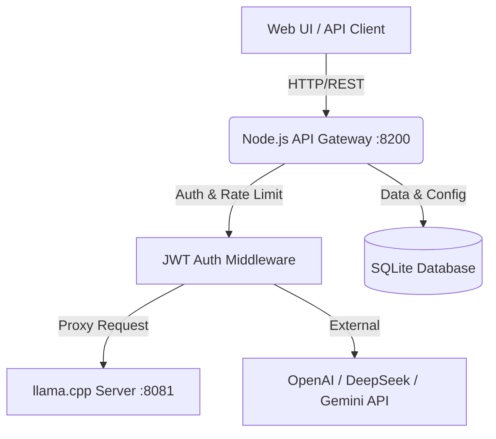

# 🦙 Chat AVG Gateway — Локальный сервер Gemma 4

Добро пожаловать в обновленную сборку локального сервера ИИ. Теперь это не просто движок нейросети, а полноценная многопользовательская система с авторизацией, ролевой моделью и централизованным управлением через админ-панель.

---

## ✨ Ключевые особенности (v2.0)

*   **Semantic Protocol (v2.3):** Смысловой слой для извлечения утверждений (claims), контроля границ адекватности (Domain Boundaries) и предотвращения галлюцинаций.
*   **Durable Runtime (Temporal):** Устойчивое исполнение длительных процессов (AgentRuns) с возможностью перезапуска, ожидания одобрения и компенсации ошибок.
*   **Model Gateway:** Унифицированный шлюз для доступа к LLM (OpenAI, Anthropic, LiteLLM, llama.cpp) с поддержкой fallback и контроля стоимости.
*   **Sandbox Manager:** Изолированное выполнение кода и инструментов в защищенных песочницах (E2B).
*   **MCP Tool Gateway:** Поддержка Model Context Protocol для расширения возможностей агентов через внешние инструменты.

---

## 🚀 Быстрый старт

1.  **Настройка окружения:** Скопируйте файл `.env.example` в `.env` и обязательно укажите `CHATAVG_SECRET` (минимум 32 случайных символа) и `CHATAVG_ADMIN_PASSWORD` (ваш новый пароль администратора).
2.  **Установка зависимостей:** Выполните файл `install_deps.cmd`.
3.  **Запуск:** Запустите `start_windows.cmd` (он автоматически поднимет llama.cpp и шлюз Node.js).
4.  **Вход в систему:** Откройте [http://127.0.0.1:8200](http://127.0.0.1:8200).
    *   **Логин:** `admin`
    *   **Пароль:** Тот, что вы указали в `.env` (или случайно сгенерированный, который вывелся в консоли Node.js при первом запуске).
5.  **Переменные окружения (.env):**
    *   `CHATAVG_PORT`: Порт сервера (по умолчанию 8200).
    *   `CHATAVG_SECRET`: Ключ для подписи JWT (минимум 32 символа).
    *   `CHATAVG_ADMIN_PASSWORD`: Пароль администратора (Обязателен в PROD).
    *   `CHATAVG_ENV`: Режим работы (`development`, `production`).
    *   `TEMPORAL_ADDRESS`: Адрес сервера Temporal (например, `localhost:7233`).
    *   `E2B_API_KEY`: Ключ для работы с песочницами E2B.
    *   `MCP_GATEWAY_URL`: URL шлюза MCP.
    *   `LITELLM_PROXY_URL`: URL прокси LiteLLM.
    *   `OPENAI_API_KEY`: Ключ OpenAI (для OpenAI Responses Adapter).
    *   `LLAMACPP_URL`: URL локального сервера llama.cpp.

## 🛡️ Safety Checklist (v2.3)
- [ ] **Fail-Closed Sandbox:** В продакшене `LocalAdapter` отключен, используется только удаленная изоляция.
- [ ] **Secure Boot:** Сервер не запустится в продакшене без установленного `CHATAVG_ADMIN_PASSWORD`.
- [ ] **SSRF Protection:** Включен Guard для предотвращения атак на внутреннюю сеть.
- [ ] **Secret Redaction:** API ключи и токены автоматически маскируются в логах.
- [ ] **Policy Guard:** Все чувствительные маршруты защищены Policy Engine.

---

## 🛡 Безопасность и архитектура

### Архитектурная схема



Система состоит из двух уровней:
1.  **Backend (Порт 8081):** Движок `llama-server.exe`, который занимается вычислениями. Он закрыт для прямого доступа извне.
2.  **Gateway (Порт 8200):** Сервер на Node.js, который проверяет токены, инжектирует системные промпты и параметры генерации, а затем проксирует запрос к бэкенду.

Это позволяет безопасно выставлять сервер в интернет (например, через IIS или ngrok) — доступ получит только авторизованный пользователь.

## 🧬 Testing

The application includes an integration test suite built with Node.js native `node:test` and `supertest`.

To run the tests:
```cmd
npm test
```
The test runner isolates its environment by automatically targeting an in-memory or alternative SQLite database (`data_test`), ensuring that production data is not modified during testing.

## 🔐 Security Configurations

- [x] Строгие требования к `CHATAVG_SECRET` (только через `.env`).
- [x] Никаких дефолтных `admin/admin` (пароль генерируется или задается в `.env`).
- [x] Хеширование паролей с помощью `bcrypt`.
- [x] Ограничение количества запросов (`express-rate-limit`) для защиты от DDoS и брутфорса.
- [x] Защита заголовков (`helmet`) и базовая конфигурация `cors`.
- [x] Защита от SSRF: Блокировка приватных IP и localhost для внешних провайдеров.
- [x] Строгая валидация входящих данных через Zod Schema.
- [x] Полностью синхронный и безопасный движок `better-sqlite3` для работы с БД (никаких гонок I/O).

---

## ⚙️ Управление через Админ-панель

В левом меню выберите **Админ-панель**. Там вы сможете:
*   **Управление пользователями:** Создавать новых сотрудников, менять им пароли, задавать персональные системные инструкции и лимиты контекста.
*   **Справочник категорий:** Настраивать глобальные параметры генерации (Temperature, Top-P и др.) для целых групп пользователей. Также здесь можно привязать категорию к внешнему API, выбрав подходящего Provider.

---

## 🚀 Развертывание на сервере

Для развертывания на серверах Windows (IIS) или Linux, обратитесь к файлу `IIS_DEPLOYMENT_GUIDE.md`.

Основные шаги для ручного запуска:
1.  Скопируйте вашу GGUF модель в папку `models_cache`.
2.  Создайте `.env` файл на основе `.env.example`.
3.  Запустите `llama-server.exe` отдельно (порт 8081).
4.  Запустите шлюз: `node server.js` (порт 8200).

Данные (база SQLite) хранятся в папке `data/`.

---

## ⚠️ Техническая поддержка

Если у вас возникли вопросы по работе системы или производительности, обратитесь к файлу `IIS_DEPLOYMENT_GUIDE.md` (для серверной установки) или проверьте логи в окне консоли Node.js.
