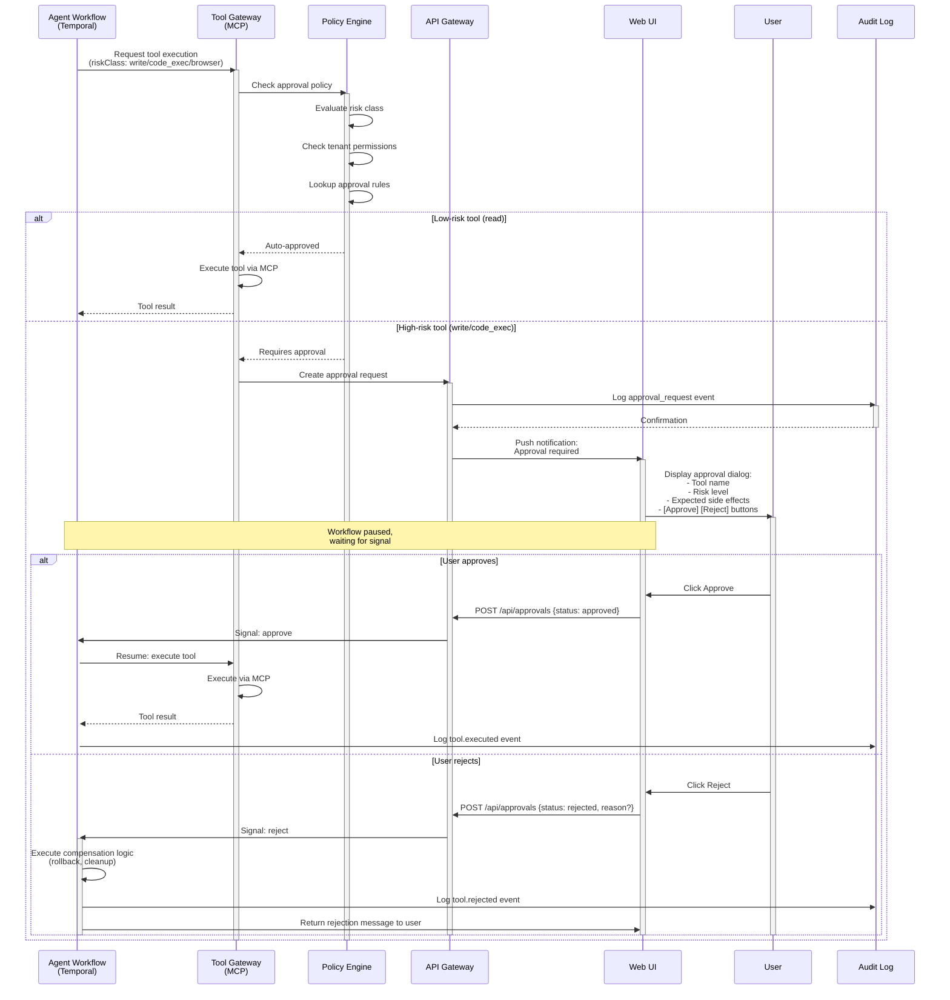
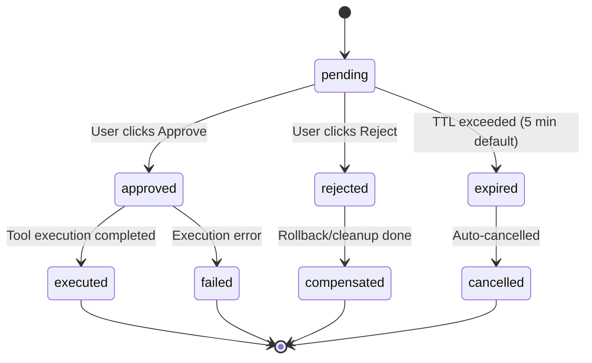

# Approval Flow Sequence Diagram

**Related Specs:** [SPEC-011 PolicyEngine](../04_specs/SPEC-011-POLICY_ENGINE.md), [SPEC-018 MCP Tool Gateway](../04_specs/SPEC-018-MCP_TOOL_GATEWAY.md)  
**Last Updated:** 2026-05-19

This document illustrates the user approval flow for high-risk agent actions (tool executions, semantic claims, write operations).

## Approval Flow Diagram



## Approval States



## Approval Dialog Content

When an approval is required, the UI displays:

### Information Shown to User

| Field | Example |
|-------|---------|
| **Tool Name** | `github.create_repository` |
| **Risk Class** | `external_side_effect` (creates external resource) |
| **Description** | "Create a new GitHub repository in organization 'acme-corp'" |
| **Parameters** | `{ name: "chatavg-backup", private: true, autoInit: false }` |
| **Expected Side Effects** | - New repository created<br>- Billing charged to organization<br>- Webhook notifications sent |
| **Timeout** | "This request will expire in 5 minutes" |
| **Actions** | [Approve] [Reject with comment] |

## Risk Classes and Approval Requirements

| Risk Class | Approval Required? | Timeout | Notes |
|------------|-------------------|---------|-------|
| `read` | No (auto-approved) | N/A | Safe read-only operations |
| `write` | Yes (user approval) | 5 min | Database writes, file mutations |
| `external_side_effect` | Yes (user approval) | 5 min | API calls, emails, external resources |
| `code_exec` | Yes (user approval) | 3 min | Arbitrary code execution in sandbox |
| `browser` | Yes (user approval) | 5 min | Headless browser automation |
| `privileged` | Yes (admin approval) | 10 min | Infrastructure-level actions |

## Implementation Details

### Temporal Workflow Integration

```javascript
// In AgentRun workflow
async function executeToolWithApproval(toolCall) {
  const approvalRequired = await policyEngine.checkApproval(toolCall);
  
  if (approvalRequired) {
    // Create approval request in database
    const approvalId = await createApprovalRequest(toolCall);
    
    // Wait for user signal (workflow pauses here, state persisted)
    const signal = await workflow.condition(
      () => signals.approve || signals.reject || signals.expire,
      { timeout: '5m' }
    );
    
    if (signal === 'approve') {
      return await toolGateway.execute(toolCall);
    } else if (signal === 'reject') {
      await compensate(toolCall); // Rollback if needed
      throw new Error('Tool execution rejected by user');
    } else {
      // Timeout
      await cancelApprovalRequest(approvalId);
      throw new Error('Approval request expired');
    }
  } else {
    // Auto-approved for low-risk tools
    return await toolGateway.execute(toolCall);
  }
}
```

### API Endpoints

#### `POST /api/approvals`
Create or respond to an approval request.

**Request:**
```json
{
  "approvalId": "appr_abc123",
  "status": "approved" | "rejected",
  "reason": "Optional comment if rejected"
}
```

**Response:**
```json
{
  "approvalId": "appr_abc123",
  "status": "approved",
  "respondedAt": "2026-05-19T14:30:00Z"
}
```

#### `GET /api/approvals/:approvalId`
Get current approval status.

#### `WS /api/approvals/stream`
WebSocket stream for real-time approval notifications.

## Audit Events

All approval actions are logged:

| Event | Description |
|-------|-------------|
| `approval.requested` | User approval required |
| `approval.approved` | User approved action |
| `approval.rejected` | User rejected action |
| `approval.expired` | Timeout exceeded, auto-cancelled |
| `approval.bypassed` | Admin bypassed approval (emergency) |

## Security Considerations

1. **No Hidden Authority**: System never executes high-risk actions without explicit user consent
2. **Fail-Safe Default**: If approval system fails, default to requiring approval (not auto-approve)
3. **Timeout Enforcement**: Pending approvals expire to prevent indefinite workflow blocking
4. **Audit Trail**: All approval decisions are immutable and queryable for compliance
5. **Admin Override**: Emergency bypass available for critical incidents (logged separately)
