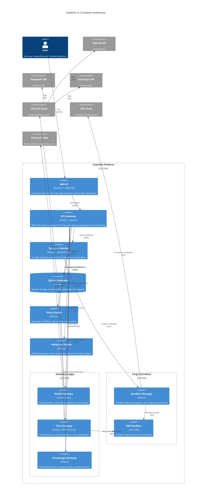

# Архитектурное видение (Architecture Overview v2.3)

## 1. Введение и формула платформы
ChatAVG v2.3 — это не просто обертка над LLM (чат), а **Meaning-first Agent Execution Platform** (Платформа выполнения смысловых агентных миссий). 

**Архитектурная формула v2.0:**
`ChatAVG = ER Meaning Layer + Mission Room + Adequacy Engine + Durable Agent Runtime + Gateway Plane + Artifact Workspace + Control Plane + Forge`

## 2. Ключевые компоненты (Core Platform)

*   **Durable Agent Runtime (Temporal):** Ядро оркестрации. Агенты работают как длительные процессы (workflows), которые могут засыпать (ожидая ответа человека), безопасно падать и перезапускаться без потери контекста.
*   **Model Gateway (LiteLLM):** Единая точка входа для всех запросов к LLM (OpenAI, Anthropic и др.). Отвечает за маршрутизацию, fallbacks, учет стоимости и лимиты.
*   **MCP Tool Gateway:** Шлюз для инструментов. Протокол MCP используется строго для безопасного подключения внешних инструментов (tools/connectors), а не для генерации текста.
*   **Knowledge Gateway:** Управление RAG (Поиск и генерация). Имеет разные режимы (от `no_retrieval` до `max_quality`) для баланса между скоростью и точностью.
*   **Sandbox Manager (Forge):** Интеграция с защищенными песочницами (E2B/Daytona) для безопасного выполнения сложного кода и файловых операций.
*   **Adequacy Engine (Смысловой слой):** Уникальный модуль, реализующий концепцию эзоагностики реальности (ЭР). Отвечает за извлечение утверждений (Claims), проверку границ применимости (Domain Boundaries) и недопущение "смысловых галлюцинаций".
*   **Policy / Cost Control Plane:** Слой аудита и политик безопасности. Запросы на опасные действия автоматически перехватываются для получения одобрения (Approval) пользователя.

## 3. Режимы работы (Runtime Modes)
Архитектура жестко разделяет потоки выполнения:
1.  **Fast Path (Быстрый путь):** Для простых диалогов. Без песочниц, без тяжелого RAG. Максимальная скорость и минимальная цена.
2.  **Studio / Lab:** Глубокая проработка задач со смысловым слоем (Adequacy Engine).
3.  **Forge:** Режим разработки, когда агенту выделяется изолированный контейнер (Sandbox) для написания и выполнения кода.

## 4. Главные анти-паттерны (Anti-goals)
*   **НЕТ** самописному workflow engine на SQLite для сложных процессов.
*   **НЕТ** песочницам (sandbox) по умолчанию на каждый чат.
*   **НЕТ** скрытому авторитету ИИ (система не делает сильных выводов без доказательств).

---

## 5. C4 Container Diagram

### Component Descriptions

| Component | Technology | Responsibility |
|-----------|------------|----------------|
| **Web UI** | Vanilla JS | User interface for chat, approval dialogs, artifact browsing |
| **API Gateway** | Node.js + Express | Request routing, authentication, session management |
| **Temporal Worker** | Node.js + Temporal SDK | Durable workflow execution, crash recovery, approval waits |
| **SQLite** | SQLite | Persistent storage for sessions, missions, audit logs |
| **Model Gateway** | LiteLLM Proxy | Multi-provider LLM routing, fallbacks, cost tracking |
| **Tool Gateway** | Node.js + MCP | Tool discovery, schema validation, risk classification |
| **Knowledge Gateway** | Node.js | RAG orchestration with configurable retrieval modes |
| **Sandbox Manager** | Node.js | E2B sandbox lifecycle management |
| **E2B Sandbox** | Cloud VM | Isolated code execution environment |
| **Policy Engine** | Node.js | Approval workflows, risk scoring, cost controls |
| **Adequacy Engine** | Node.js | ER meaning layer, claim extraction, domain validation |

### Communication Patterns

1. **User → Web UI → API**: Standard REST over HTTPS
2. **API → Temporal Worker**: gRPC calls to start/query workflows
3. **API → Gateways**: HTTP for Knowledge Gateway, JSON-RPC/SSE for Tool Gateway
4. **Temporal → SQLite**: Direct SQL writes for workflow state persistence
5. **Model Gateway → LiteLLM**: OpenAI-compatible API calls
6. **Tool Gateway → External Tools**: MCP protocol over SSE/HTTP or STDIO
7. **Sandbox Manager → E2B**: REST API for sandbox provisioning and management
