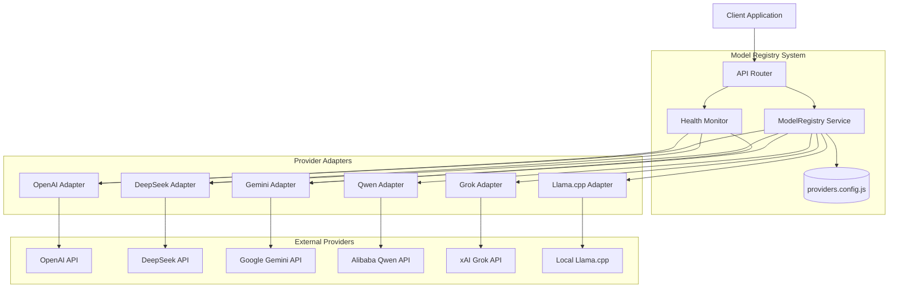

# SPEC-002: ModelRegistry

**Status:** Accepted  
**Sprint:** 3 (Model Registry)  
**Date:** 2026-05-07  

## Summary

ModelRegistry provides a unified API for dynamic model discovery, provider health monitoring, and model metadata across all configured AI providers in ChatAVG.

## Architecture



## API Endpoints

### GET /api/providers
Returns list of all configured providers with their available models.

**Response:**
```json
[
  { "id": "openai", "name": "OpenAI API", "models": ["gpt-4.1", "gpt-4o"] },
  { "id": "llamacpp", "name": "Локальная LLM", "models": ["default"] }
]
```

### GET /api/providers/:id/models
Returns dynamic model list from a specific provider. Performs live API call when possible.

**Response:**
```json
{
  "provider": "openai",
  "models": ["gpt-4.1", "gpt-4.1-mini", "gpt-4o", "gpt-4o-mini"]
}
```

### GET /api/providers/:id/health
Returns health status of a specific provider.

**Response:**
```json
{
  "status": "online",
  "provider": "openai"
}
```

### GET /api/providers/health  
Returns health status of the user's configured provider.

## Model Metadata

Each model entry in `providers.config.js` supports:

```javascript
{
  "model-id": {
    "name": "Display Name",
    "extra_params": {},
    // Future extensions (Sprint 6+):
    // "capabilities": ["chat", "tools", "vision"],
    // "costClass": "standard",
    // "fallbackEligible": true,
    // "maxTokens": 128000,
  }
}
```

## Provider Interface

All providers extending `BaseProvider` implement:

```javascript
class BaseProvider {
  // Returns dynamic model list (may call external API)
  async getModels(config) → string[]
  
  // Returns boolean health status
  async checkHealth(config) → boolean
}
```

### getModels() Behavior
- Default implementation returns statically configured `this.models`.
- OpenAI-compatible adapters call `GET /models` on the provider endpoint.
- On failure, returns static model list as fallback.

### checkHealth() Behavior  
- Default returns `true`.
- Implemented adapters attempt a lightweight API call (model list, ping).
- Must complete within `PROVIDER_TIMEOUT`.

## Health Status Values

| Status | Meaning |
|---|---|
| `online` | Provider responded successfully |
| `offline` | Provider unreachable or returned error |

## Error Handling

- Provider not found: `404 { error: "Provider not found" }`.
- API failure: `500 { error: "error message" }`.
- Partial failure: Returns available data with error field.

## Implementation

- **BaseProvider:** `cons/chatavg/src/modules/providers/base.provider.js`
- **Routes:** `cons/chatavg/src/modules/providers/providers.routes.js`
- **Config:** `cons/chatavg/src/core/providers.config.js`
- **Factory:** `cons/chatavg/src/modules/providers/provider.factory.js`

## Future Extensions (Sprint 6+)

- Model capabilities matrix (chat, tools, vision, code).
- Cost class mapping for budget policies.
- Fallback eligibility flags.
- Cache TTL for model list responses.
- UI status-dot synchronization.

## References

- SPEC-003: ModelGateway
- ADR-002: ModelGateway with LiteLLM
