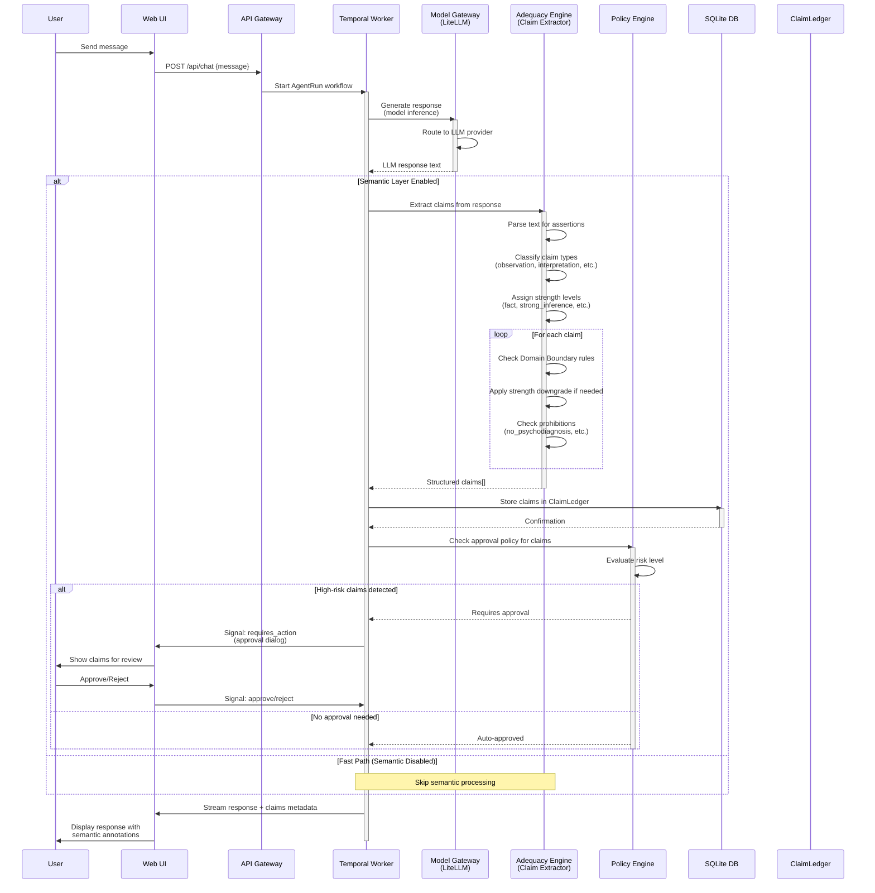

# SemanticProtocol v0 (Спецификация)

**ID:** SPEC-004 | **Версия:** 0.1 (PoC) | **Статус:** Active  
**Владелец:** Semantic Lead + Backend | **Обновлено:** 7 мая 2026  
**ADR:** ADR-005 Semantic Shift-Left

---

## 1. Назначение

SemanticProtocol — версионируемый набор правил, который определяет, как система работает со смыслом: какие утверждения извлекаются, как оценивается их сила, где проходят границы области определения и какие языковые подмены запрещены.

Каждая Mission (или chat session с включённым semantic layer) привязывается к конкретной версии SemanticProtocol.

## 2. Структура SemanticProtocol v0

```javascript
{
  protocolId: "semantic-v0",
  version: "0.1.0",
  glossaryVersion: "1.0",

  // Уровни силы утверждения (от сильного к слабому)
  strengthLevels: ["fact", "strong_inference", "weak_hypothesis", "question"],

  // Типы утверждений
  claimTypes: ["observation", "interpretation", "hypothesis", "decision", "recommendation"],

  // Уровни реальности
  realityLevels: ["text", "fact", "model", "value", "trajectory", "system"],

  // Правила Domain Boundary
  domainBoundaryRules: [...],

  // Запреты (No Hidden Authority)
  prohibitions: [
    "no_psychodiagnosis",        // Не диагностировать пользователя
    "no_hidden_authority",       // Не говорить сильнее доказательств
    "no_level_mixing",           // Не смешивать факты и ценности
    "no_depth_scoring",          // Не присваивать числовой score сущности
    "no_pseudo_understanding"    // Не прятать незнание в красивых формулировках
  ]
}
```

## 3. Strength Levels (Сила утверждений)

| Уровень | Описание | Когда допустим |
|---------|----------|----------------|
| `fact` | Проверяемый факт с источником | Есть цитируемый source, данные наблюдаемы |
| `strong_inference` | Логический вывод из фактов | Посылки являются facts, вывод следует из них |
| `weak_hypothesis` | Возможное объяснение | Данные неполны, вывод не единственный |
| `question` | Открытый вопрос | Данных недостаточно для любого вывода |

## 4. Strength Downgrade Rules

| Условие | Действие | Пример |
|---------|----------|--------|
| Claim выходит за DomainBoundary | `fact` → `weak_hypothesis` | Медицинский вывод в юридическом контексте |
| Отсутствует sourceRef | `strong_inference` → `weak_hypothesis` | Утверждение без ссылки на данные |
| Смешение reality levels | Downgrade на 1 ступень | Факт смешан с ценностным суждением |
| Психодиагностика пользователя | **BLOCK** | "Вы проявляете признаки..." |
| Утверждение о внутреннем мире | `strong_inference` → `question` | "Вы чувствуете..." → "Возможно, вы чувствуете...?" |

## 5. Claim Types

| Тип | Описание | Допустимые strength |
|-----|----------|---------------------|
| `observation` | Фиксация наблюдаемого данного | `fact`, `strong_inference` |
| `interpretation` | Толкование наблюдения | `strong_inference`, `weak_hypothesis` |
| `hypothesis` | Предположение для проверки | `weak_hypothesis`, `question` |
| `decision` | Зафиксированное решение | `fact` (если принято), `question` (если открыто) |
| `recommendation` | Предложение действия | `strong_inference`, `weak_hypothesis` |

## 6. Feature Flag

Весь semantic layer активируется только при `SEMANTIC_LAYER_ENABLED=true` в `.env`.  
На Fast Path (simple chat без semantic layer) — никакого overhead.

## 7. Интеграция с ChatService

При включённом semantic layer:
1. После получения ответа от LLM, текст проходит через `ClaimExtractor`.
2. Извлечённые claims проверяются `DomainBoundary` rules.
3. При нарушениях происходит strength downgrade.
4. Claims сохраняются в `ClaimLedger` (in-memory для PoC).
5. Semantic events (`claim.created`, `claim.downgraded`, `boundary.violation`) логируются.

## 8. Ограничения PoC

- In-memory хранение claims (без персистенции в БД).
- Claim extraction через LLM-as-judge prompt (не NLP pipeline).
- Только базовые domain boundary rules (5-7 правил).
- Нет Mission/AgentRun интеграции (будет в Sprint 6+).
- Нет UX для отображения claims (будет в Sprint 12).

---

## 9. Sequence Diagram: Claim Extraction Flow



### Flow Description

1. **User Input**: User sends a message through the Web UI
2. **Workflow Initiation**: API Gateway starts an `AgentRun` workflow in Temporal
3. **Model Inference**: Temporal worker calls Model Gateway (LiteLLM) to generate LLM response
4. **Claim Extraction** (if semantic layer enabled):
   - Adequacy Engine parses response text for assertions
   - Each assertion is classified by type (`observation`, `interpretation`, `hypothesis`, etc.)
   - Strength levels are assigned (`fact`, `strong_inference`, `weak_hypothesis`, `question`)
   - Domain Boundary rules are checked; violations trigger strength downgrades
   - Prohibitions are enforced (e.g., psychodiagnosis is blocked)
5. **Persistence**: Extracted claims are stored in ClaimLedger (SQLite)
6. **Policy Check**: Policy Engine evaluates if claims require user approval
   - High-risk claims → pause workflow, show approval dialog
   - Low-risk claims → auto-approved
7. **Response Delivery**: Final response with semantic metadata is streamed back to UI

### Key Integration Points

| Component | Responsibility | Protocol |
|-----------|---------------|----------|
| **Adequacy Engine** | Claim extraction, classification, strength assignment | Sync function call |
| **ClaimLedger** | Persistent storage of claims with timestamps | SQLite INSERT |
| **Policy Engine** | Approval decision based on claim risk | Sync evaluation |
| **Temporal** | Orchestrate extraction flow, handle approval waits | Workflow activities + signals |
| **Web UI** | Display claims with visual annotations (strength badges, source links) | SSE streaming |

### Error Handling

- **Claim Extraction Failure**: Log error, continue with unannotated response (graceful degradation)
- **Domain Boundary Violation**: Downgrade strength automatically, emit `boundary.violation` audit event
- **Prohibition Triggered** (e.g., psychodiagnosis): Block claim entirely, emit security alert
- **Policy Engine Timeout**: Default to requiring approval (fail-safe)
