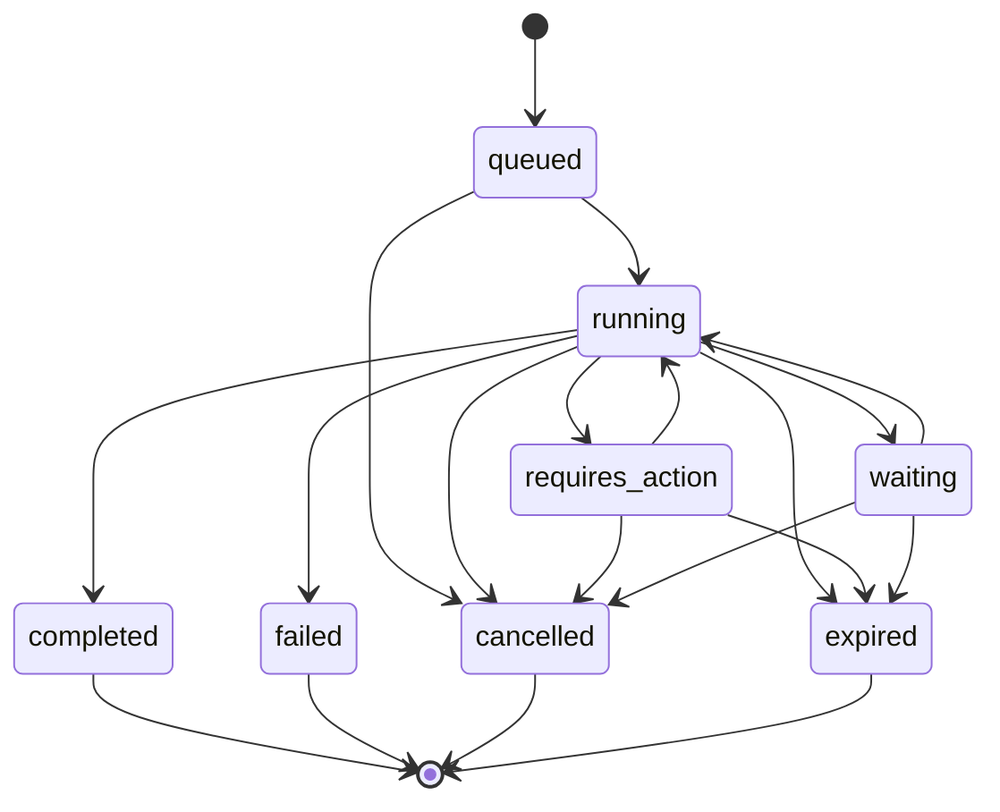

# SPEC-006: AgentRun State Machine

**Status:** Draft | **Version:** 1.0 | **Date:** 2026-05-07

## 1. Introduction
The `AgentRun` is the fundamental unit of execution in ChatAVG v2.3. Unlike a simple chat interaction, an `AgentRun` can span multiple steps, involve multiple models, tools, and require human-in-the-loop approvals. This document defines the formal state machine governing the lifecycle of an `AgentRun`.

## 2. State Definitions

| State | Description |
|---|---|
| `queued` | The run has been created and is waiting for an available worker/slot. |
| `running` | The run is actively being processed (model inference, tool execution, etc.). |
| `requires_action` | The run is paused and requires external input (e.g., tool call approval, semantic clarification). |
| `waiting` | The run is waiting for an external event or signal (used in durable workflows). |
| `completed` | The run has finished successfully and produced the final artifact/response. |
| `failed` | The run encountered a terminal error. |
| `cancelled` | The run was explicitly terminated by the user or system policy. |
| `expired` | The run exceeded its time-to-live (TTL) or maximum execution time. |

## 3. Transitions



### 3.1. Valid Transitions Table

| From | To | Trigger |
|---|---|---|
| `queued` | `running` | Worker picks up the task. |
| `running` | `requires_action` | Tool policy requires approval or semantic boundary hit. |
| `requires_action` | `running` | User provides approval/input. |
| `running` | `waiting` | Workflow hits a deliberate wait step or external dependency. |
| `waiting` | `running` | Signal received or timer expired. |
| `running` | `completed` | Goal reached. |
| `running` | `failed` | Unrecoverable error. |
| `any active` | `cancelled` | Explicit user cancellation. |
| `any active` | `expired` | TTL timeout. |

## 4. Implementation Notes
- **Persistence:** Every state transition MUST be recorded in the `AgentRun` repository with a timestamp and optional metadata (e.g., error message, action required).
- **Events:** Every transition MUST emit an `AgentRunEvent` to the event stream.
- **Idempotency:** State transitions must be idempotent. Attempting to transition to the same state should be a no-op.
- **Terminal States:** `completed`, `failed`, `cancelled`, and `expired` are terminal. No further transitions are allowed from these states.

## 5. Code Examples

### Example 1: AgentRun State Machine Implementation

```javascript
// src/models/agentRun.model.js
class AgentRun {
  constructor(data) {
    this.runId = data.runId;
    this.userId = data.userId;
    this.missionId = data.missionId;
    this.status = 'queued';
    this.history = [{
      status: 'queued',
      timestamp: new Date().toISOString(),
      metadata: { reason: 'Initial state' },
    }];
    this.createdAt = new Date().toISOString();
    this.updatedAt = new Date().toISOString();
  }

  // Valid state transitions
  static get VALID_TRANSITIONS() {
    return {
      queued: ['running', 'cancelled'],
      running: ['requires_action', 'waiting', 'completed', 'failed', 'cancelled', 'expired'],
      requires_action: ['running', 'cancelled', 'expired'],
      waiting: ['running', 'cancelled', 'expired'],
      completed: [],
      failed: [],
      cancelled: [],
      expired: [],
    };
  }

  static isTerminalState(status) {
    return ['completed', 'failed', 'cancelled', 'expired'].includes(status);
  }

  transition(newStatus, metadata = {}) {
    const validNextStates = AgentRun.VALID_TRANSITIONS[this.status];

    if (!validNextStates.includes(newStatus)) {
      throw new Error(
        `Invalid transition from ${this.status} to ${newStatus}. ` +
        `Valid transitions: ${validNextStates.join(', ')}`
      );
    }

    // Idempotency check
    if (this.status === newStatus) {
      console.log(`Transition to ${newStatus} is no-op (already in this state)`);
      return;
    }

    const previousStatus = this.status;
    this.status = newStatus;
    this.updatedAt = new Date().toISOString();

    // Record transition in history
    this.history.push({
      status: newStatus,
      previousStatus,
      timestamp: new Date().toISOString(),
      metadata,
    });

    console.log(`AgentRun ${this.runId}: ${previousStatus} → ${newStatus}`);

    // Emit transition event
    this.emitTransitionEvent(previousStatus, newStatus, metadata);
  }

  emitTransitionEvent(fromStatus, toStatus, metadata) {
    const event = {
      type: 'agent_run.transition',
      runId: this.runId,
      userId: this.userId,
      missionId: this.missionId,
      fromStatus,
      toStatus,
      timestamp: new Date().toISOString(),
      metadata,
    };

    // Publish to event bus (see SPEC-007)
    global.eventBus.publish('agent_run', event);
  }
}

module.exports = AgentRun;
```

### Example 2: State Transition Handler in Temporal Workflow

```javascript
// src/workflows/agentWorkflow.js
const { proxyActivities } = require('@temporalio/workflow');

const {
  inferenceActivity,
  extractClaimsActivity,
  executeToolCallActivity,
  evaluatePolicyActivity,
} = proxyActivities({
  startToCloseTimeout: '5 minutes',
  retry: {
    initialInterval: '1 second',
    backoffCoefficient: 2,
    maximumAttempts: 3,
  },
});

exports.agentWorkflow = async function(agentRun) {
  const { runId, userId, missionId } = agentRun;

  // Transition to running
  await updateRunStatus(runId, 'running');

  try {
    let currentStep = 0;
    const maxSteps = 10; // Prevent infinite loops

    while (currentStep < maxSteps) {
      // Step 1: Model inference
      const llmResponse = await inferenceActivity({
        userId,
        missionId,
        messages: getCurrentMessages(runId),
      });

      // Step 2: Extract claims (semantic processing)
      const claims = await extractClaimsActivity(llmResponse.text);

      // Step 3: Check for tool calls
      if (llmResponse.toolCalls && llmResponse.toolCalls.length > 0) {
        for (const toolCall of llmResponse.toolCalls) {
          // Evaluate policy for tool call
          const policyDecision = await evaluatePolicyActivity({
            userId,
            actionType: 'tool_call',
            toolName: toolCall.name,
          });

          if (policyDecision.resolution === 'require_approval') {
            // Transition to requires_action
            await updateRunStatus(runId, 'requires_action', {
              approvalRequired: true,
              toolCallId: toolCall.id,
            });

            // Wait for user approval signal
            const approval = await workflow.condition(() => 
              workflow.signalReceived('approve_tool_call') ||
              workflow.signalReceived('reject_tool_call')
            );

            if (approval.type === 'reject') {
              await updateRunStatus(runId, 'failed', {
                reason: 'Tool call rejected by user',
              });
              return;
            }

            // Resume execution
            await updateRunStatus(runId, 'running');
          }

          // Execute tool call
          const toolResult = await executeToolCallActivity(toolCall);
          addAssistantMessage(runId, toolResult);
        }
      }

      // Step 4: Check if goal is reached
      if (isGoalReached(llmResponse, claims)) {
        await updateRunStatus(runId, 'completed', {
          totalSteps: currentStep + 1,
          claimsExtracted: claims.length,
        });
        return;
      }

      currentStep++;
    }

    // Max steps exceeded
    await updateRunStatus(runId, 'failed', {
      reason: 'Maximum steps exceeded',
      maxSteps,
    });

  } catch (error) {
    await updateRunStatus(runId, 'failed', {
      error: error.message,
      stack: error.stack,
    });
  }
};

async function updateRunStatus(runId, status, metadata = {}) {
  // Call activity to update database
  await activities.updateRunStatusActivity(runId, status, metadata);
}
```

### Example 3: Handling Cancellation and Expiration

```javascript
// src/services/agentRun.service.js
class AgentRunService {
  async cancelRun(runId, reason = 'User requested cancellation') {
    const run = await this.repository.findById(runId);

    if (!run) {
      throw new Error(`AgentRun not found: ${runId}`);
    }

    if (AgentRun.isTerminalState(run.status)) {
      throw new Error(`Cannot cancel run in terminal state: ${run.status}`);
    }

    // Transition to cancelled
    run.transition('cancelled', { reason });
    await this.repository.save(run);

    // Cancel Temporal workflow if running
    if (run.workflowId) {
      try {
        await this.temporalClient.workflow.getHandle(run.workflowId).cancel();
        console.log(`Cancelled workflow: ${run.workflowId}`);
      } catch (error) {
        console.error(`Failed to cancel workflow: ${error.message}`);
      }
    }

    return run;
  }

  async checkExpiredRuns() {
    const TTL_MS = 30 * 60 * 1000; // 30 minutes
    const now = Date.now();

    // Find runs that exceeded TTL
    const expiredRuns = await this.repository.find({
      status: { $in: ['queued', 'running', 'requires_action', 'waiting'] },
      createdAt: { $lt: new Date(now - TTL_MS) },
    });

    for (const run of expiredRuns) {
      try {
        run.transition('expired', {
          reason: 'TTL exceeded',
          ttlMs: TTL_MS,
          actualDuration: now - new Date(run.createdAt),
        });
        await this.repository.save(run);

        console.log(`Expired run: ${run.runId}`);
      } catch (error) {
        console.error(`Failed to expire run ${run.runId}: ${error.message}`);
      }
    }

    return expiredRuns.length;
  }
}

// Schedule periodic expiration check
setInterval(async () => {
  const count = await agentRunService.checkExpiredRuns();
  if (count > 0) {
    console.log(`Expired ${count} runs`);
  }
}, 60 * 1000); // Check every minute
```

### Example 4: Querying AgentRun State

```javascript
// src/services/agentRun.query.service.js
class AgentRunQueryService {
  async getRunState(runId) {
    const run = await this.repository.findById(runId);

    if (!run) {
      throw new Error(`AgentRun not found: ${runId}`);
    }

    return {
      runId: run.runId,
      status: run.status,
      missionId: run.missionId,
      userId: run.userId,
      currentStep: this.getCurrentStep(run),
      history: run.history,
      duration: this.calculateDuration(run),
      canTransition: this.getPossibleTransitions(run.status),
    };
  }

  getPossibleTransitions(currentStatus) {
    const transitions = {
      queued: ['running', 'cancelled'],
      running: ['requires_action', 'waiting', 'completed', 'failed', 'cancelled', 'expired'],
      requires_action: ['running', 'cancelled', 'expired'],
      waiting: ['running', 'cancelled', 'expired'],
      completed: [],
      failed: [],
      cancelled: [],
      expired: [],
    };

    return transitions[currentStatus] || [];
  }

  calculateDuration(run) {
    const startTime = new Date(run.createdAt);
    const endTime = run.status === 'completed' || run.status === 'failed'
      ? new Date(run.updatedAt)
      : new Date();

    return {
      milliseconds: endTime - startTime,
      seconds: Math.round((endTime - startTime) / 1000),
      humanReadable: this.formatDuration(endTime - startTime),
    };
  }

  formatDuration(ms) {
    const seconds = Math.floor(ms / 1000);
    const minutes = Math.floor(seconds / 60);
    const hours = Math.floor(minutes / 60);

    if (hours > 0) {
      return `${hours}h ${minutes % 60}m`;
    } else if (minutes > 0) {
      return `${minutes}m ${seconds % 60}s`;
    } else {
      return `${seconds}s`;
    }
  }
}

module.exports = AgentRunQueryService;
```
