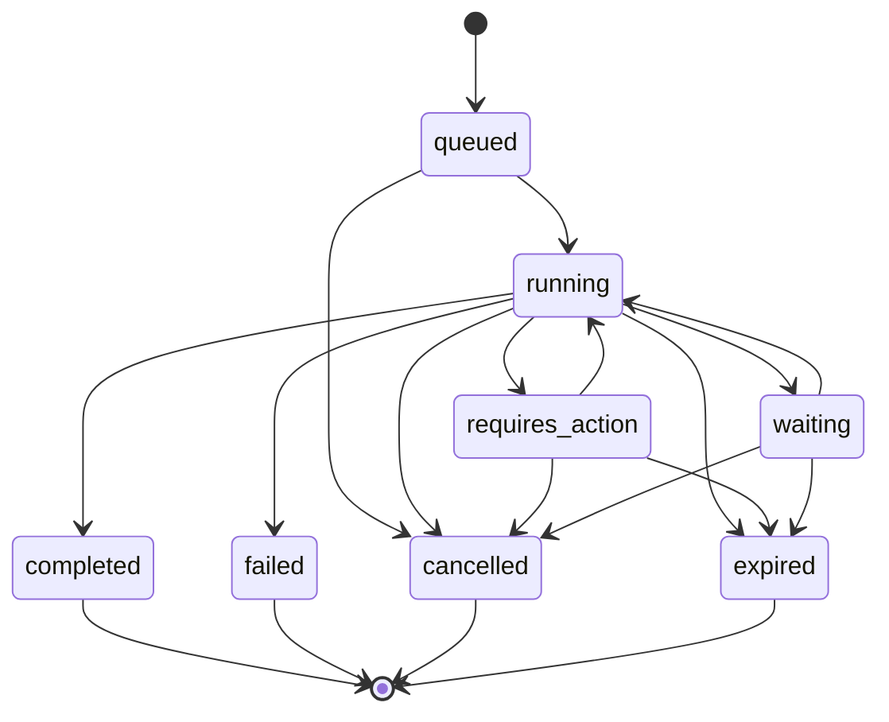

# SPEC-006: AgentRun State Machine

**Status:** Draft | **Version:** 1.0 | **Date:** 2026-05-07

## 1. Introduction
The `AgentRun` is the fundamental unit of execution in ChatAVG v2.3. Unlike a simple chat interaction, an `AgentRun` can span multiple steps, involve multiple models, tools, and require human-in-the-loop approvals. This document defines the formal state machine governing the lifecycle of an `AgentRun`.

## 2. State Definitions

| State | Description |
|---|---|
| `queued` | The run has been created and is waiting for an available worker/slot. |
| `running` | The run is actively being processed (model inference, tool execution, etc.). |
| `requires_action` | The run is paused and requires external input (e.g., tool call approval, semantic clarification). |
| `waiting` | The run is waiting for an external event or signal (used in durable workflows). |
| `completed` | The run has finished successfully and produced the final artifact/response. |
| `failed` | The run encountered a terminal error. |
| `cancelled` | The run was explicitly terminated by the user or system policy. |
| `expired` | The run exceeded its time-to-live (TTL) or maximum execution time. |

## 3. Transitions

### 3.1. Valid Transitions Table

| From | To | Trigger |
|---|---|---|
| `queued` | `running` | Worker picks up the task. |
| `running` | `requires_action` | Tool policy requires approval or semantic boundary hit. |
| `requires_action` | `running` | User provides approval/input. |
| `running` | `waiting` | Workflow hits a deliberate wait step or external dependency. |
| `waiting` | `running` | Signal received or timer expired. |
| `running` | `completed` | Goal reached. |
| `running` | `failed` | Unrecoverable error. |
| `any active` | `cancelled` | Explicit user cancellation. |
| `any active` | `expired` | TTL timeout. |

## 4. Implementation Notes
- **Persistence:** Every state transition MUST be recorded in the `AgentRun` repository with a timestamp and optional metadata (e.g., error message, action required).
- **Events:** Every transition MUST emit an `AgentRunEvent` to the event stream.
- **Idempotency:** State transitions must be idempotent. Attempting to transition to the same state should be a no-op.
- **Terminal States:** `completed`, `failed`, `cancelled`, and `expired` are terminal. No further transitions are allowed from these states.
