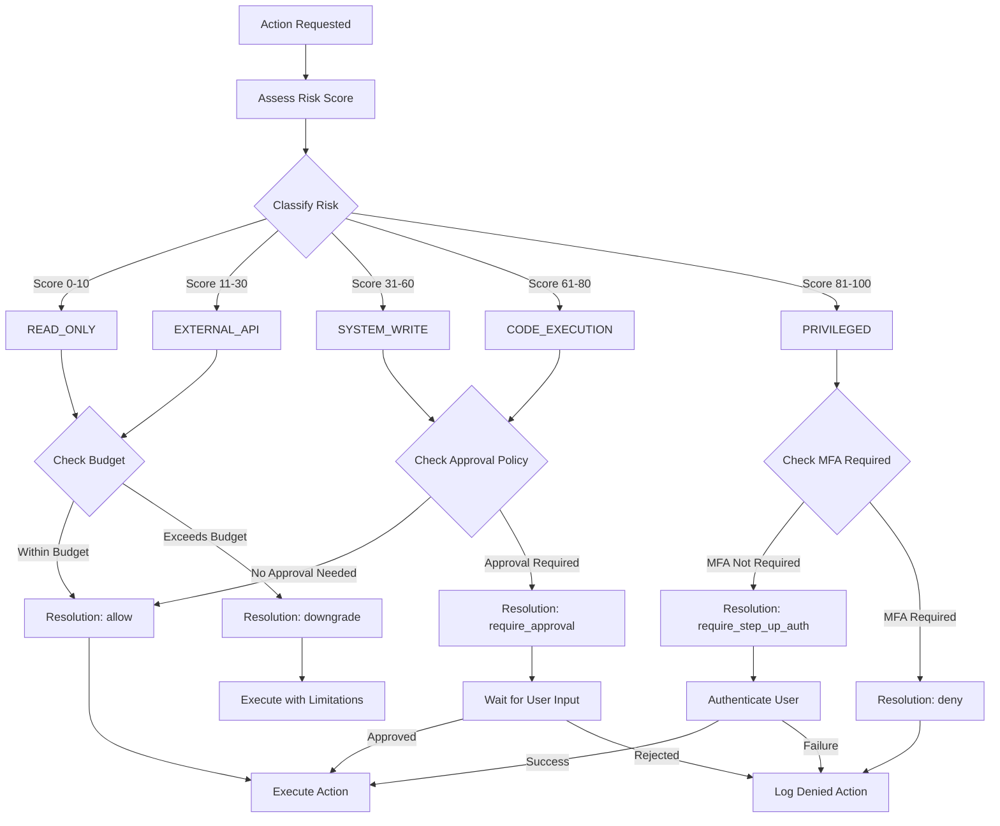

# SPEC-011: Policy Engine

**ID:** SPEC-011 | **Версия:** 1.0 | **Статус:** Active  
**Владелец:** Security & Architecture | **Обновлено:** 2026-05-07

---

## 1. Назначение (Purpose)

`PolicyEngine` — это центральный компонент Control Plane, который оценивает любые действия агента (обращение к модели, вызов инструмента, чтение данных) до их фактического выполнения. Его задача — определить уровень риска и принять решение: разрешить, запретить или запросить подтверждение пользователя (Approval).

## 2. Risk Scoring Matrix

Каждому действию присваивается оценка риска (`RiskScore`) от 0 до 100 и соответствующий класс (`RiskClass`).

### Risk Classes
1. **READ_ONLY** (Score 0-10): Чтение публичных или некритичных данных (например, получение погоды).
2. **EXTERNAL_API** (Score 11-30): Вызов внешних API с правами пользователя, не меняющих системного состояния.
3. **SYSTEM_WRITE** (Score 31-60): Запись данных (создание файлов в рабочей области, отправка email, коммит).
4. **CODE_EXECUTION** (Score 61-80): Выполнение произвольного кода в песочнице (Sandbox).
5. **PRIVILEGED** (Score 81-100): Выполнение команд вне песочницы, доступ к секретам, изменение настроек платформы.

## 2.1 Policy Evaluation Flow



## 3. Policy Decision (Решение)

На основе класса риска, скоринга и контекста (семантический уровень, текущий лимит стоимости), PolicyEngine возвращает объект `PolicyDecision`:

```typescript
type Resolution = 
  | 'allow'                 // Действие безопасно, выполнять немедленно
  | 'deny'                  // Действие категорически запрещено (нарушение границ, критический риск)
  | 'require_approval'      // Требуется вмешательство пользователя (Human-in-the-loop)
  | 'require_step_up_auth'  // Требуется повторный ввод пароля или MFA
  | 'downgrade';            // Разрешено, но в "пониженном" режиме (например, без передачи чувствительных полей)

interface PolicyDecision {
  resolution: Resolution;
  riskScore: number;
  riskClass: RiskClass;
  reason: string;
}
```

## 5. Code Examples

### Example 1: Policy Engine Implementation

```javascript
// src/services/policyEngine.service.js
class PolicyEngine {
  constructor() {
    this.policies = new Map();
    this.loadDefaultPolicies();
  }

  loadDefaultPolicies() {
    // READ_ONLY policy
    this.policies.set('READ_ONLY', {
      riskClass: 'READ_ONLY',
      scoreRange: [0, 10],
      defaultResolution: 'allow',
      requiresApproval: false,
      auditRequired: false,
    });

    // EXTERNAL_API policy
    this.policies.set('EXTERNAL_API', {
      riskClass: 'EXTERNAL_API',
      scoreRange: [11, 30],
      defaultResolution: 'allow',
      requiresApproval: false,
      auditRequired: true,
    });

    // SYSTEM_WRITE policy
    this.policies.set('SYSTEM_WRITE', {
      riskClass: 'SYSTEM_WRITE',
      scoreRange: [31, 60],
      defaultResolution: 'require_approval',
      requiresApproval: true,
      approvalTimeout: 3600000, // 1 hour
      auditRequired: true,
    });

    // CODE_EXECUTION policy
    this.policies.set('CODE_EXECUTION', {
      riskClass: 'CODE_EXECUTION',
      scoreRange: [61, 80],
      defaultResolution: 'require_approval',
      requiresApproval: true,
      sandboxRequired: true,
      approvalTimeout: 1800000, // 30 minutes
      auditRequired: true,
    });

    // PRIVILEGED policy
    this.policies.set('PRIVILEGED', {
      riskClass: 'PRIVILEGED',
      scoreRange: [81, 100],
      defaultResolution: 'deny',
      requiresApproval: true,
      requireStepUpAuth: true,
      sandboxRequired: true,
      auditRequired: true,
    });
  }

  async evaluateAction(userId, action) {
    const { type, payload, context = {} } = action;

    // Step 1: Calculate risk score
    const riskScore = this.calculateRiskScore(type, payload, context);

    // Step 2: Determine risk class
    const riskClass = this.classifyRisk(riskScore);

    // Step 3: Get policy for this risk class
    const policy = this.policies.get(riskClass);

    if (!policy) {
      throw new Error(`No policy found for risk class: ${riskClass}`);
    }

    // Step 4: Apply contextual modifiers
    const decision = this.applyModifiers(policy, riskScore, context);

    // Step 5: Log to audit trail
    if (policy.auditRequired) {
      await this.logAuditEvent({
        userId,
        action: type,
        riskScore,
        riskClass,
        decision: decision.resolution,
        timestamp: new Date(),
      });
    }

    return {
      resolution: decision.resolution,
      riskScore,
      riskClass,
      reason: decision.reason,
      requiresApproval: policy.requiresApproval,
      sandboxRequired: policy.sandboxRequired || false,
      requireStepUpAuth: policy.requireStepUpAuth || false,
    };
  }

  calculateRiskScore(actionType, payload, context) {
    let baseScore = 0;

    // Base score by action type
    switch (actionType) {
      case 'read_file':
      case 'search':
        baseScore = 5;
        break;

      case 'call_external_api':
        baseScore = 20;
        break;

      case 'write_file':
      case 'send_email':
      case 'create_commit':
        baseScore = 45;
        break;

      case 'execute_code':
        baseScore = 70;
        break;

      case 'run_shell_command':
      case 'access_secrets':
        baseScore = 90;
        break;

      default:
        baseScore = 50; // Unknown actions get medium-high risk
    }

    // Modifiers based on context
    if (payload.sensitiveData) {
      baseScore += 15;
    }

    if (context.crossTenant) {
      baseScore += 20;
    }

    if (context.batchSize > 100) {
      baseScore += 10;
    }

    if (payload.highPrivilege) {
      baseScore += 15;
    }

    // Cap at 100
    return Math.min(baseScore, 100);
  }

  classifyRisk(riskScore) {
    if (riskScore <= 10) return 'READ_ONLY';
    if (riskScore <= 30) return 'EXTERNAL_API';
    if (riskScore <= 60) return 'SYSTEM_WRITE';
    if (riskScore <= 80) return 'CODE_EXECUTION';
    return 'PRIVILEGED';
  }

  applyModifiers(policy, riskScore, context) {
    let resolution = policy.defaultResolution;

    // Override based on user trust level
    if (context.userTrustLevel === 'high' && policy.riskClass !== 'PRIVILEGED') {
      if (resolution === 'require_approval') {
        resolution = 'allow';
      }
    }

    // Override based on cost constraints
    if (context.costExceedsBudget) {
      resolution = 'deny';
      return {
        resolution,
        reason: 'Action denied: exceeds cost budget',
      };
    }

    // Override based on time of day (restrict privileged actions at night)
    const currentHour = new Date().getHours();
    if (policy.riskClass === 'PRIVILEGED' && (currentHour < 6 || currentHour > 22)) {
      resolution = 'deny';
      return {
        resolution,
        reason: 'Privileged actions restricted outside business hours (6 AM - 10 PM)',
      };
    }

    return {
      resolution,
      reason: `Policy evaluation: ${policy.riskClass} (score: ${riskScore})`,
    };
  }

  async logAuditEvent(event) {
    // Store in SQLite or external audit system
    console.log('[AUDIT]', JSON.stringify(event));
    // In production: await auditLogger.log(event);
  }
}

module.exports = PolicyEngine;
```

### Example 2: Using Policy Engine in Agent Workflow

```javascript
// src/workflows/agentWorkflow.policy.js
const PolicyEngine = require('../services/policyEngine.service');
const ApprovalService = require('../services/approval.service');

class PolicyAwareWorkflow {
  constructor() {
    this.policyEngine = new PolicyEngine();
    this.approvalService = new ApprovalService();
  }

  async executeAgentAction(userId, action) {
    // Step 1: Evaluate policy
    const policyDecision = await this.policyEngine.evaluateAction(userId, action);

    console.log(`Policy decision: ${policyDecision.resolution} (risk: ${policyDecision.riskClass})`);

    // Step 2: Handle based on resolution
    switch (policyDecision.resolution) {
      case 'allow':
        return this.executeAction(action);

      case 'deny':
        throw new Error(`Action denied by policy: ${policyDecision.reason}`);

      case 'require_approval':
        return this.handleApprovalFlow(userId, action, policyDecision);

      case 'require_step_up_auth':
        return this.handleStepUpAuth(userId, action);

      case 'downgrade':
        return this.executeDowngraded(action);

      default:
        throw new Error(`Unknown resolution: ${policyDecision.resolution}`);
    }
  }

  async handleApprovalFlow(userId, action, policyDecision) {
    // Create approval request
    const approvalRequest = await this.approvalService.createRequest({
      userId,
      action,
      riskScore: policyDecision.riskScore,
      riskClass: policyDecision.riskClass,
      reason: policyDecision.reason,
      timeout: policyDecision.approvalTimeout || 3600000,
    });

    // Wait for user approval (this pauses the Temporal workflow)
    const approved = await this.approvalService.waitForDecision(approvalRequest.id);

    if (!approved) {
      throw new Error('Action rejected by user');
    }

    // Execute after approval
    return this.executeAction(action);
  }

  async handleStepUpAuth(userId, action) {
    // Require MFA or password re-entry
    const authenticated = await this.verifyStepUpAuth(userId);

    if (!authenticated) {
      throw new Error('Step-up authentication failed or cancelled');
    }

    // Re-evaluate with elevated auth
    return this.executeAgentAction(userId, {
      ...action,
      context: {
        ...action.context,
        stepUpAuthCompleted: true,
      },
    });
  }

  async executeDowngraded(action) {
    // Redact sensitive data before execution
    const redactedAction = await this.redactSensitiveData(action);
    return this.executeAction(redactedAction);
  }

  async executeAction(action) {
    // Actual execution logic
    // ...
  }

  async redactSensitiveData(action) {
    // Mask secrets, PII, etc.
    // ...
  }

  async verifyStepUpAuth(userId) {
    // Send MFA challenge
    // ...
  }
}

module.exports = PolicyAwareWorkflow;
```

### Example 3: Cost Policy Integration

```javascript
// src/services/costPolicy.service.js
const PolicyEngine = require('./policyEngine.service');

class CostPolicyEngine extends PolicyEngine {
  constructor(costTracker) {
    super();
    this.costTracker = costTracker;
  }

  async evaluateAction(userId, action) {
    // First, run standard policy evaluation
    const decision = await super.evaluateAction(userId, action);

    // Then check cost constraints
    const costCheck = await this.checkCostConstraints(userId, action);

    if (!costCheck.allowed) {
      return {
        ...decision,
        resolution: 'deny',
        reason: costCheck.reason,
        costInfo: costCheck,
      };
    }

    return decision;
  }

  async checkCostConstraints(userId, action) {
    // Get current month's spending
    const monthlySpending = await this.costTracker.getMonthlySpending(userId);

    // Get user's budget
    const budget = await this.costTracker.getUserBudget(userId);

    // Estimate cost of this action
    const estimatedCost = this.estimateActionCost(action);

    const projectedTotal = monthlySpending + estimatedCost;

    if (projectedTotal > budget.hardLimit) {
      return {
        allowed: false,
        reason: `Projected spending ($${projectedTotal.toFixed(2)}) exceeds hard limit ($${budget.hardLimit})`,
        currentSpending: monthlySpending,
        estimatedCost,
        hardLimit: budget.hardLimit,
      };
    }

    if (projectedTotal > budget.softLimit) {
      // Allow but warn
      return {
        allowed: true,
        warning: `Spending will exceed soft limit ($${budget.softLimit})`,
        currentSpending: monthlySpending,
        estimatedCost,
      };
    }

    return { allowed: true };
  }

  estimateActionCost(action) {
    const { type, payload } = action;

    switch (type) {
      case 'llm_inference':
        // Estimate based on token count
        const tokens = payload.estimatedTokens || 1000;
        return tokens * 0.00002; // $0.02 per 1K tokens

      case 'execute_code':
        // Sandbox cost: $0.008 per minute
        return 5 * 0.008; // Assume 5 minutes

      case 'browser_automation':
        // Browser automation is more expensive
        return 10 * 0.008; // Assume 10 minutes

      default:
        return 0.01; // Default small cost
    }
  }
}

module.exports = CostPolicyEngine;
```

### Example 4: Policy Configuration

```javascript
// config/policies.js

module.exports = {
  // Global policy settings
  global: {
    enablePolicyEngine: true,
    strictMode: process.env.NODE_ENV === 'production',
    auditAllDecisions: true,
  },

  // Risk class configurations
  riskClasses: {
    READ_ONLY: {
      maxScore: 10,
      defaultResolution: 'allow',
      requiresApproval: false,
      auditRequired: false,
    },

    EXTERNAL_API: {
      maxScore: 30,
      defaultResolution: 'allow',
      requiresApproval: false,
      auditRequired: true,
      rateLimitPerMinute: 60,
    },

    SYSTEM_WRITE: {
      maxScore: 60,
      defaultResolution: 'require_approval',
      requiresApproval: true,
      approvalTimeout: 3600000, // 1 hour
      auditRequired: true,
      maxActionsPerHour: 50,
    },

    CODE_EXECUTION: {
      maxScore: 80,
      defaultResolution: 'require_approval',
      requiresApproval: true,
      sandboxRequired: true,
      approvalTimeout: 1800000, // 30 minutes
      auditRequired: true,
      maxExecutionTime: 300000, // 5 minutes
      memoryLimit: '512mb',
    },

    PRIVILEGED: {
      maxScore: 100,
      defaultResolution: 'deny',
      requiresApproval: true,
      requireStepUpAuth: true,
      sandboxRequired: true,
      auditRequired: true,
      allowedRoles: ['admin', 'super_admin'],
      allowedHours: { start: 6, end: 22 }, // 6 AM to 10 PM only
    },
  },

  // Contextual modifiers
  modifiers: {
    highTrustUser: {
      scoreReduction: 10,
      skipApprovalFor: ['SYSTEM_WRITE'],
    },

    crossTenant: {
      scoreIncrease: 20,
      alwaysRequireApproval: true,
    },

    batchSize: {
      threshold: 100,
      scoreIncrease: 10,
    },

    sensitiveData: {
      scoreIncrease: 15,
      requireRedaction: true,
    },
  },

  // Cost policies
  costPolicies: {
    defaultBudget: {
      softLimit: 50,   // Warn when exceeded
      hardLimit: 100,  // Block when exceeded
    },

    alerts: {
      at50Percent: true,
      at80Percent: true,
      at100Percent: true,
    },
  },
};
```

### Example 5: Testing Policy Engine

```javascript
// tests/unit/policyEngine.test.js
const PolicyEngine = require('../../src/services/policyEngine.service');

describe('Policy Engine', () => {
  let policyEngine;

  beforeEach(() => {
    policyEngine = new PolicyEngine();
  });

  describe('Risk Classification', () => {
    it('should classify read actions as low risk', async () => {
      const decision = await policyEngine.evaluateAction('user-123', {
        type: 'read_file',
        payload: { path: '/public/readme.md' },
      });

      expect(decision.riskClass).toBe('READ_ONLY');
      expect(decision.resolution).toBe('allow');
      expect(decision.riskScore).toBeLessThanOrEqual(10);
    });

    it('should classify code execution as high risk', async () => {
      const decision = await policyEngine.evaluateAction('user-123', {
        type: 'execute_code',
        payload: { language: 'python', code: 'print("hello")' },
      });

      expect(decision.riskClass).toBe('CODE_EXECUTION');
      expect(decision.resolution).toBe('require_approval');
      expect(decision.sandboxRequired).toBe(true);
    });

    it('should deny privileged actions by default', async () => {
      const decision = await policyEngine.evaluateAction('user-123', {
        type: 'run_shell_command',
        payload: { command: 'rm -rf /' },
      });

      expect(decision.riskClass).toBe('PRIVILEGED');
      expect(decision.resolution).toBe('deny');
    });
  });

  describe('Contextual Modifiers', () => {
    it('should increase risk for cross-tenant actions', async () => {
      const decision = await policyEngine.evaluateAction('user-123', {
        type: 'read_file',
        payload: { path: '/data/file.csv' },
        context: { crossTenant: true },
      });

      expect(decision.riskScore).toBeGreaterThan(5); // Higher than normal read
    });

    it('should allow high-trust users to skip approval', async () => {
      const decision = await policyEngine.evaluateAction('trusted-user', {
        type: 'write_file',
        payload: { path: '/workspace/output.txt' },
        context: { userTrustLevel: 'high' },
      });

      expect(decision.resolution).toBe('allow');
    });

    it('should deny actions exceeding cost budget', async () => {
      const decision = await policyEngine.evaluateAction('user-123', {
        type: 'llm_inference',
        payload: { model: 'gpt-4', estimatedTokens: 100000 },
        context: { costExceedsBudget: true },
      });

      expect(decision.resolution).toBe('deny');
    });
  });

  describe('Time-based Restrictions', () => {
    it('should restrict privileged actions outside business hours', async () => {
      // Mock time to 3 AM
      jest.spyOn(Date.prototype, 'getHours').mockReturnValue(3);

      const decision = await policyEngine.evaluateAction('user-123', {
        type: 'access_secrets',
        payload: {},
      });

      expect(decision.resolution).toBe('deny');
      expect(decision.reason).toContain('business hours');
    });
  });
});
```

---

## 6. Redaction (Скрытие чувствительных данных)

Policy Engine работает совместно с `RedactionService`. Если `resolution` = `downgrade`, RedactionService маскирует чувствительные данные (`secrets`, токены, PII), заменяя их на плейсхолдеры (например, `[REDACTED_API_KEY]`) перед тем, как отдать Payload провайдеру или записать в Audit Log.
