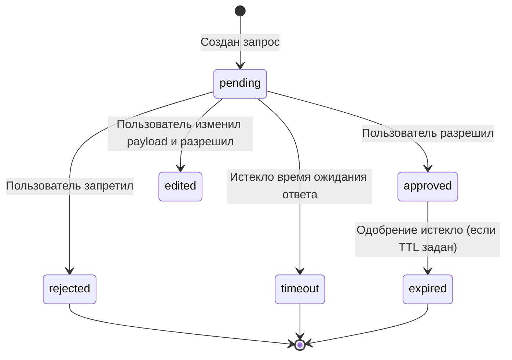

# SPEC-013: Approval Request (Human-in-the-Loop)

**ID:** SPEC-013 | **Версия:** 1.0 | **Статус:** Active  
**Владелец:** UX + Backend | **Обновлено:** 2026-05-07

---

## 1. Назначение (Purpose)

Когда `PolicyEngine` возвращает `require_approval`, выполнение `AgentRun` приостанавливается (стейт `waiting` или `requires_action`), и пользователю отправляется запрос на одобрение (`ApprovalRequest`). Это механизм Human-in-the-Loop (HITL), необходимый для операций класса `SYSTEM_WRITE` или `CODE_EXECUTION`.

## 2. State Machine: Approval Request

Жизненный цикл запроса на одобрение:



## 3. Модель данных

```typescript
interface ApprovalRequest {
  id: string;
  runId: string;
  actionType: string;         // 'tool_call', 'commit', 'send_email'
  payload: any;               // Параметры действия (например, текст письма)
  riskScore: number;
  reason: string;             // Почему запрошено подтверждение
  state: 'pending' | 'approved' | 'rejected' | 'edited' | 'timeout' | 'expired';
  expiresAt: Date;            // Время, когда pending превратится в timeout
}
```

## 4. Взаимодействие с AgentRun

1. Workflow Temporal получает `require_approval`.
2. В БД создаётся `ApprovalRequest`.
3. AgentRun отправляет событие (Signal) клиенту: `approval_requested`.
4. Клиент показывает UI (Confirm/Reject).
5. Пользователь нажимает Confirm. API вызывает `/api/runs/:id/signal` с результатом.
6. Temporal Workflow выходит из ожидания и выполняет действие (либо отменяет его, если rejected).

## 5. Security Context

Одобрение должно содержать токен или осуществляться в защищенной сессии. Для критичных действий (`require_step_up_auth`) Approval UI дополнительно запросит пароль.
