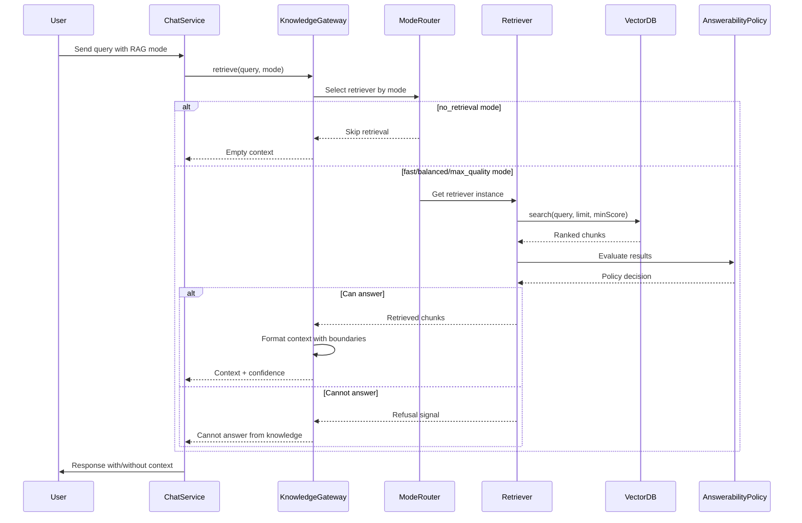

# SPEC-014: Knowledge Gateway

**Status:** Proposed  
**Sprint:** 10 (Knowledge Gateway and RAG Modes)  
**Date:** 2026-05-07  

## Summary

KnowledgeGateway is the central orchestrator for all retrieval-augmented generation (RAG) operations. It abstracts the complexity of query classification, mode-driven retrieval, and citation validation, providing a clean interface for the ChatService.

## Architecture



**Diagram Description:**
- **User** initiates a query with optional RAG mode selection
- **ChatService** delegates to KnowledgeGateway for retrieval
- **ModeRouter** selects appropriate retriever based on mode (fast/balanced/max_quality)
- **Retriever** queries VectorDB and ranks results
- **AnswerabilityPolicy** evaluates if retrieved context is sufficient
- If policy allows, formatted context is returned; otherwise refusal signal is sent

## RAG Modes

The KnowledgeGateway supports four primary modes, selectable via category settings or request parameters:

| Mode | Description | Latency | Quality | Use Case |
|---|---|---|---|---|
| `no_retrieval` | Retrieval is completely bypassed. | None | N/A | Fast chat, general knowledge. |
| `fast` | Low chunk count (1-2), limited search depth. | < 200ms | Low | Quick facts, high volume. |
| `balanced` | Optimal chunk count (3-5), semantic reranking. | 200-800ms | High | Standard research tasks. |
| `max_quality` | High chunk count (10+), multi-query expansion. | > 800ms | Max | Deep analysis, complex queries. |

## Query Classification

Before retrieval, the gateway classifies the query to optimize performance:
- **Navigational**: "Find the document about X" -> Targeted search.
- **Informational**: "How does X work?" -> Broad semantic search.
- **Complex/Multi-hop**: "Compare X and Y in the context of Z" -> Query expansion (Max Quality only).

## Answerability Policy

Defines system behavior when retrieval yields no or low-quality results:
1. **Refusal**: "I don't have enough information in the provided context."
2. **Base Knowledge Fallback**: "Based on my general knowledge (as no local context was found)..."
3. **Partial Answer**: Combine available fragments with a disclaimer.

## Integration

### Category Settings
```json
{
  "rag_enabled": true,
  "rag_mode": "balanced",
  "rag_answerability_policy": "refusal"
}
```

### Trace Events
```javascript
'retrieval.started'    // { query, mode, timestamp }
'retrieval.completed'  // { chunkCount, topScore, latency }
'retrieval.failed'     // { error, query }
```

## Implementation Plan

1. Create `src/modules/knowledge/knowledge.gateway.js`
2. Create `src/modules/knowledge/knowledge.router.js`
3. Update `ChatService.js` to call `KnowledgeGateway.retrieve()`

## References

- SPEC-015: Retrieval & Citation Contract
- ADR-005: Semantic Protocol
