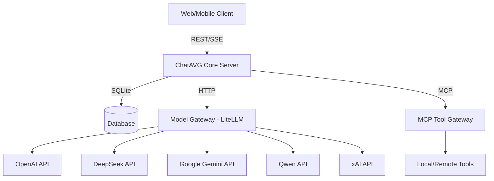

# Архитектура развертывания (Deployment Architecture)

## Обзор
ChatAVG v2.3 состоит из нескольких микросервисов/процессов, которые обеспечивают изоляцию ответственности, стабильность долгих миссий и эффективную маршрутизацию запросов.

## Основные компоненты

1. **ChatAVG Core (Backend / Node.js)**
   - Основной API-сервер и бизнес-логика.
   - Отвечает за аутентификацию, управление сессиями, "Fast Path" маршрутизацию, Adequacy Engine (смысловой слой).
   - Подключается к SQLite для хранения данных.

2. **Model Gateway (LiteLLM Proxy / Python)**
   - Единая точка входа для всех инференс-запросов (LLM).
   - Запускается как отдельный процесс (`cons/litellm_gateway`).
   - Настраивается через `litellm_config.yaml`.
   - Обеспечивает fallbacks, rate-limiting, load-balancing и подсчет стоимости токенов.
   - Core-сервер общается с ним по протоколу OpenAI-compat (через HTTP).

3. **MCP Tool Gateway (Node.js)**
   - Выделенный сервер для регистрации и исполнения внешних инструментов (tools).
   - Работает по протоколу Model Context Protocol (MCP).
   - Изолирует выполнение инструментов от ядра системы.

4. **Durable Runtime (Temporal)** *(запланировано)*
   - Кластер Temporal для оркестрации AgentRun миссий.

5. **Sandbox (E2B / Daytona)** *(запланировано)*
   - Безопасные песочницы для выполнения кода, сгенерированного ИИ.

## Схема взаимодействия

## Требования к окружению
Для локального запуска необходимо стартовать следующие компоненты:
1. `npm start` (в папке `cons/chatavg`).
2. `start_proxy.cmd` (в папке `cons/litellm_gateway`).
3. Запуск MCP Gateway (опционально, если требуются внешние инструменты).
