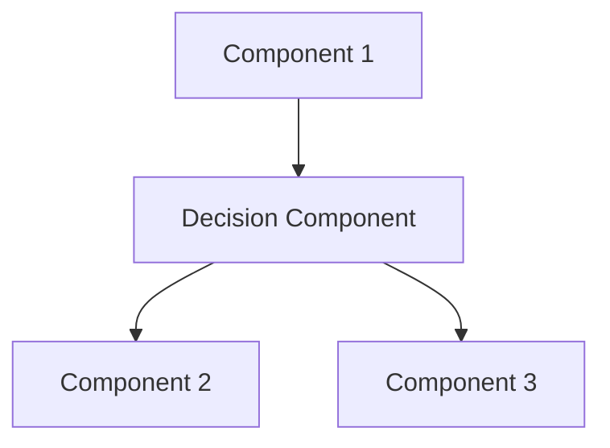

# ADR-XXX: Decision Title

**Status:** [Proposed/Accepted/Rejected/Superseded]
**Version:** 1.0
**Owner:** [Name/Team]
**Last Updated:** YYYY-MM-DD
**Reviewers:** [Names of people who reviewed this decision]

## Context

Describe the problem or situation that led to this decision. Include:

- What is the issue we're trying to solve?
- What are the constraints (technical, business, time)?
- Who are the stakeholders?
- What are the forces at play?

**Example context:**
```
ChatAVG platform requires durable execution for long-running agent workflows with:
1. Human-in-the-loop approval (hours/days pause)
2. Crash resilience across server restarts
3. Automatic retries with exponential backoff
4. Compensation logic on rejection
```

## Decision

Clearly state the decision that was made. Use "We have chosen..." or "Selected..." format.

**Example decision:**
```
Selected: Temporal.io as the Durable Runtime engine

Rationale:
- Provides deterministic replay for crash recovery
- Built-in support for long-running workflows (days/weeks)
- Human-in-the-loop via signals and waiting states
- Mature ecosystem with good Node.js SDK
```

### Architecture Diagram

If applicable, include a diagram showing how this decision fits into the architecture:



## Consequences

### Positive Consequences

- Benefit 1: Explanation of how this helps
- Benefit 2: Explanation
- Benefit 3: Explanation

### Negative Consequences

- Drawback 1: Explanation and mitigation strategy
- Drawback 2: Explanation and mitigation strategy

### Trade-offs

| Aspect | Before Decision | After Decision |
|--------|----------------|----------------|
| Complexity | High | Medium |
| Performance | Fast | Slightly slower |
| Cost | $X/month | $Y/month |
| Maintenance | Manual | Automated |

## Alternatives Considered

### Alternative 1: [Name]

**Description:** Brief explanation of this alternative.

**Pros:**
- Pro 1
- Pro 2

**Cons:**
- Con 1
- Con 2

**Why rejected:** Clear explanation of why this wasn't chosen.

### Alternative 2: [Name]

**Description:** Brief explanation.

**Pros:**
- Pro 1

**Cons:**
- Con 1

**Why rejected:** Explanation.

## Validation

How will we validate that this decision is correct?

**Metrics to track:**
- Metric 1: Target value
- Metric 2: Target value

**Success criteria:**
- [ ] Criterion 1
- [ ] Criterion 2

**Timeline for review:** Re-evaluate this decision in [X months] or when [specific trigger occurs].

## Implementation

### Key Files

- `path/to/file1.js` - Main implementation
- `path/to/file2.js` - Supporting code
- `docs/SPEC-XXX.md` - Related specification

### Timeline

- Phase 1: [Description] - [Date]
- Phase 2: [Description] - [Date]

### Rollout Plan

1. Development and testing
2. Staging deployment
3. Production rollout (canary → gradual → full)

## References

- [Link to related documents](../path/to/doc.md)
- [External resource](https://example.com)
- [RFC or proposal](link-to-rfc)

## Notes

Any additional context, meeting notes, or discussion points that informed this decision.

**Meeting date:** YYYY-MM-DD
**Attendees:** List of people involved in the decision

---

*This ADR was created following the template in `docs/templates/ADR_TEMPLATE.md`*
