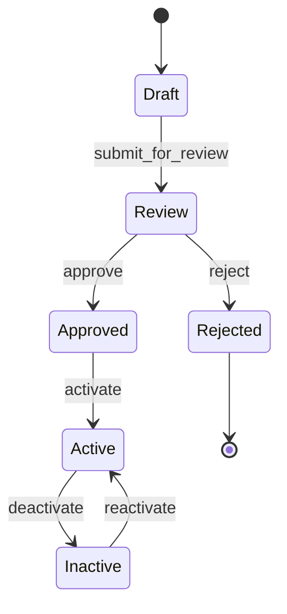

# SPEC-XXX: Full Descriptive Title

## Overview

One paragraph summary explaining what this specification covers and why it exists.

**Key concepts:**
- Concept 1: Brief explanation
- Concept 2: Brief explanation

## Motivation

Why is this specification needed? What problem does it solve?

**Current state:** Describe the current situation and its limitations.

**Proposed solution:** High-level description of the approach.

**Benefits:**
- Benefit 1 with explanation
- Benefit 2 with explanation

## Specification

### Schema / Data Model

```json
{
  "$schema": "http://json-schema.org/draft-07/schema#",
  "title": "ExampleSchema",
  "type": "object",
  "properties": {
    "id": {
      "type": "string",
      "pattern": "^[a-z0-9-]+$",
      "description": "Unique identifier"
    },
    "name": {
      "type": "string",
      "maxLength": 255
    },
    "status": {
      "type": "string",
      "enum": ["active", "inactive", "pending"]
    }
  },
  "required": ["id", "name", "status"]
}
```

### API Endpoints

| Method | Path | Description | Auth Required |
|--------|------|-------------|---------------|
| GET | `/api/resource` | List all resources | Yes |
| POST | `/api/resource` | Create new resource | Yes |
| GET | `/api/resource/:id` | Get specific resource | Yes |
| PUT | `/api/resource/:id` | Update resource | Yes |
| DELETE | `/api/resource/:id` | Delete resource | Yes (Admin) |

### Request/Response Examples

#### Create Resource

**Request:**
```bash
curl -X POST https://api.example.com/api/resource \
  -H "Authorization: Bearer $TOKEN" \
  -H "Content-Type: application/json" \
  -d '{
    "name": "Example Resource",
    "status": "active"
  }'
```

**Response (201 Created):**
```json
{
  "id": "res-123",
  "name": "Example Resource",
  "status": "active",
  "created_at": "2026-05-19T10:30:00Z"
}
```

**Response (400 Bad Request):**
```json
{
  "error": "VALIDATION_ERROR",
  "message": "Invalid input",
  "details": [
    {
      "field": "name",
      "message": "Name is required"
    }
  ]
}
```

### State Machine / Workflow

If applicable, include a Mermaid diagram showing state transitions:



### Error Handling

**Error Codes:**

| Code | Name | Description | Retryable |
|------|------|-------------|-----------|
| 400 | VALIDATION_ERROR | Invalid input parameters | No |
| 401 | UNAUTHORIZED | Missing or invalid authentication | No |
| 403 | FORBIDDEN | Insufficient permissions | No |
| 404 | NOT_FOUND | Resource does not exist | No |
| 409 | CONFLICT | Resource already exists | No |
| 429 | RATE_LIMITED | Too many requests | Yes |
| 500 | INTERNAL_ERROR | Server error | Yes |
| 503 | SERVICE_UNAVAILABLE | Service temporarily unavailable | Yes |

## Implementation Notes

### Key Technical Details

- Detail 1: Explanation
- Detail 2: Explanation

### Dependencies

- Dependency 1 (version): Why it's needed
- Dependency 2 (version): Why it's needed

### Performance Considerations

- Expected latency: < 100ms for typical requests
- Throughput: 1000 req/s per instance
- Memory usage: ~50MB per instance

### Security Considerations

- Input validation: All inputs must be validated against schema
- Authentication: JWT tokens required for all endpoints
- Authorization: Role-based access control (RBAC)
- Rate limiting: 100 req/min per user

## Testing Requirements

### Unit Tests

- [ ] Test validation logic with valid/invalid inputs
- [ ] Test error handling for all error codes
- [ ] Test state transitions in state machine

### Integration Tests

- [ ] Test API endpoints with real database
- [ ] Test authentication and authorization flows
- [ ] Test rate limiting behavior

### End-to-End Tests

- [ ] Test complete user workflow from start to finish
- [ ] Test error scenarios and recovery

## Migration Guide

*If this specification changes existing behavior, provide migration steps:*

### From v1.0 to v2.0

1. Update API client to handle new response format
2. Change endpoint from `/api/v1/resource` to `/api/v2/resource`
3. Update request payload to include new required field `status`

### Database Migrations

```sql
-- Add new column
ALTER TABLE resources ADD COLUMN status VARCHAR(20) DEFAULT 'active';

-- Update existing rows
UPDATE resources SET status = 'active' WHERE status IS NULL;
```

## Changelog

| Version | Date | Author | Changes |
|---------|------|--------|---------|
| 1.0 | 2026-05-19 | [Name] | Initial specification |
| 1.1 | YYYY-MM-DD | [Name] | [Description of changes] |

## References

- [Related SPEC-001](SPEC-001-CANONICAL_PROVIDER_EVENTS.md)
- [ADR-001: Temporal Durable Runtime](../03_adr/ADR-001-temporal-durable-runtime.md)
- [External Resource](https://example.com)

---

**Status:** This specification is [Draft/Active/Deprecated].
**Questions?** Contact [owner name] or post in #chatavg-backend Slack channel.
