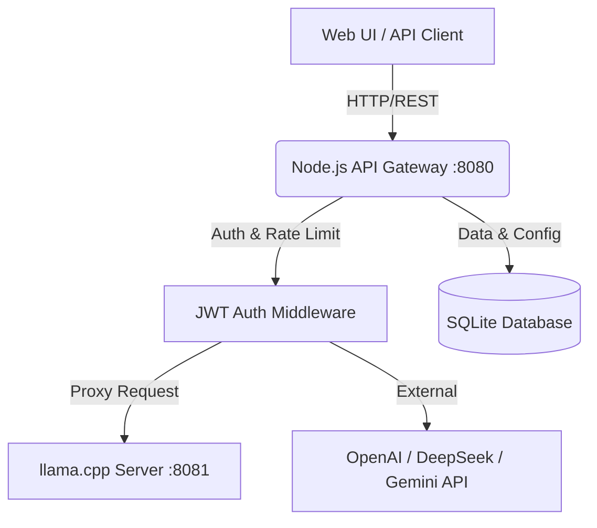

# 🦙 Chat AVG Gateway — Локальный сервер Gemma 4

Добро пожаловать в обновленную сборку локального сервера ИИ. Теперь это не просто движок нейросети, а полноценная многопользовательская система с авторизацией, ролевой моделью и централизованным управлением через админ-панель.

---

## ✨ Ключевые особенности (v2.0)

*   **Node.js API Gateway:** Собственный сервер-шлюз на Node.js, обеспечивающий безопасность и управление доступом.
*   **Многопользовательская работа:** Поддержка нескольких аккаунтов с индивидуальными логинами, паролями и сроками действия доступа.
*   **Категории обслуживания:** Гибкая система ролей (Консультант, Эксперт, Мудрец, Администратор) с предустановленными лимитами контекста и параметрами генерации.
*   **Админ-панель:** Встроенный интерфейс для управления пользователями и справочником категорий прямо в браузере.
*   **Централизованный промпт:** Возможность задавать системные инструкции как для всей категории, так и для конкретного пользователя (промпты суммируются).
*   **Поддержка внешних API:** Возможность переключить любую категорию на использование внешних провайдеров (например, **DeepSeek API**, **OpenAI**, **Gemini**) простым изменением URL и ID модели в админке.
*   **Надежное хранилище:** Все пользователи, настройки и история чатов хранятся в надежной и быстрой базе данных **SQLite**.

---

## 🚀 Быстрый старт

1.  **Настройка окружения:** Скопируйте файл `.env.example` в `.env` и обязательно укажите `CHATAVG_SECRET` (минимум 32 случайных символа) и `CHATAVG_ADMIN_PASSWORD` (ваш новый пароль администратора).
2.  **Установка зависимостей:** Выполните файл `install_deps.cmd`.
3.  **Запуск:** Запустите `start_4k.cmd` (он автоматически поднимет llama.cpp и шлюз Node.js).
4.  **Вход в систему:** Откройте [http://127.0.0.1:8080](http://127.0.0.1:8080).
    *   **Логин:** `admin`
    *   **Пароль:** Тот, что вы указали в `.env` (или случайно сгенерированный, который вывелся в консоли Node.js при первом запуске).

---

## 🛡 Безопасность и архитектура

### Архитектурная схема


Система состоит из двух уровней:
1.  **Backend (Порт 8081):** Движок `llama-server.exe`, который занимается вычислениями. Он закрыт для прямого доступа извне.
2.  **Gateway (Порт 8080):** Сервер на Node.js, который проверяет токены, инжектирует системные промпты и параметры генерации, а затем проксирует запрос к бэкенду.

Это позволяет безопасно выставлять сервер в интернет (например, через IIS или ngrok) — доступ получит только авторизованный пользователь.

## 🧬 Testing

The application includes an integration test suite built with Node.js native `node:test` and `supertest`.

To run the tests:
```cmd
npm test
```
The test runner isolates its environment by automatically targeting an in-memory or alternative SQLite database (`data_test`), ensuring that production data is not modified during testing.

## 🔐 Security Configurations
- [x] Строгие требования к `CHATAVG_SECRET` (только через `.env`).
- [x] Никаких дефолтных `admin/admin` (пароль генерируется или задается в `.env`).
- [x] Хеширование паролей с помощью `bcrypt`.
- [x] Ограничение количества запросов (`express-rate-limit`) для защиты от DDoS и брутфорса.
- [x] Защита заголовков (`helmet`) и базовая конфигурация `cors`.
- [x] Строгая валидация входящих данных через Zod Schema.
- [x] Полностью синхронный и безопасный движок `better-sqlite3` для работы с БД (никаких гонок I/O).

---

## ⚙️ Управление через Админ-панель

В левом меню выберите **Админ-панель**. Там вы сможете:
*   **Управление пользователями:** Создавать новых сотрудников, менять им пароли, задавать персональные системные инструкции и лимиты контекста.
*   **Справочник категорий:** Настраивать глобальные параметры генерации (Temperature, Top-P и др.) для целых групп пользователей. Также здесь можно привязать категорию к внешнему API, выбрав подходящего Provider.

---

## 🐳 Развертывание с Docker (Кросс-платформенность)

Для развертывания на серверах Linux или локально через Docker, в репозитории добавлены `Dockerfile` и `docker-compose.yml`.

1.  Скопируйте вашу GGUF модель в папку `models_cache`.
2.  Отредактируйте `docker-compose.yml`, указав точное имя вашего файла модели.
3.  Создайте `.env` файл рядом с `docker-compose.yml`.
4.  Запустите стек:
    ```bash
    docker-compose up -d
    ```
Gateway будет доступен на порту 8080, а данные (база SQLite) сохранятся в volume `gateway_data`.

---

## ⚠️ Техническая поддержка

Если у вас возникли вопросы по работе системы или производительности, обратитесь к файлу `IIS_DEPLOYMENT_GUIDE.md` (для серверной установки) или проверьте логи в окне консоли Node.js.
