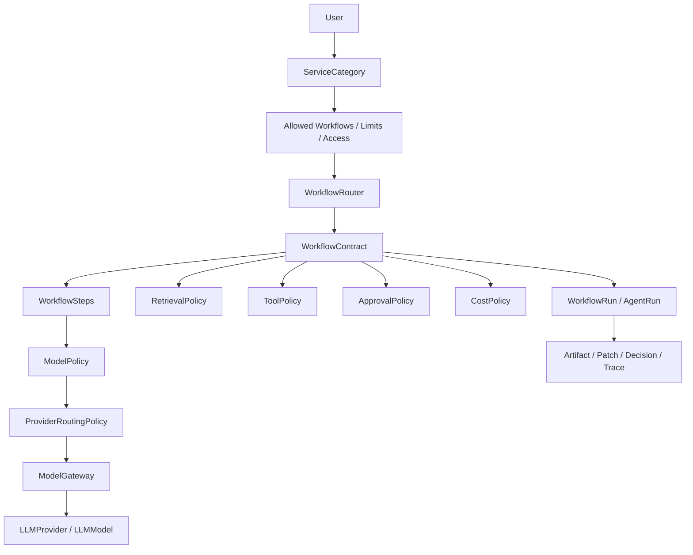

# ChatAVG RC1–RC2 — концепт интерфейса и структуры администрирования

**Документ:** `CHATAVG-RC1-RC2-INTERFACE-ADMIN-WF-CONCEPT`  
**Дата:** 9 мая 2026  
**Статус:** Draft for Product / UX / Frontend / Backend / Architecture Review  
**Назначение:** зафиксировать целевую архитектуру интерфейса ChatAVG для пользователя и администратора на RC1–RC2, а также структуру справочников, Workflow Settings и границы ответственности между коммерческим контуром обслуживания пользователя и техническим контуром исполнения workflow.

---

## 1. Ключевое решение

**LLM-провайдеры, модели, fallback-цепочки, routing, provider capabilities и параметры вызова не входят в “Категории обслуживания”.**

Категории обслуживания — это коммерческий и организационный слой ChatAVG:

- какой уровень обслуживания получает пользователь;
- какие лимиты ему доступны;
- какие workflow и режимы разрешены;
- какой уровень RAG/tools/sandbox доступен;
- какие требования к audit, retention и SLA применяются.

Технический выбор LLM-провайдера, модели, fallback и capabilities выполняется в **Workflow Settings**:

```text
WorkflowContract
→ WorkflowStep
→ ModelPolicy
→ ProviderRoutingPolicy
→ LLMProvider / LLMModel
→ ModelGateway
```

Это разделяет два разных контура:

```text
ServiceCategory
= коммерция / организация / доступ / лимиты / SLA

Workflow Settings
= структура процесса / шаги / политики / провайдеры / execution

ModelGateway
= нормализация вызова модели / routing / fallback / usage / trace / cost
```

---

## 2. Цель RC1–RC2 интерфейсной архитектуры

К RC1–RC2 ChatAVG должен перестать выглядеть как “чат с настройками” и стать управляемой workflow-платформой:

```text
User intent
→ WorkflowRouter
→ WorkflowContract
→ WorkflowRun / AgentRun
→ Visible Progress
→ Artifact Workspace
→ Human Decision / Approval
→ Traceable Result
```

Для пользователя система должна оставаться простой: цель, текущий шаг, артефакт, решение, действие.

Для администратора система должна быть управляемой: пользователи, категории обслуживания, workflow contracts, шаги workflow, model policies, provider routing, approvals, cost, audit и observability.

---

## 3. Границы ответственности

### 3.1. Категория обслуживания

Категория обслуживания отвечает на вопрос:

> Что этому пользователю или организации разрешено и в каком объёме?

Категория не должна отвечать на вопрос:

> Какая конкретная модель и какой LLM-провайдер будут вызваны на шаге mapping или artifact synthesis?

### 3.2. Workflow Settings

Workflow Settings отвечают на вопрос:

> Как именно исполняется workflow, какие шаги он содержит, какие политики применяются, какие model policies и provider routing используются на каждом этапе?

### 3.3. ModelGateway

ModelGateway отвечает на вопрос:

> Как выполнить конкретный model call через нужного провайдера, нормализовать streaming, tool calls, structured output, usage, cost, trace и fallback?

### 3.4. Durable Runtime

Durable Runtime отвечает на вопрос:

> Как сохранить состояние workflow, не потерять approvals, не повторить side effects, восстановиться после ошибки и довести миссию до результата?

---

## 4. Целевая схема слоёв



---

## 5. Пользовательский интерфейс

## 5.1. Главный принцип

Пользователь не должен видеть внутреннюю агентную сложность. Он должен видеть:

1. что сейчас происходит;
2. какой workflow выбран;
3. на каком шаге система находится;
4. какой артефакт создаётся или изменяется;
5. какие данные использованы;
6. где есть неопределённость;
7. где требуется решение человека;
8. что будет сделано перед внешним действием.

---

## 5.2. Mission Cockpit

Основной интерфейс пользователя для Studio/Lab/Forge workflow.

```text
┌──────────────────────────────────────────────────────────────────────────────┐
│ Top Bar: Mission · Workflow · Mode · State · Cost/Risk · Next Action        │
├───────────────┬─────────────────────────────────────────────┬────────────────┤
│ Left Rail     │ Main Artifact Workspace                     │ Right Panel    │
│               │                                             │                │
│ Missions      │ Document / Plan / Map / Code / Decision     │ Distinctions   │
│ Sources       │ Diff / Versions / Comments                  │ Claims         │
│ Runs          │                                             │ Conflicts      │
│ Templates     │                                             │ Approvals      │
│ Command       │                                             │ Sources        │
├───────────────┴─────────────────────────────────────────────┴────────────────┤
│ Bottom Drawer: Trace · Cost · Tool calls · Retrieval · Debug, hidden         │
└──────────────────────────────────────────────────────────────────────────────┘
```

### Области интерфейса

| Область | Назначение |
|---|---|
| Top Bar | Миссия, workflow, режим, статус, риск/стоимость, следующее действие. |
| Left Rail | Миссии, источники, run history, templates, command palette. |
| Main Artifact Workspace | Главный рабочий результат: документ, план, карта, код, diff. |
| Right Panel | Различения, claims, источники, conflict cards, approvals. |
| Bottom Drawer | Trace, cost, model calls, retrieval, tool calls, debug; скрыт по умолчанию. |

---

## 5.3. Fast Chat

Fast Chat сохраняется как быстрый путь.

```text
Chat centered
Compact uncertainty / boundary chips
Action: “Развернуть в миссию”
```

### Требования

| Элемент | Требование |
|---|---|
| Chat input | P0 |
| Быстрый ответ | P0 |
| Boundary note | P1 |
| Save as Mission | P0 |
| Expand to Studio/Lab | P0 |
| Heavy RAG/tools/sandbox по умолчанию | Запрещено |

---

## 5.4. Mission Brief Builder

Mission Room не должен начинаться с пустого большого textarea. Для сложных задач нужен guided intake.

```text
Что мы решаем?
[ Goal ]

Что должно получиться?
[ Document ] [ Plan ] [ Decision Map ] [ Code ] [ Review ] [ Other ]

Какие материалы использовать?
[ Upload ] [ Paste ] [ Connect Source ] [ Start Empty ]

Ограничения
[ deadline ] [ audience ] [ risk ] [ format ] [ budget ]

[Create Mission]
```

### Поля Mission Brief

| Поле | Тип |
|---|---|
| Goal | one-line editable field |
| Context | text / source chips |
| Success criteria | checklist |
| Constraints | chips + free text |
| Unknowns | inline list |
| Desired artifact | select |
| Sensitivity | low / medium / high |

---

## 5.5. Artifact Workspace

Центральная зона должна принадлежать артефакту, а не чату.

### P0 capabilities

| Возможность | RC |
|---|---|
| Rich Markdown viewer/editor | RC1 |
| Version history | RC1 |
| Artifact patches | RC1 |
| Diff mode | RC1 |
| Accept/reject patch | RC1/RC2 |
| Inline comments | RC2 |
| Section provenance | RC2 |
| Export | RC1 |
| Multi-artifact tabs | после RC2 |

---

## 5.6. Claim / Boundary UI

Каждый значимый claim должен быть проверяемым.

```text
Claim:
“Этот workflow требует approval перед внешним write action.”

Type: recommendation
Strength: strong
Evidence: policy / workflow contract / tool class
Boundary: applies to write/code/browser/external actions, not to simple chat
Action: Use · Downgrade · Ask for source · Convert to decision
```

### ClaimCard fields

| Поле | Приоритет |
|---|---|
| claim_text | P0 |
| claim_type | P0 |
| allowed_strength | P0 |
| source/evidence | P0 |
| domain_boundary | P0 |
| downgrade_reason | P1 |
| distortion_risk | P1 |
| actions | P0 |

---

## 5.7. ConflictCard

ConflictCard показывает развилку, где система не должна принимать решение за человека.

```text
Conflict:
Скорость MVP vs смысловая полнота workflow

Option A: Fast shipping
+ быстрее
- выше риск слабой traceability

Option B: WorkflowContract MVP
+ управляемость и тестируемость
- выше трудозатраты

Decision needed:
Выберите допустимый компромисс для RC1.
```

---

## 5.8. ApprovalCard

Approval — не confirm-dialog, а state workflow.

```text
Approve action: Export artifact to workspace

What will happen:
- Create file: ChatAVG_Interface_Concept.md
- Destination: Project workspace
- External side effect: none
- Data leaving ChatAVG: no

Risk: Low
Rollback: delete exported file / restore previous artifact version

[Approve once] [Edit before approve] [Reject] [More details]
```

---

## 5.9. Mobile UI

Мобильный интерфейс не должен пытаться показать весь cockpit. Он нужен для review, approval и quick continuation.

```text
Mission Header
Current Step / Next Action
Artifact Preview
Primary Card: claim / conflict / approval
Bottom Nav: Chat · Artifact · Claims · Decisions · More
```

---

## 6. Администраторский интерфейс

## 6.1. Главная идея

Admin Console — это не “настройки чата”, а **Workflow Control Plane**.

```text
Admin Console
├─ Dashboard
├─ Пользователи
├─ Категории обслуживания
├─ Workflow Registry
├─ Workflow Designer
├─ Workflow Step Settings
├─ Model Policies
├─ Provider Routing
├─ LLM Providers
├─ Knowledge / RAG
├─ Tools & Approvals
├─ Cost / Quotas
├─ Observability
├─ Audit Log
├─ Feature Flags
└─ Debug
```

---

## 6.2. Dashboard

### Карточки

| Card | Смысл |
|---|---|
| Active users | активные пользователи |
| Active workflow runs | активные WF runs |
| Failed runs | ошибки |
| Cost today/month | расходы |
| Provider health | состояние провайдеров |
| Approval queue | ожидающие approvals |
| Sandbox failures | ошибки sandbox |
| Semantic downgrade rate | где система снижала силу утверждений |
| Citation validation errors | ошибки источников |

### Таблицы

- последние failed runs;
- самые дорогие runs;
- provider errors;
- users over budget;
- workflows with high failure rate;
- pending approvals;
- failed tool calls.

---

## 6.3. Пользователи

```text
User | Role | Service Category | Monthly Budget | Cost | Last Run | Status | Actions
```

### Возможности

- создать / заблокировать / активировать пользователя;
- назначить категорию обслуживания;
- посмотреть доступные workflow;
- посмотреть usage/cost;
- посмотреть run history;
- посмотреть audit events;
- задать индивидуальный override лимита, если разрешено политикой.

---

## 6.4. Категории обслуживания

Категория обслуживания — коммерческо-организационный справочник.

### Важно

В этом разделе **не должно быть**:

- `providerId`;
- `modelId`;
- `fallbackModelIds`;
- `OpenAI / Anthropic / Gemini` выбора;
- temperature/top_p/top_k;
- provider routing;
- prompt templates;
- model-specific capabilities.

### Вкладки

```text
Категории обслуживания
├─ Основное
├─ Коммерческие лимиты
├─ Доступные Workflow
├─ Доступные режимы
├─ RAG / Tools / Sandbox access
├─ SLA / Support
├─ Retention / Audit
└─ Feature flags
```

### ServiceCategory schema

```ts
type ServiceCategory = {
  id: string;
  code: string;
  name: string;
  description?: string;

  commercialTier: 'free' | 'basic' | 'pro' | 'team' | 'enterprise';
  organizationId?: string;
  isDefault: boolean;

  monthlyTokenBudget?: number;
  monthlyCostBudgetUsd?: number;
  maxCostPerRunUsd?: number;
  maxRunsPerDay?: number;
  maxConcurrentRuns?: number;

  allowedWorkflowIds: string[];
  allowedModes: Array<'fast' | 'studio' | 'lab' | 'forge'>;
  maxWorkflowComplexity: 'fast' | 'studio' | 'lab' | 'forge';

  ragAccessLevel: 'none' | 'fast' | 'balanced' | 'max_quality';
  toolsAccessLevel: 'none' | 'read_only' | 'approval_required';
  sandboxAccess: 'none' | 'limited' | 'full';

  supportLevel: 'standard' | 'priority' | 'enterprise';
  auditRetentionDays?: number;
  dataRetentionPolicyId?: string;

  defaultApprovalPolicyId?: string;
  featureFlagGroupId?: string;

  createdAt: string;
  updatedAt: string;
};
```

---

## 6.5. Workflow Registry

Workflow Registry показывает доступные workflow и их версии.

```text
Workflow | RU Name | Version | Mode | Status | Categories | Runs | Failure Rate | Actions
```

### Actions

- open contract;
- edit draft;
- create new version;
- activate/deprecate;
- rollback;
- open steps;
- open health dashboard;
- feature flag rollout.

---

## 6.6. Workflow Designer

Для RC1 достаточно таблицы шагов.

```text
Order | Step | Type | Visible | Model Policy | Provider Routing | RAG | Tool Policy | Approval | Cost Limit
```

Для RC2 добавить визуальный stepper.

```text
[Intake]
  ↓
[Briefing]
  ↓
[Retrieval]
  ↓
[Mapping]
  ↓
[Artifact Patch]
  ↓
[Review]
  ↓
[Forge]
```

### WorkflowContract schema

```ts
type WorkflowContract = {
  id: string;
  code: string;
  englishName: string;
  russianName: string;
  version: string;
  status: 'draft' | 'active' | 'deprecated';

  purpose: string;
  defaultMode: 'fast' | 'studio' | 'lab' | 'forge';

  entryCriteria: unknown[];
  exitCriteria: unknown[];

  requiredInputs: InputField[];
  optionalInputs: InputField[];

  states: WorkflowState[];
  transitions: WorkflowTransition[];

  artifactTypes: ArtifactType[];

  defaultRetrievalPolicyId?: string;
  defaultToolPolicyId?: string;
  defaultApprovalPolicyId?: string;
  defaultCostPolicyId?: string;

  allowedServiceCategoryIds?: string[];

  semanticDepth: 'none' | 'light' | 'standard' | 'full';
  userVisibleProgress: ProgressStep[];
  qualityGates: QualityGate[];
  observabilityEvents: TraceEventType[];

  featureFlagId?: string;
  createdAt: string;
  updatedAt: string;
};
```

---

## 6.7. Workflow Step Settings

Каждый workflow состоит из шагов. Именно на уровне шага назначаются ModelPolicy, ProviderRoutingPolicy, RAG, tools, approvals и cost policy.

```ts
type WorkflowStep = {
  id: string;
  workflowContractId: string;

  order: number;
  code: string;
  name: string;
  type:
    | 'intake'
    | 'briefing'
    | 'preflight'
    | 'retrieval'
    | 'mapping'
    | 'role_pass'
    | 'synthesis'
    | 'artifact_patch'
    | 'review'
    | 'approval'
    | 'forge';

  userVisible: boolean;
  userVisibleName?: string;
  required: boolean;

  inputContract?: unknown;
  outputContract?: unknown;

  modelPolicyId?: string;
  providerRoutingPolicyId?: string;

  retrievalPolicyId?: string;
  toolPolicyId?: string;
  approvalPolicyId?: string;
  costPolicyId?: string;

  timeoutMs?: number;
  retryPolicy?: RetryPolicy;
  qualityGates?: QualityGate[];
};
```

### Step details UI

```text
Step Settings
├─ General
├─ Input / Output Contract
├─ Model Policy
├─ Provider Routing
├─ Retrieval Policy
├─ Tool Policy
├─ Approval Policy
├─ Cost / Timeout / Retry
├─ Quality Gates
└─ Test Step
```

---

## 6.8. Model Policies

Model Policy — это “роль модели” в процессе, а не конкретный провайдер.

```ts
type ModelPolicy = {
  id: string;
  code:
    | 'fast_chat'
    | 'semantic_standard'
    | 'artifact_builder'
    | 'reviewer'
    | 'rag_synthesizer'
    | 'code_assistant'
    | 'conflict_mapper';

  name: string;
  purpose: string;

  defaultProviderRoutingPolicyId: string;

  maxInputTokens?: number;
  maxOutputTokens?: number;
  maxCostUsd?: number;
  timeoutMs?: number;

  toolMode: 'none' | 'declared' | 'auto_with_policy' | 'manual_only';

  responseFormatSchemaId?: string;
  extraParamsJson?: Record<string, unknown>;

  createdAt: string;
  updatedAt: string;
};
```

### ModelPolicy examples

| Policy | Назначение |
|---|---|
| `fast_chat` | быстрый ответ, минимальная стоимость и latency |
| `semantic_standard` | claims, boundaries, mapping |
| `artifact_builder` | генерация и изменение артефактов |
| `reviewer` | проверка качества, consistency, downgrade |
| `rag_synthesizer` | synthesis по источникам |
| `code_assistant` | код, sandbox/forge |
| `conflict_mapper` | развилки, options, decision cards |

---

## 6.9. Provider Routing

Здесь живут LLM-провайдеры, модели, fallback и routing strategy.

```ts
type ProviderRoutingPolicy = {
  id: string;
  code: string;
  name: string;

  routingStrategy:
    | 'fixed'
    | 'cost_optimized'
    | 'latency_optimized'
    | 'quality_optimized'
    | 'capability_required';

  primaryProviderId: string;
  primaryModelId: string;

  fallbackChain: Array<{
    providerId: string;
    modelId: string;
    condition:
      | 'provider_error'
      | 'timeout'
      | 'rate_limit'
      | 'context_too_large'
      | 'tool_not_supported'
      | 'structured_output_failed'
      | 'cost_limit_exceeded';
  }>;

  requireCapabilities: {
    streaming?: boolean;
    tools?: boolean;
    structuredOutput?: boolean;
    vision?: boolean;
    fileSearch?: boolean;
    reasoning?: boolean;
    jsonSchema?: boolean;
  };

  budgetGuard?: BudgetGuard;
  latencyGuard?: LatencyGuard;

  enabled: boolean;
};
```

### UI table

```text
Routing Policy | Strategy | Primary Model | Fallbacks | Capabilities | Used By | Status
```

### Example

| Workflow | Step | Model Policy | Provider Routing |
|---|---|---|---|
| Fast Chat | answer | fast_chat | low_latency_fixed |
| Studio | mapping | semantic_standard | structured_output_quality |
| Studio | artifact_patch | artifact_builder | quality_with_cost_guard |
| RAG | synthesis | rag_synthesizer | file_search_capable |
| Forge | code_review | code_assistant | code_quality_fallback |

---

## 6.10. LLM Providers

LLM Providers — технический справочник провайдеров и моделей.

```ts
type LLMProvider = {
  id: string;
  code: 'openai' | 'anthropic' | 'google' | 'deepseek' | 'qwen' | 'grok' | 'local';
  displayName: string;

  adapterType: 'litellm' | 'openai_responses' | 'openai_compat' | 'local';

  enabled: boolean;
  healthStatus: 'unknown' | 'healthy' | 'degraded' | 'down';

  supportsStreaming: boolean;
  supportsTools: boolean;
  supportsStructuredOutput: boolean;
  supportsVision: boolean;
  supportsReasoning: boolean;
  supportsFileSearch: boolean;

  costProfileId?: string;
  rateLimitPolicyId?: string;
  secretsRef?: string;

  createdAt: string;
  updatedAt: string;
};
```

```ts
type LLMModel = {
  id: string;
  providerId: string;
  modelName: string;
  displayName: string;

  contextWindow?: number;
  maxOutputTokens?: number;

  inputCostPer1M?: number;
  outputCostPer1M?: number;
  reasoningCostPer1M?: number;

  qualityTier: 'fast' | 'standard' | 'strong' | 'premium';
  latencyTier: 'low' | 'medium' | 'high';

  enabled: boolean;
};
```

---

## 6.11. Knowledge / RAG

```ts
type KnowledgePolicy = {
  id: string;
  code: string;
  mode: 'none' | 'fast' | 'balanced' | 'max_quality';

  retriever: 'sqlite_fts5' | 'openai_file_search' | 'hybrid' | 'external_connector';

  maxSources?: number;
  minScore?: number;
  requireCitation: boolean;
  answerabilityThreshold?: number;

  freshnessPolicy?: 'ignore' | 'prefer_recent' | 'require_recent';
  citationValidation: 'none' | 'basic' | 'strict';
};
```

### UI

```text
Knowledge / RAG
├─ Retrieval Policies
├─ Source Registries
├─ Ingestion Jobs
├─ Citation Validation
├─ Answerability Rules
└─ Source Quality Dashboard
```

---

## 6.12. Tools & Approvals

```ts
type ToolPolicy = {
  id: string;
  code: string;

  readOnlyLocal: 'allow' | 'deny';
  readOnlyExternal: 'allow' | 'approval_required' | 'deny';
  writeAction: 'approval_required' | 'deny';
  codeExecution: 'approval_required' | 'deny';
  browserAction: 'approval_required' | 'deny';
  expensiveAction: 'preflight' | 'approval_required' | 'deny';

  requirePreview: boolean;
  requireIdempotencyKey: boolean;
  auditLevel: 'basic' | 'full';
};
```

```ts
type ApprovalPolicy = {
  id: string;
  code: string;

  allowApproveOnce: boolean;
  allowApproveForRun: boolean;
  allowEditThenApprove: boolean;
  allowRejectWithReason: boolean;

  approvalTimeoutMinutes?: number;
  escalationPolicyId?: string;
};
```

---

## 7. RC1 scope

RC1 должен закрыть управляемость, безопасность и базовую видимость workflow.

### 7.1. User UI RC1

| Component | RC1 |
|---|---|
| Fast Chat | yes |
| Expand to Mission | yes |
| New Mission Screen | yes |
| Mission Brief Builder | yes |
| WorkflowHeader | yes |
| ProgressRail basic | yes |
| WorkflowRun status | yes |
| Artifact preview / basic workspace | yes |
| Export basic | yes |
| ApprovalCard basic | yes |
| TraceDrawer minimal | internal / debug |

### 7.2. Admin UI RC1

| Module | RC1 |
|---|---|
| Users | yes |
| Service Categories | yes |
| Workflow Registry | yes |
| Workflow Step table | yes |
| Model Policies | yes |
| Provider Routing | yes |
| LLM Providers | yes |
| Tool / Approval Policies | yes |
| Cost / Quotas | yes |
| Observability v0 | yes |
| Audit Log | yes |
| Feature Flags basic | yes |

### 7.3. Backend RC1

| Capability | RC1 |
|---|---|
| `ServiceCategory` without providers | yes |
| `WorkflowContract` | yes |
| `WorkflowStep` | yes |
| `ModelPolicy` | yes |
| `ProviderRoutingPolicy` | yes |
| `WorkflowRun API` | yes |
| Event stream basic | yes |
| Approval decision API | yes |
| Audit events | yes |
| Cost tracking per run | yes |

---

## 8. RC2 scope

RC2 должен добавить durable workflow maturity, RAG/knowledge качество, расширенный review и observability.

### 8.1. User UI RC2

| Component | RC2 |
|---|---|
| ArtifactWorkspace full | yes |
| ArtifactDiffViewer | yes |
| PatchQueue | yes |
| ClaimCard | yes |
| DistinctionsSummary | yes |
| ConflictCard | yes |
| EvidenceStrip | yes |
| SourceTable | yes |
| TraceDrawer | yes |
| ForgePlanPreview | yes |
| Mobile review mode | yes |

### 8.2. Admin UI RC2

| Module | RC2 |
|---|---|
| Workflow Designer stepper | yes |
| Per-step simulation | yes |
| Workflow versioning / rollback | yes |
| Knowledge policy UI | yes |
| Citation validation dashboard | yes |
| WorkflowHealthDashboard | yes |
| Cost simulator | yes |
| Canary rollout by category | yes |
| Semantic eval dashboard | yes |
| Recovery dashboard | yes |

### 8.3. Backend RC2

| Capability | RC2 |
|---|---|
| durable resume/cancel/retry | yes |
| replay-safe tool execution | yes |
| artifact patch provenance | yes |
| claim ledger API | yes |
| citation validation | yes |
| quality gates | yes |
| semantic eval runner | yes |
| workflow health metrics | yes |
| advanced provider fallback | yes |

---

## 9. API surface

## 9.1. Admin API

```http
GET    /api/admin/users
POST   /api/admin/users
PATCH  /api/admin/users/:id

GET    /api/admin/service-categories
POST   /api/admin/service-categories
PATCH  /api/admin/service-categories/:id

GET    /api/admin/workflows
POST   /api/admin/workflows
GET    /api/admin/workflows/:id
PATCH  /api/admin/workflows/:id

GET    /api/admin/workflows/:id/steps
POST   /api/admin/workflows/:id/steps
PATCH  /api/admin/workflow-steps/:stepId

GET    /api/admin/model-policies
POST   /api/admin/model-policies
PATCH  /api/admin/model-policies/:id

GET    /api/admin/provider-routing-policies
POST   /api/admin/provider-routing-policies
PATCH  /api/admin/provider-routing-policies/:id

GET    /api/admin/providers
POST   /api/admin/providers/:id/test
PATCH  /api/admin/providers/:id

GET    /api/admin/knowledge-policies
POST   /api/admin/knowledge-policies
PATCH  /api/admin/knowledge-policies/:id

GET    /api/admin/tool-policies
POST   /api/admin/tool-policies
PATCH  /api/admin/tool-policies/:id

GET    /api/admin/approval-policies
POST   /api/admin/approval-policies
PATCH  /api/admin/approval-policies/:id

GET    /api/admin/observability/workflows
GET    /api/admin/observability/providers
GET    /api/admin/observability/cost
GET    /api/admin/audit
```

---

## 9.2. User / Workflow API

```http
GET    /api/workflows
GET    /api/workflows/:id

POST   /api/workflow-runs
GET    /api/workflow-runs/:id
GET    /api/workflow-runs/:id/events
POST   /api/workflow-runs/:id/cancel
POST   /api/workflow-runs/:id/resume
POST   /api/workflow-runs/:id/fork

GET    /api/artifacts/:id
GET    /api/artifacts/:id/patches
POST   /api/artifacts/:id/patches/:patchId/accept
POST   /api/artifacts/:id/patches/:patchId/reject

POST   /api/approvals/:id/decision
```

---

## 10. Справочники и таблицы

### P0 tables

```text
users
service_categories
workflow_contracts
workflow_steps
workflow_runs
workflow_events
model_policies
provider_routing_policies
llm_providers
llm_models
tool_policies
approval_policies
cost_policies
audit_events
```

### P1 tables

```text
knowledge_policies
retrieval_runs
citation_validations
claims
domain_boundaries
artifact_patches
decision_records
approval_requests
workflow_quality_metrics
provider_health_events
feature_flags
```

---

## 11. Командная структура работ

### Product / PM

- определить RC1/RC2 workflow scope;
- зафиксировать категории обслуживания;
- определить коммерческие пакеты;
- согласовать, какие workflow доступны для каждой категории;
- сформировать golden routing set.

### UX

- Mission Cockpit;
- Admin Control Plane;
- ServiceCategory forms without provider settings;
- Workflow Designer;
- ApprovalCard / ConflictCard / ClaimCard;
- mobile review mode.

### Frontend

- user shell;
- admin tables/forms;
- workflow step editor;
- provider routing editor;
- artifact workspace;
- diff viewer;
- dashboard widgets.

### Backend

- domain model;
- migrations;
- workflow run API;
- workflow contract service;
- policy resolver;
- provider routing resolver;
- audit and cost events.

### Runtime / SRE

- Durable Runtime integration;
- replay-safety;
- idempotency keys;
- provider health;
- observability;
- run recovery.

### Semantic / QA

- ClaimCard contract;
- semantic eval cases;
- overclaiming / boundary tests;
- workflow quality gates;
- citation validation.

### Security

- approval policies;
- tool risk classes;
- audit policy;
- secrets handling for providers;
- sandbox access boundaries.

---

## 12. Миграционный план

### Step 1 — разделить ServiceCategory и Model Settings

Удалить из категории обслуживания:

```text
providerId
modelId
fallbackModels
providerRouting
modelParams
```

Добавить в Workflow Settings:

```text
WorkflowStep.modelPolicyId
WorkflowStep.providerRoutingPolicyId
ModelPolicy.defaultProviderRoutingPolicyId
ProviderRoutingPolicy.primaryProviderId
ProviderRoutingPolicy.primaryModelId
ProviderRoutingPolicy.fallbackChain
```

---

### Step 2 — создать WorkflowContract и WorkflowStep

Минимально описать 4 workflow:

1. Fast Chat;
2. Studio;
3. Adequacy Mapping;
4. Tool / Approval.

Lab и Forge можно оставить как internal beta path.

---

### Step 3 — добавить ModelPolicy

Начальный набор:

```text
fast_chat
semantic_standard
artifact_builder
reviewer
rag_synthesizer
code_assistant
conflict_mapper
```

---

### Step 4 — добавить ProviderRoutingPolicy

Начальный набор:

```text
low_latency_fixed
quality_with_cost_guard
structured_output_quality
file_search_capable
code_quality_fallback
local_dev
```

---

### Step 5 — обновить Admin UI

В категориях обслуживания оставить только коммерцию, лимиты и доступ.

В Workflow Settings перенести model/provider routing.

---

### Step 6 — добавить audit

Любое изменение должно писать audit event:

```text
service_category.updated
workflow_contract.updated
workflow_step.updated
model_policy.updated
provider_routing.updated
provider.enabled
provider.disabled
```

---

## 13. Definition of Done

### ServiceCategory DoD

- не содержит LLM-провайдеров и моделей;
- содержит коммерческий tier, лимиты, доступные workflow и режимы;
- управляет доступом к RAG/tools/sandbox на уровне capability;
- изменения логируются в audit;
- изменение категории не ломает workflow execution.

### Workflow Settings DoD

- workflow описан через WorkflowContract;
- каждый шаг имеет type, order, input/output contract;
- шаг может ссылаться на ModelPolicy;
- шаг может ссылаться на ProviderRoutingPolicy;
- workflow имеет версию и status;
- можно откатить draft/active версию;
- есть health metrics по workflow.

### Provider Routing DoD

- primary model задан явно;
- fallback chain задан явно;
- capabilities заданы явно;
- ошибки провайдера не протекают в пользовательский UX;
- fallback не нарушает cost/risk policy;
- usage/cost/latency пишутся в trace.

### User UI DoD

- пользователь видит workflow, режим, статус и next action;
- для workflow из 3+ шагов есть ProgressRail;
- artifact является центральным результатом;
- risky action имеет ApprovalCard;
- high/critical развилки имеют ConflictCard;
- значимые claims доступны через ClaimCard;
- trace скрыт, но доступен.

### Admin UI DoD

- админ может управлять пользователями и категориями;
- админ может видеть и редактировать workflow contracts;
- админ может настраивать model policy и provider routing по шагам WF;
- админ видит cost, failures, provider health и audit;
- нет смешения коммерческого и технического контуров.

---

## 14. Риски

| Риск | Последствие | Mitigation |
|---|---|---|
| LLM-провайдеры останутся в категориях | коммерческая модель станет зависеть от технического routing | удалить provider/model fields из ServiceCategory |
| Workflow Settings станут слишком сложными | команда не сможет быстро конфигурировать WF | RC1: таблица шагов; RC2: stepper |
| Пользователь увидит слишком много структуры | перегруз UX | progressive disclosure |
| Lab/Forge запустятся слишком часто | рост cost/latency | preflight + explicit consent |
| Approval fatigue | пользователь будет игнорировать approvals | grouped approvals + severity |
| Fallback нарушит качество | неожиданные ответы | capability requirements + quality gates |
| Durable replay повторит side effect | внешние дублирующиеся действия | idempotencyKey + side effects outside replay |
| Observability появится поздно | невозможно понять, где ломается WF | WorkflowHealth v0 в RC1 |

---

## 15. Итоговая формула

```text
ChatAVG RC1–RC2 Interface Architecture =
  User Mission Cockpit
  + Admin Workflow Control Plane
  + ServiceCategory as commercial/service layer
  + WorkflowContract as process layer
  + WorkflowStep as execution stage
  + ModelPolicy as model role
  + ProviderRoutingPolicy as LLM routing layer
  + ModelGateway as provider abstraction
  + Durable WorkflowRun as source of truth
  + Artifact / Claim / Decision / Approval / Trace as visible result
```

Главное проектное правило:

> **Категория обслуживания управляет правами, лимитами и уровнем сервиса.  
> Workflow Settings управляют исполнением процесса.  
> LLM-провайдеры и модели живут только в WorkflowStep / ModelPolicy / ProviderRoutingPolicy, но не в ServiceCategory.**
